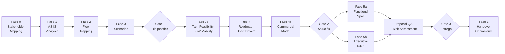

# Sofka Discovery Framework v10.0.0

Framework de discovery técnico empresarial para Claude Code — 78 skills especializados, 46 agentes dream team, 82 comandos, pipeline de 8 fases con 4 quality gates, 10 tipos de servicio.

---

## Quick Start

```bash
# Instalar plugin
claude --plugin-dir ./sofka-discovery-framework

# Pipeline guiado (recomendado primera vez)
/sdf:run-guided

# Ejecución autónoma (piloto-auto por defecto)
/sdf:run-auto

# Express — Go/No-Go en 1 sesión
/sdf:run-express

# Intermediate — Dirección arquitectónica
/sdf:run-deep
```

**Parámetros globales:**

| Parámetro | Valores | Default | Descripción |
|-----------|---------|---------|-------------|
| `{MODO}` | `piloto-auto`, `desatendido`, `supervisado`, `paso-a-paso` | `piloto-auto` | Nivel de intervención humana |
| `{FORMATO}` | `markdown`, `html`, `docx`, `dual` | `markdown` | Formato de salida |
| `{VARIANTE}` | `ejecutiva`, `técnica` | `técnica` | Ejecutiva ~40% longitud, técnica completa |
| `{ADJUNTOS}` | `procesar-todo`, `solo-código`, `ignorar` | `procesar-todo` | Tratamiento de archivos adjuntos |
| `{PROFUNDIDAD}` | `ejecutivo`, `técnico`, `exhaustivo` | `técnico` | Granularidad del análisis |
| `{TIPO_SERVICIO}` | `SDA`, `QA`, `Management`, `RPA`, `Data-AI`, `Cloud`, `SAS`, `UX-Design`, `Digital-Transformation`, `Multi-Service` | `SDA` | Tipo de servicio Sofka |

---

## Tipos de Servicio (`{TIPO_SERVICIO}`)

v10.0.0 es una plataforma de discovery universal que cubre TODAS las líneas de servicio de Sofka:

| Tipo | Línea de Servicio | Comando Directo |
|------|-------------------|-----------------|
| **SDA** (default) | Software Development & Architecture | `/sdf:run-guided` |
| **QA** | Quality Assurance as a Service | `/sdf:qa-discovery` |
| **Management** | PMO, Agile Coaching, Governance | `/sdf:run-guided {TIPO_SERVICIO}=Management` |
| **RPA** | Robotic Process Automation | `/sdf:rpa-discovery` |
| **Data-AI** | Data Platform & AI Center | `/sdf:ai-discovery` |
| **Cloud** | Cloud Migration & Operations | `/sdf:run-guided {TIPO_SERVICIO}=Cloud` |
| **SAS** | Staff Augmentation Services | `/sdf:run-guided {TIPO_SERVICIO}=SAS` |
| **UX-Design** | UX/UI Design & Research | `/sdf:run-guided {TIPO_SERVICIO}=UX-Design` |
| **Digital-Transformation** | Multi-service Program | `/sdf:transformation` |
| **Multi-Service** | Combination of service types | `/sdf:transformation` |

---

## Arquitectura del Pipeline

### Fases y Quality Gates



### Criterios por Gate

| Gate | Fase | Criterios clave |
|------|------|----------------|
| **G1 — Diagnóstico** | Post Fase 3 | Stakeholders mapeados, AS-IS validado, flujos documentados, escenarios priorizados |
| **G1.5 — Validación** | Post Fase 3b | Feasibility ≥3.5/5.0, viabilidad SW confirmada, Think Tank 7 Sabios |
| **G2 — Solución** | Post Fase 4b | Roadmap con cost drivers, modelo comercial definido, magnitudes validadas |
| **G3 — Entrega** | Post QA + Risk | Proposal QA ≥3.5/5.0, risk assessment completo, spec funcional aprobada |

---

## Comandos (82)

### Pipeline Flows (4)

| Comando | Alias | Descripción |
|---------|-------|-------------|
| `/sdf:run-guided` | `guide`, `discovery` | Pipeline guiado completo (8 fases, 4 gates) |
| `/sdf:run-auto` | `auto`, `discovery-auto` | Pipeline autónomo (zero interrupciones) |
| `/sdf:run-express` | `express` | Go/No-Go en 1 sesión (3 entregables) |
| `/sdf:run-deep` | `deep`, `intermediate` | Dirección arquitectónica (7 entregables) |

### Document Commands (10)

| Comando | Alias | Entregable |
|---------|-------|------------|
| `/sdf:generate-plan` | `plan` | 00_Discovery_Plan |
| `/sdf:map-stakeholders` | `stakeholders` | 01_Stakeholder_Map |
| `/sdf:generate-brief` | `brief` | 02_Brief_Tecnico |
| `/sdf:diagnose-asis` | `asis`, `diagnose` | 03_Analisis_AS-IS |
| `/sdf:trace-flows` | `flows`, `trace` | 04_Mapeo_Flujos |
| `/sdf:evaluate-scenarios` | `scenarios`, `evaluate` | 05_Escenarios_ToT |
| `/sdf:chart-roadmap` | `roadmap`, `chart` | 06_Solution_Roadmap |
| `/sdf:write-spec` | `spec` | 07_Especificacion_Funcional |
| `/sdf:craft-pitch` | `pitch`, `craft` | 08_Pitch_Ejecutivo |
| `/sdf:deliver-handover` | `handover`, `deliver` | 09_Handover_Operaciones |

### Service-Type Discovery (4)

| Comando | {TIPO_SERVICIO} |
|---------|-----------------|
| `/sdf:rpa-discovery` | RPA |
| `/sdf:qa-discovery` | QA |
| `/sdf:ai-discovery` | Data-AI |
| `/sdf:transformation` | Digital-Transformation |

### Assessment Commands (5)

| Comando | Alias | Entregable |
|---------|-------|------------|
| `/sdf:assess-architecture` | `arch` | Architecture_Deep_Dive |
| `/sdf:assess-data` | `data` | Data_Landscape |
| `/sdf:assess-cloud` | `cloud` | Cloud_Readiness |
| `/sdf:assess-security` | `security` | Security_Posture |
| `/sdf:assess-change` | `change` | Change_Readiness |

### Report & Review Commands (4)

| Comando | Alias | Entregable |
|---------|-------|------------|
| `/sdf:report-tech` | `tech` | Hallazgos_Tecnicos |
| `/sdf:report-func` | `func` | Hallazgos_Funcionales |
| `/sdf:review-business` | `biz` | Revision_Negocio |
| `/sdf:discover-ai` | `ai` | Oportunidades_IA |

### Operations (5)

| Comando | Alias | Descripción |
|---------|-------|-------------|
| `/sdf:present-findings` | `findings` | Presentación de hallazgos ejecutiva |
| `/sdf:audit-quality` | `audit` | Auditoría de entregables |
| `/sdf:improve-deliverables` | `improve` | Mejora iterativa de artefactos |
| `/sdf:rescue-stalled` | `rescue` | Rescate de discovery estancado |
| `/sdf:validate-feasibility` | `validate`, `feasibility` | Think Tank de 7 Sabios |

---

## Catálogo de Skills (78)

### 1. Discovery Pipeline (16)

| Skill | Fase | Entregable |
|-------|------|------------|
| `discovery-orchestrator` | — | Orquestación end-to-end del pipeline |
| `mermaid-diagramming` | — | Diagramas Mermaid (C4, gantt, quadrant, sequence, ER, state) |
| `stakeholder-mapping` | 0 | Mapa de stakeholders, matriz poder/interés |
| `workshop-facilitator` | 0-5 | Facilitación de workshops transversales |
| `asis-analysis` | 1 | Diagnóstico AS-IS universal (8 variantes por {TIPO_SERVICIO}) |
| `dynamic-sme` | 1-3 | Simulación de experto de dominio por industria |
| `flow-mapping` | 2 | Flujos de proceso actuales y TO-BE |
| `scenario-analysis` | 3 | Escenarios priorizados con trade-offs |
| `technical-feasibility` | 3b | Validación de factibilidad técnica ≥3.5/5.0 |
| `software-viability` | 3b | Validación universal de viabilidad |
| `solution-roadmap` | 4 | Roadmap con fases, hitos y dependencias |
| `cost-estimation` | 4 | Inductores de costo + magnitudes (5% innovación) |
| `commercial-model` | 4b | Earned value, JV, usage-based, hybrid |
| `functional-spec` | 5a | Especificación funcional con criterios de aceptación |
| `executive-pitch` | 5b | Pitch ejecutivo con narrativa de valor |
| `discovery-handover` | 6 | Handover operacional completo |

### 2. Architecture Design (8)

| Skill | Propósito |
|-------|-----------|
| `software-architecture` | Arquitectura de software (patrones, ADRs, C4) |
| `architecture-tobe` | Diseño de estado futuro TO-BE |
| `enterprise-architecture` | Arquitectura empresarial (TOGAF, capacidades) |
| `solutions-architecture` | Arquitectura de solución end-to-end |
| `infrastructure-architecture` | Infraestructura, redes, compute |
| `devsecops-architecture` | CI/CD, seguridad integrada, IaC |
| `design-system` | Sistema de diseño (tokens, componentes, guías) |
| `functional-toolbelt` | Herramientas funcionales para análisis |

### 3. Data Strategy (7)

| Skill | Propósito |
|-------|-----------|
| `data-science-architecture` | ML/AI pipelines, feature stores, MLOps |
| `bi-architecture` | BI, dashboards, semantic layer |
| `data-engineering` | ETL/ELT, data pipelines, streaming |
| `database-architecture` | Modelado relacional, NoSQL, particionamiento |
| `data-governance` | Políticas, linaje, catálogo de datos |
| `data-quality` | Reglas de calidad, profiling, observabilidad |
| `analytics-engineering` | dbt, métricas, modelos analíticos |

### 4. Cloud & Mobile (5)

| Skill | Propósito |
|-------|-----------|
| `cloud-native-architecture` | Microservicios, serverless, containers |
| `cloud-migration` | Estrategia de migración (7Rs), landing zones |
| `mobile-architecture` | Nativo, cross-platform, offline-first |
| `mobile-assessment` | Evaluación de madurez mobile |
| `mobile-platform-assessment` | Assessment unificado de plataforma mobile |

### 5. Engineering Excellence (5)

| Skill | Propósito |
|-------|-----------|
| `api-architecture` | REST, GraphQL, gRPC, API gateway |
| `event-architecture` | Event-driven, CQRS, event sourcing |
| `security-architecture` | Zero trust, IAM, threat modeling |
| `performance-engineering` | Benchmarks, SLOs, capacity planning |
| `observability` | Logs, métricas, trazas, alertas |

### 6. Consulting & Quality (5)

| Skill | Propósito |
|-------|-----------|
| `quality-engineering` | Estrategia de calidad, automation frameworks |
| `testing-strategy` | Pirámide de testing, shift-left, contract tests |
| `user-representative` | Voz del usuario, journey maps, personas |
| `workshop-design` | Diseño de workshops (event storming, impact mapping) |
| `multidimensional-feasibility` | Think Tank de 7 Sabios — validación profunda |

### 7. Governance & Risk (3)

| Skill | Propósito |
|-------|-----------|
| `project-program-management` | Gobernanza PMO, phase gates, orquestación |
| `risk-controlling-dynamics` | Stress-testing, pre-mortem, controles financieros |
| `pipeline-governance` | Gobernanza del pipeline de discovery |

### 8. Delivery & Brand (5)

| Skill | Propósito |
|-------|-----------|
| `html-brand` | Entregables HTML con Sofka Design System |
| `ux-writing` | Microcopy, naming, voz del producto |
| `roadmap-poc` | POC planning, criterios go/no-go |
| `output-engineering` | Ghost menu, producción multi-formato |
| `input-analysis` | Pre-procesamiento de inputs del usuario |

### 9. Service Discovery (11)

| Skill | {TIPO_SERVICIO} | Secciones |
|-------|-----------------|-----------|
| `rpa-discovery` | RPA | Process landscape, automation scoring, bot architecture (7) |
| `qa-service-discovery` | QA | TMMi assessment, PITT, test factory design (7) |
| `ai-center-discovery` | Data-AI | AI readiness (AI SCALE), use case portfolio, AI governance (8) |
| `management-discovery` | Management | PMO maturity, methodology fitness, Factor WOW (7) |
| `staff-augmentation-discovery` | SAS | Talent gap, skills matrix, staffing model (6) |
| `digital-transformation-discovery` | Digital-Transformation | Digital maturity, multi-service program (7) |
| `cloud-service-discovery` | Cloud | Cloud readiness, DORA metrics, FinOps (6) |
| `bi-analytics-discovery` | Data-AI | Data maturity (DCAM), BI landscape, self-service (7) |
| `ux-design-discovery` | UX-Design | Design maturity, design system, UX research (7) |
| `mentoring-training-discovery` | SAS | Capability assessment, learning paths (6) |
| `mini-apps-discovery` | SDA | Citizen developer readiness, low-code assessment (6) |

### 10. Narrative & Editorial (7)

| Skill | Propósito |
|-------|-----------|
| `copywriting` | Escritura persuasiva para ejecutivos |
| `storytelling` | Narrativa de transformación |
| `data-storytelling` | Métricas a narrativas significativas |
| `data-viz-storytelling` | Visualización de datos narrativa |
| `technical-writing` | Documentación técnica de precisión |
| `sector-intelligence` | Inteligencia de industria/sector |
| `technology-vigilance` | Vigilancia tecnológica (Gartner, Forrester) |

### 11. Strategic Methods (5)

| Skill | Propósito |
|-------|-----------|
| `execution-burndown` | Tracking de ejecución, sprints de 1 día |
| `finops` | Cloud financial operations (FinOps Foundation) |
| `hypothesis-driven-development` | HDD, Lean Startup cycles |
| `adoption-strategy` | Estrategia de adopción, comunicación, training |
| `change-readiness-assessment` | Readiness organizacional, scorecard |
| `data-mesh-strategy` | Data mesh (4 principios de Dehghani) |

---

## Dream Team (46 Agentes)

### Core Team (12)

| Agente | Rol | Fases |
|--------|-----|-------|
| `discovery-conductor` | Orquestador principal, plan maestro | Todas |
| `technical-architect` | Decisiones de arquitectura, ADRs, C4 | 3b, 4, 5a |
| `domain-analyst` | Dominio de negocio, procesos, reglas | 1, 2, 3 |
| `full-stack-generalist` | Implementación transversal, prototipos | 3b, 4 |
| `delivery-manager` | Roadmap, dependencias, riesgos | 4, 4b, 6 |
| `quality-guardian` | Quality gates, Proposal QA | G1-G3 |
| `data-strategist` | Datos, analytics, ML, gobernanza | 1-4 |
| `change-catalyst` | Gestión del cambio, adopción | 0, 5b, 6 |
| `ai-strategist` | AI SCALE, MLOps, responsible AI | Data-AI |
| `process-automation-specialist` | RPA/BPM, Six Sigma DMAIC | RPA |
| `qa-strategist` | TMMi, PITT, test factory, ISTQB | QA |
| `transformation-architect` | Multi-service program design | DT/Multi |

### Domain Specialists (34)

| Categoría | Agentes |
|-----------|---------|
| **Architecture** | `enterprise-architect`, `solutions-architect`, `cloud-architect`, `security-architect`, `mobile-architect` |
| **Development** | `backend-developer`, `frontend-developer`, `technical-lead`, `devops-engineer`, `middle-integrations-developer` |
| **Data & AI** | `data-architect`, `data-engineer`, `data-scientist`, `analytics-architect`, `ai-architect`, `ai-agent-architect` |
| **Infrastructure** | `platform-engineer`, `hardware-systems-engineer`, `devsecops-expert` |
| **Quality & Research** | `quality-engineer`, `research-scientist`, `economics-researcher`, `systems-theorist`, `technology-scout`, `integration-researcher` |
| **Business & UX** | `business-analyst`, `subject-matter-expert`, `ux-researcher`, `ux-strategist`, `implementation-analyst` |
| **Editorial** | `content-strategist`, `editorial-director`, `format-specialist` |
| **Governance** | `risk-controller` |

---

## Priming-RAG Knowledge Base (20 archivos)

Documentos de contexto para inyección RAG por tipo de servicio:

| Archivo | Cobertura |
|---------|-----------|
| `priming-rag-sofka-corporate` | Datos corporativos Sofka |
| `priming-rag-sda-capabilities` | Capacidades SDA |
| `priming-rag-qa-capabilities` | Capacidades QA |
| `priming-rag-management-capabilities` | Capacidades Management |
| `priming-rag-rpa-capabilities` | Capacidades RPA |
| `priming-rag-data-ai-capabilities` | Capacidades Data/AI |
| `priming-rag-cloud-capabilities` | Capacidades Cloud |
| `priming-rag-sas-capabilities` | Capacidades SAS |
| `priming-rag-banking-industry` | Industria Bancaria |
| `priming-rag-retail-industry` | Industria Retail |
| `priming-rag-ai-center` | AI Center (ES) |
| `priming-rag-ai-center-v2-en` | AI Center V2.0 (EN) |
| `priming-rag-ai-scale-methodology` | AI SCALE Methodology |
| `priming-rag-coe-management` | CoE Management |
| `priming-rag-apm-guidelines` | Lineamientos APM |
| `priming-rag-management-offering-2026` | Oferta Management 2026 |
| `priming-rag-service-models` | Modelos de Servicio |
| `priming-rag-impact-metrics` | Métricas de Impacto |
| `priming-rag-certifications` | Certificaciones |
| `priming-rag-contractual-models` | Modelos Contractuales |

---

## Output Excellence

### Formatos de salida

| Formato | Características |
|---------|----------------|
| `markdown` (default) | Estándar markdown-excellence: TL;DR, tablas con semáforo, Mermaid, footnotes, callouts |
| `html` | Sofka Design System, Mermaid vía CDN, archivo autocontenido |
| `docx` | Markdown compatible con Pandoc, portada, TOC automático |
| `dual` | Markdown + HTML por cada entregable |

### Modos de ejecución (HITL)

| Modo | Comportamiento |
|------|---------------|
| `piloto-auto` (default) | Autónomo en rutina; pausa en gates, ambigüedades, riesgos críticos |
| `desatendido` | Zero interrupciones, auto-resolución total |
| `supervisado` | Autónomo con reportes en cada milestone |
| `paso-a-paso` | Confirmación antes de cada sección/fase |

---

## Filosofía de Costos

> **Costear ≠ Cobrar**

El framework produce **inductores de costo, drivers de esfuerzo e indicadores de magnitud** — nunca precios finales. Las magnitudes incluyen un 5% de margen de innovación para excelencia operacional. El modelo comercial identifica estructuras de captura de valor (earned value, JV, usage-based, hybrid), no pricing.

---

## Estructura de Directorios

```
sofka-discovery-framework/
├── .claude-plugin/plugin.json   # Metadata v10.0.0
├── settings.json                # Agente default: discovery-conductor
├── LICENSE                      # Propietario — Sofka Technologies
├── CHANGELOG.md                 # Historial de versiones
├── CLAUDE.md                    # Guía de orquestación
├── README.md                    # Este archivo
├── agents/                      # 46 agentes (12 core + 34 especialistas)
├── commands/                    # 82 comandos (21 primary + 61 aliases)
├── hooks/hooks.json             # 6 hooks automatizados
├── references/
│   ├── service-type-matrix.md   # Routing por {TIPO_SERVICIO}
│   └── priming-rag/             # 20 archivos de contexto RAG
├── scripts/                     # Utilidades (index, scan, validate)
└── skills/                      # 78 skills en 11 dominios
    ├── discovery-orchestrator/
    │   ├── SKILL.md
    │   ├── references/
    │   └── examples/
    ├── asis-analysis/
    │   ├── SKILL.md
    │   └── references/
    │       └── service-variants.md
    └── ... (76 más)
```

---

## Historial de Versiones

| Versión | Fecha | Cambios principales |
|---------|-------|---------------------|
| **10.0.0** | 2026-03-14 | Full roster merge: 46 agents, 78 skills, 82 commands + universal services |
| **9.0.0** | 2026-03-14 | Universal services: {TIPO_SERVICIO}, 11 service discovery skills, 20 priming-RAG |
| **7.0.0** | 2026-03-14 | NL-HP v3.0, checkpoint model, ghost menu |
| **6.2.0** | 2026-03-12 | 48 skills, 8 dominios, Governance & Risk |
| **6.0.0** | 2026-03-12 | Markdown-first, Mermaid, A/B variantes, piloto-auto |
| **3.0.0** | 2026-03-11 | 30 skills nuevos, catálogo de skills, Expert Panel |
| **1.0.0** | 2026-03-10 | Release inicial — 11 skills, 3 quality gates |

Ver [CHANGELOG.md](CHANGELOG.md) para detalle completo.

---

## Equipo

**Autor:** Javier Montaño
**Equipo:** PreSales Sofka

---

<sub>Copyright &copy; 2026 Sofka Technologies. All Rights Reserved. Proprietary.<br>
See <a href="LICENSE">LICENSE</a> for details.</sub>
