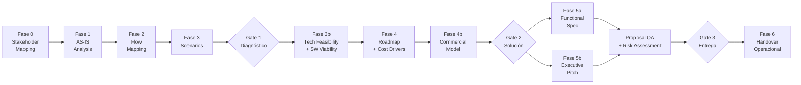

# Sofka Discovery Framework v6.2.0

Framework de discovery técnico empresarial para Claude Code — 48 skills especializados, 8 agentes dream team, pipeline de 8 fases con 3 quality gates.

---

## Quick Start

```bash
# Instalar plugin
claude --plugin-dir ./sofka-discovery-framework

# Pipeline guiado (recomendado primera vez)
/sofka-discovery-framework:discovery

# Ejecución autónoma (piloto-auto por defecto)
/sofka-discovery-framework:discovery-auto

# Revisión de entregables existentes
/sofka-discovery-framework:discovery-review

# Mejora iterativa de artefactos
/sofka-discovery-framework:discovery-improve
```

**Parámetros globales:**

| Parámetro | Valores | Default | Descripción |
|-----------|---------|---------|-------------|
| `MODO` | `piloto-auto`, `desatendido`, `supervisado`, `paso-a-paso` | `piloto-auto` | Nivel de intervención humana |
| `FORMATO` | `markdown`, `html`, `docx`, `dual` | `markdown` | Formato de salida |
| `VARIANTE` | `ejecutiva`, `técnica` | `técnica` | Ejecutiva ~40% longitud, técnica completa |
| `ADJUNTOS` | rutas de archivo | — | Documentación cliente para análisis |
| `PROFUNDIDAD` | `express`, `standard`, `deep` | `standard` | Granularidad del análisis |

---

## Arquitectura del Pipeline

### Fases y Quality Gates



### Criterios por Gate

| Gate | Fase | Criterios clave |
|------|------|----------------|
| **G1 — Diagnóstico** | Post Fase 3 | Stakeholders mapeados, AS-IS validado, flujos documentados, escenarios priorizados |
| **G2 — Solución** | Post Fase 4b | Feasibility ≥3.5/5.0, viabilidad SW confirmada, roadmap con cost drivers, modelo comercial definido |
| **G3 — Entrega** | Post QA + Risk | Proposal QA ≥3.5/5.0, risk assessment completo, spec funcional aprobada, pitch ejecutivo listo |

### Pausas automáticas (piloto-auto)

El modo `piloto-auto` detiene la ejecución ante: quality gates, ambigüedades de requisitos, QA failure, supuestos críticos sin validar, deriva de magnitudes >10%.

---

## Catálogo de Skills (48)

### 1. Discovery Pipeline (16)

| Skill | Fase | Entregable |
|-------|------|------------|
| `discovery-orchestrator` | — | Orquestación end-to-end del pipeline |
| `mermaid-diagramming` | — | Diagramas Mermaid (C4, gantt, quadrant, sequence, ER, state) |
| `stakeholder-mapping` | 0 | Mapa de stakeholders, matriz poder/interés |
| `workshop-facilitator` | 0-5 | Facilitación de workshops transversales |
| `asis-analysis` | 1 | Diagnóstico AS-IS, pain points, deuda técnica |
| `dynamic-sme` | 1-3 | Simulación de experto de dominio por industria |
| `flow-mapping` | 2 | Flujos de proceso actuales y TO-BE |
| `scenario-analysis` | 3 | Escenarios priorizados con trade-offs |
| `technical-feasibility` | 3b | Validación de factibilidad técnica ≥3.5/5.0 |
| `software-viability` | 3b | Forensics de viabilidad de software |
| `solution-roadmap` | 4 | Roadmap con fases, hitos y dependencias |
| `cost-estimation` | 4 | Inductores de costo + magnitudes (5% innovación) |
| `commercial-model` | 4b | Earned value, JV, usage-based, hybrid |
| `functional-spec` | 5a | Especificación funcional con criterios de aceptación |
| `executive-pitch` | 5b | Pitch ejecutivo con narrativa de valor |
| `discovery-handover` | 6 | Handover operacional completo |

### 2. Architecture Design (8)

| Skill | Propósito |
|-------|-----------|
| `software-architecture` | Arquitectura de software (patrones, ADRs, C4) |
| `architecture-tobe` | Diseño de estado futuro TO-BE |
| `enterprise-architecture` | Arquitectura empresarial (TOGAF, capacidades) |
| `solutions-architecture` | Arquitectura de solución end-to-end |
| `infrastructure-architecture` | Infraestructura, redes, compute |
| `devsecops-architecture` | CI/CD, seguridad integrada, IaC |
| `design-system` | Sistema de diseño (tokens, componentes, guías) |
| `functional-toolbelt` | Herramientas funcionales para análisis |

### 3. Data Strategy (7)

| Skill | Propósito |
|-------|-----------|
| `data-science-architecture` | ML/AI pipelines, feature stores, MLOps |
| `bi-architecture` | BI, dashboards, semantic layer |
| `data-engineering` | ETL/ELT, data pipelines, streaming |
| `database-architecture` | Modelado relacional, NoSQL, particionamiento |
| `data-governance` | Políticas, linaje, catálogo de datos |
| `data-quality` | Reglas de calidad, profiling, observabilidad |
| `analytics-engineering` | dbt, métricas, modelos analíticos |

### 4. Cloud & Mobile (4)

| Skill | Propósito |
|-------|-----------|
| `cloud-native-architecture` | Microservicios, serverless, containers |
| `cloud-migration` | Estrategia de migración (6Rs), landing zones |
| `mobile-architecture` | Nativo, cross-platform, offline-first |
| `mobile-assessment` | Evaluación de madurez mobile |

### 5. Engineering Excellence (5)

| Skill | Propósito |
|-------|-----------|
| `api-architecture` | REST, GraphQL, gRPC, API gateway |
| `event-architecture` | Event-driven, CQRS, event sourcing |
| `security-architecture` | Zero trust, IAM, threat modeling |
| `performance-engineering` | Benchmarks, SLOs, capacity planning |
| `observability` | Logs, métricas, trazas, alertas |

### 6. Consulting & Quality (3)

| Skill | Propósito |
|-------|-----------|
| `quality-engineering` | Estrategia de calidad, automation frameworks |
| `testing-strategy` | Pirámide de testing, shift-left, contract tests |
| `user-representative` | Voz del usuario, journey maps, personas |

### 7. Governance & Risk (2)

| Skill | Propósito |
|-------|-----------|
| `project-program-management` | Gobernanza PMO, phase gates, orquestación de recursos |
| `risk-controlling-dynamics` | Stress-testing de supuestos, pre-mortem, controles financieros |

### 8. Delivery & Brand (3)

| Skill | Propósito |
|-------|-----------|
| `html-brand` | Entregables HTML con Sofka Design System |
| `ux-writing` | Microcopy, naming, voz del producto |
| `roadmap-poc` | POC planning, criterios go/no-go |

---

## Dream Team (8 Agentes)

| Agente | Rol | Fases principales |
|--------|-----|-------------------|
| `discovery-conductor` | Orquestador principal, gestión de comité, plan maestro | Todas |
| `technical-architect` | Decisiones de arquitectura, ADRs, C4, feasibility | 3b, 4, 5a |
| `domain-analyst` | Dominio de negocio, procesos, reglas, AS-IS | 1, 2, 3 |
| `full-stack-generalist` | Implementación transversal, prototipos, POCs | 3b, 4 |
| `delivery-manager` | Roadmap, dependencias, riesgos de entrega | 4, 4b, 6 |
| `quality-guardian` | Quality gates, Proposal QA, métricas de calidad | G1, G2, G3 |
| `data-strategist` | Datos, analytics, ML, gobernanza de información | 1-4 |
| `change-catalyst` | Gestión del cambio, adopción, stakeholder alignment | 0, 5b, 6 |

El `discovery-conductor` es el agente default del plugin (`settings.json`). Coordina la activación on-demand de skills según hallazgos del discovery.

---

## Output Excellence

### Formatos de salida

| Formato | Características |
|---------|----------------|
| `markdown` (default) | Estándar markdown-excellence: TL;DR, tablas con semáforo 🟢/🟡/🔴, Mermaid, footnotes, callouts |
| `html` | Sofka Design System, Mermaid vía CDN, archivo autocontenido |
| `docx` | Markdown compatible con Pandoc, portada, TOC automático |
| `dual` | Markdown + HTML por cada entregable |

### Variantes A/B

| Variante | Audiencia | Extensión |
|----------|-----------|-----------|
| `técnica` (default) | Equipos técnicos, arquitectos | 100% — detalle completo |
| `ejecutiva` | C-level, sponsors, stakeholders no técnicos | ~40% — resumen ejecutivo con KPIs y decisiones |

### Modos de ejecución (HITL)

| Modo | Comportamiento |
|------|---------------|
| `piloto-auto` (default) | Autónomo en rutina; pausa en gates, ambigüedades, riesgos críticos |
| `desatendido` | Zero interrupciones, auto-resolución total |
| `supervisado` | Autónomo con reportes en cada milestone |
| `paso-a-paso` | Confirmación antes de cada sección/fase |

### Diagramas Mermaid por entregable

Cada skill prescribe tipos de diagrama específicos: C4 para arquitectura, gantt para roadmaps, quadrant para priorización, sequence para flujos, ER para datos, state para máquinas de estado.

---

## NL-HP v3.0 Prompts (16)

Prompts de alta densidad (Natural Language — High Performance) con referencias cruzadas, criterios de aceptación y 10x quality density.

### Documentos (10)

| # | Prompt | Skill asociado |
|---|--------|----------------|
| 1 | Mapa de Stakeholders | `stakeholder-mapping` |
| 2 | Diagnóstico AS-IS | `asis-analysis` |
| 3 | Mapeo de Flujos | `flow-mapping` |
| 4 | Análisis de Escenarios | `scenario-analysis` |
| 5 | Factibilidad Técnica | `technical-feasibility` |
| 6 | Viabilidad de Software | `software-viability` |
| 7 | Roadmap de Solución | `solution-roadmap` |
| 8 | Inductores de Costo | `cost-estimation` |
| 9 | Especificación Funcional | `functional-spec` |
| 10 | Pitch Ejecutivo | `executive-pitch` |

### Flujos (3)

| # | Prompt | Skill asociado |
|---|--------|----------------|
| 11 | Discovery Completo | `discovery-orchestrator` |
| 12 | Modelo Comercial | `commercial-model` |
| 13 | Handover Operacional | `discovery-handover` |

### Operaciones (3)

| # | Prompt | Skill asociado |
|---|--------|----------------|
| 14 | Workshop Facilitación | `workshop-facilitator` |
| 15 | SME Dinámico | `dynamic-sme` |
| 16 | Diagramación Mermaid | `mermaid-diagramming` |

Ubicación: `/prompts-for-discovery/sofka/` (17 archivos incluyendo README).

---

## Excellence Loop

Rúbrica de 10 criterios aplicada a cada skill y agente del framework.

| # | Criterio | Descripción |
|---|----------|-------------|
| 1 | **Completitud** | Cubre todos los aspectos del dominio sin omisiones |
| 2 | **Autocontención** | Funciona sin dependencias externas ni cross-references |
| 3 | **Estructura** | Frontmatter, secciones S1-S6, progressive disclosure |
| 4 | **Accionabilidad** | Produce artefactos concretos, no solo análisis |
| 5 | **Trade-offs** | Documenta tensiones y decisiones explícitas |
| 6 | **Edge Cases** | Maneja escenarios límite y excepciones |
| 7 | **Validation Gate** | Criterios de aceptación medibles |
| 8 | **Límites** | Declara lo que NO hace el skill |
| 9 | **Densidad** | Máxima información por línea, zero filler |
| 10 | **Cross-References** | Referencias a skills relacionados para composición |

Cada skill: 240-283 líneas. Progressive disclosure vía `references/` y `agents/`.

---

## Filosofía de Costos

> **Costear ≠ Cobrar**

El framework produce **inductores de costo, drivers de esfuerzo e indicadores de magnitud** — nunca precios finales. Las magnitudes incluyen un 5% de margen de innovación para excelencia operacional. El modelo comercial identifica estructuras de captura de valor (earned value, JV, usage-based, hybrid), no pricing.

---

## Estructura de Directorios

```
sofka-discovery-framework/
├── settings.json              # Agente default: discovery-conductor
├── LICENSE                    # Propietario — Sofka Technologies
├── CHANGELOG.md               # Historial de versiones
├── README.md                  # Este archivo
├── agents/                    # 8 agentes dream team
│   ├── discovery-conductor.md
│   ├── technical-architect.md
│   ├── domain-analyst.md
│   ├── full-stack-generalist.md
│   ├── delivery-manager.md
│   ├── quality-guardian.md
│   ├── data-strategist.md
│   └── change-catalyst.md
├── commands/                  # 4 comandos
│   ├── discovery.md
│   ├── discovery-auto.md
│   ├── discovery-review.md
│   └── discovery-improve.md
├── hooks/
│   └── hooks.json
└── skills/                    # 48 skills en 8 dominios
    ├── discovery-orchestrator/
    │   ├── SKILL.md
    │   ├── agents/
    │   ├── examples/
    │   └── references/
    │       ├── markdown-excellence.md
    │       └── template-catalog.md
    ├── stakeholder-mapping/
    ├── ... (46 más)
    └── workshop-facilitator/
```

---

## Historial de Versiones

| Versión | Fecha | Cambios principales |
|---------|-------|---------------------|
| **6.2.0** | 2026-03-12 | 48 skills, 8 dominios, Governance & Risk, Proposal QA pre-G3, 4 comandos |
| **6.1.0** | 2026-03-12 | +`project-program-management`, +`risk-controlling-dynamics`, checkpoint Proposal QA |
| **6.0.0** | 2026-03-12 | Markdown-first, Mermaid, A/B variantes, piloto-auto, NL-HP v3.0, 5% innovación |
| **3.0.0** | 2026-03-11 | 30 skills nuevos (6 dominios), catálogo de skills, Expert Panel |
| **2.0.0** | 2026-03-11 | 4 comandos, 8 agentes dream team, Excellence Loop |
| **1.0.0** | 2026-03-10 | Release inicial — 11 skills, 3 quality gates |

Ver [CHANGELOG.md](CHANGELOG.md) para detalle completo.

---

## Equipo

**Autor:** Javier Montaño
**Equipo:** PreSales Sofka

---

<sub>Copyright &copy; 2026 Sofka Technologies. All Rights Reserved. Proprietary.<br>
See <a href="LICENSE">LICENSE</a> for details.</sub>
