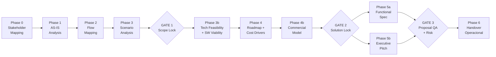

# MetodologIA Discovery Framework v10.0

[](https://www.gnu.org/licenses/gpl-3.0)

**Framework de discovery técnico y consultoría para Claude Code — copyleft, para el profesional en la era de la IA.**

57 skills (MOAT standard) · 12 agentes · 21 comandos · 59 prompts NL-HP · 8 fases de pipeline · 3 quality gates · markdown-first con Mermaid

---

## Quick Start

```bash
# Instalar como plugin de Claude Code
claude --plugin-dir ./metodologia-discovery-framework

# Pipeline guiado (interactivo)
/metodologia-discovery-framework:discovery

# Ejecución autónoma (piloto-auto)
/metodologia-discovery-framework:discovery-auto

# Mejora de entregables existentes
/metodologia-discovery-framework:discovery-improve

# Revisión de calidad
/metodologia-discovery-framework:discovery-review
```

**Ejecución mínima:**
```
/metodologia-discovery-framework:discovery-auto CLIENTE="Acme Corp" SECTOR="fintech" VARIANTE=ejecutiva
```

---

## Architecture Overview

### Pipeline de 8 fases



### Quality Gates

| Gate | Fase | Criterio | Acción si falla |
|------|------|----------|-----------------|
| **Gate 1** — Scope Lock | Post-Phase 3 | Alcance validado, escenarios priorizados, stakeholders alineados | Iterar fases 1-3 |
| **Gate 2** — Solution Lock | Post-Phase 4b | Roadmap viable, drivers costeados, modelo comercial coherente | Revisar fases 4-4b |
| **Gate 3** — Proposal QA | Post-Phase 5 | Spec completa, pitch alineado, riesgos mitigados | Ajustar entregables 5a/5b |

---

## Skills Catalog — 57 skills en 9 dominios (MOAT standard)

| Dominio | # | Skills |
|---------|---|--------|
| **Discovery Pipeline** | 16 | discovery-orchestrator, mermaid-diagramming, stakeholder-mapping, workshop-facilitator, asis-analysis, dynamic-sme, flow-mapping, scenario-analysis, technical-feasibility, software-viability, solution-roadmap, cost-estimation, commercial-model, functional-spec, executive-pitch, discovery-handover |
| **Architecture Design** | 8 | software-architecture, architecture-tobe, enterprise-architecture, solutions-architecture, infrastructure-architecture, devsecops-architecture, design-system, functional-toolbelt |
| **Data Strategy** | 7 | data-science-architecture, bi-architecture, data-engineering, database-architecture, data-governance, data-quality, analytics-engineering |
| **Cloud & Mobile** | 5 | cloud-native-architecture, cloud-migration, cloud-service-discovery, mobile-architecture, mobile-assessment |
| **Engineering Excellence** | 5 | api-architecture, event-architecture, security-architecture, performance-engineering, observability |
| **Consulting & Quality** | 4 | quality-engineering, testing-strategy, user-representative, qa-service-discovery |
| **Governance & Risk** | 2 | project-program-management, risk-controlling-dynamics |
| **Service Discovery** | 7 | ai-center-discovery, bi-analytics-discovery, digital-transformation-discovery, management-discovery, mentoring-training-discovery, mini-apps-discovery, rpa-discovery, staff-augmentation-discovery, ux-design-discovery |
| **Delivery & Brand** | 3 | html-brand, ux-writing, roadmap-poc |

**Total: 57 skills** — cada uno MOAT compliant (SKILL.md + examples/ + prompts/).

### Anatomía de un skill

Cada skill sigue una estructura estandarizada:

- **Frontmatter**: name, description (trigger phrases), model: opus, context: fork
- **Secciones**: Inputs ($ARGUMENTS), When to Use/NOT, Steps S1-S6, Trade-offs, Assumptions, Limits, Edge Cases, Validation Gate
- **Cross-References**: skills relacionados (sin dependencia directa)
- **Output Artifact**: entregable concreto por skill
- **Extensión**: 240-283 líneas; progressive disclosure via references/ + agents/

---

## Dream Team — 12 Agentes

| Agente | Rol | Fases principales |
|--------|-----|-------------------|
| **discovery-conductor** | Orquestador autónomo del pipeline completo | Todas — coordina secuencia, gates y HITL |
| **domain-analyst** | Análisis de dominio, AS-IS, flujos de negocio | 0, 1, 2 |
| **technical-architect** | Arquitectura, feasibility, viabilidad de software | 3b, 4 |
| **data-strategist** | Stack de datos, BI, gobernanza, calidad | 3b, 4 |
| **quality-guardian** | Quality gates, testing strategy, QA de propuesta | Gates 1-3 |
| **delivery-manager** | Roadmap, estimación, gestión de programa | 4, 4b, 6 |
| **change-catalyst** | Gestión del cambio, adopción, stakeholder alignment | 0, 3, 5b |
| **full-stack-generalist** | Cobertura cross-cutting: APIs, seguridad, observabilidad | Todas según necesidad |
| **ai-strategist** | AI/ML strategy, MLOps maturity, model governance | {TIPO_SERVICIO}=Data-AI |
| **process-automation-specialist** | RPA, process mining, bot architecture | {TIPO_SERVICIO}=RPA |
| **qa-strategist** | TMMi maturity, test factory, QA CoE | {TIPO_SERVICIO}=QA |
| **transformation-architect** | Multi-service program design, digital maturity | {TIPO_SERVICIO}=Digital-Transformation |

Todos los agentes siguen el estándar de 4 secciones: **Core Responsibilities**, **Assigned Skills**, **Output Configuration**, **Escalation Triggers**.

El **discovery-conductor** opera en modo `piloto-auto` por defecto: ejecuta autónomamente el trabajo rutinario y solicita input humano solo en gates y ambigüedades.

---

## Output Excellence

### Formatos de salida

| Formato | Default | Descripción |
|---------|---------|-------------|
| `markdown` | **Si** | Markdown-excellence standard: TL;DR, tablas con semáforo, Mermaid, footnotes |
| `html` | | MetodologIA Design System, Mermaid via CDN, self-contained |
| `docx` | | Pandoc-compatible markdown con portada, TOC |
| `dual` | | Ambos markdown + html por entregable |

### Variantes A/B

| Variante | Extensión | Audiencia |
|----------|-----------|-----------|
| `ejecutiva` | ~40% del contenido | C-level, sponsors, decisores |
| `técnica` | 100% del contenido | Equipos técnicos, arquitectos, leads |

### Modos de ejecución (HITL)

| Modo | Default | Comportamiento |
|------|---------|----------------|
| `piloto-auto` | **Si** | Autónomo en rutina, HITL en gates y ambigüedades |
| `desatendido` | | Cero interrupciones, todo auto-resuelto |
| `supervisado` | | Autónomo con reportes en hitos |
| `paso-a-paso` | | Confirma antes de cada sección/fase |

### Mermaid diagrams por entregable

Cada deliverable genera diagramas Mermaid específicos: C4 (architecture), gantt (roadmap), quadrant (priorización), sequence (flujos), ER (datos), state (estados de proceso).

---

## NL-HP v3.0 Prompts

59 prompts NL-HP v3.0 (uno por skill) + prompts de orquestación:

| Categoría | Cantidad | Contenido |
|-----------|----------|-----------|
| **Skills** | 57 | Un prompt NL-HP por skill (en `skills/*/prompts/prompt.md`) |
| **Flujos** | 3 | Orquestación, transiciones, escalamiento |
| **Operaciones** | 3 | Calidad, formatos, variantes |

Cada prompt codifica criterios de aceptación, anti-patrones y formato de salida. NL-HP = Natural Language High-Performance.

---

## Excellence Loop

Rúbrica de 10 criterios aplicada a **cada skill** del framework. Filosofía abierta: la excelencia se comparte, no se oculta.

| # | Criterio | Qué evalúa |
|---|----------|-------------|
| 1 | **Completitud** | Todas las secciones requeridas presentes |
| 2 | **Claridad** | Instrucciones sin ambigüedad, progressive disclosure |
| 3 | **Consistencia** | Estructura uniforme con el ecosistema |
| 4 | **Frontmatter** | name, description, model, context correctos |
| 5 | **Inputs** | $ARGUMENTS definidos con defaults |
| 6 | **Validation Gate** | Criterios de aceptación del output |
| 7 | **Edge Cases** | Escenarios límite documentados |
| 8 | **Cross-References** | Skills relacionados correctamente enlazados |
| 9 | **Output Artifact** | Entregable concreto y verificable |
| 10 | **Anti-patrones** | Qué NO hacer, explícitamente listado |

Registro: `EXCELLENCE_LOOP_LOG.md` — historial de auditorías por skill.

> La excelencia no es un secreto corporativo. Es una metodología abierta para el profesional en la era de la IA.

---

## Parameters

Parámetros aceptados por los comandos del framework:

| Parámetro | Valores | Default | Descripción |
|-----------|---------|---------|-------------|
| `CLIENTE` | string | — | Nombre del cliente/proyecto |
| `SECTOR` | string | — | Industria o vertical |
| `VARIANTE` | `ejecutiva` \| `técnica` | `técnica` | Nivel de detalle del output |
| `FORMATO` | `markdown` \| `html` \| `docx` \| `dual` | `markdown` | Formato de salida |
| `MODO` | `piloto-auto` \| `desatendido` \| `supervisado` \| `paso-a-paso` | `piloto-auto` | Nivel de intervención humana |
| `FASE_INICIO` | `0`-`6` | `0` | Fase de inicio (para retomar) |
| `FASE_FIN` | `0`-`6` | `6` | Fase de fin (para ejecución parcial) |

---

## Cost Philosophy

> **Costear ≠ Cobrar.**

Este framework produce **drivers de costo, inductores de esfuerzo e indicadores de magnitud** — nunca precios finales.

- **Drivers**: factores que mueven el costo (complejidad, integraciones, volumen de datos, regulación)
- **Inductores**: unidades de esfuerzo (story points, sprints, FTEs, horas por rol)
- **Magnitudes**: rangos T-shirt (S/M/L/XL) con bandas porcentuales
- **Margen de innovación**: 5% adicional en magnitudes para excelencia operacional
- **Modelo comercial**: identifica estructuras de captura de valor (earned value, JV, usage-based, híbrido) — no pricing

---

## Directory Structure

```
metodologia-discovery-framework/
├── README.md
├── LICENSE                          # GPL-3.0
├── CHANGELOG.md
├── EXCELLENCE_LOOP_LOG.md           # Auditoría por skill
├── settings.json                    # Configuración del plugin
├── skills/                          # 57 skills (MOAT standard)
│   ├── discovery-orchestrator/      #   Each: SKILL.md + examples/ + prompts/
│   ├── stakeholder-mapping/
│   ├── asis-analysis/
│   ├── ... (57 total)
│   └── roadmap-poc/
├── agents/                          # 12 agentes estandarizados
│   ├── discovery-conductor.md       #   Each: Core Responsibilities, Assigned Skills,
│   ├── domain-analyst.md            #         Output Configuration, Escalation Triggers
│   ├── technical-architect.md
│   ├── ... (12 total)
│   └── transformation-architect.md
├── commands/                        # 21 comandos
│   ├── discovery.md                 #   4 flows + 10 documents + 4 service-type + 3 ops
│   ├── discovery-auto.md
│   ├── ... (21 total)
│   └── rescue.md
├── references/                      # Priming RAG + service matrix
│   ├── priming-rag/
│   └── service-type-matrix.md
└── hooks/                           # SessionStart hook
```

---

## Contributing

MetodologIA Discovery Framework es **open-source bajo copyleft** (GPL-3.0). Contribuciones bienvenidas.

### Cómo contribuir

1. **Fork** del repositorio
2. **Branch** con prefijo: `feat/`, `fix/`, `docs/`
3. **Cada skill** debe pasar los 10 criterios del Excellence Loop
4. **PR** con descripción del cambio y skill(s) afectado(s)

### Guías

- Cada skill es 100% self-contained — sin dependencias cruzadas
- Frontmatter obligatorio: name, description, model: opus, context: fork
- Extensión: 240-283 líneas por skill
- Spanish-first en documentación y prompts
- Anti-patrones explícitos en cada skill

### Filosofía

Este framework existe porque la consultoría técnica de calidad no debería ser un privilegio corporativo. La metodología es abierta. El conocimiento se comparte. El profesional en la era de la IA merece herramientas de nivel enterprise sin barreras de acceso.

---

## License

**GNU General Public License v3.0** (Copyleft)

Este software es libre: puedes redistribuirlo y/o modificarlo bajo los términos de la GNU GPL v3.0 publicada por la Free Software Foundation.

**Copyleft significa**: cualquier trabajo derivado debe mantener la misma licencia. El conocimiento que se construye sobre este framework permanece abierto.

Ver [LICENSE](LICENSE) para el texto completo.

---

<p align="center">
<strong>MetodologIA Discovery Framework v10.0</strong><br>
© Javier Montaño, MetodologIA · GPL-3.0 (Copyleft)<br>
<a href="https://metodologia.info">metodologia.info</a><br>
<em>Para el profesional en la era de la IA.</em>
</p>
