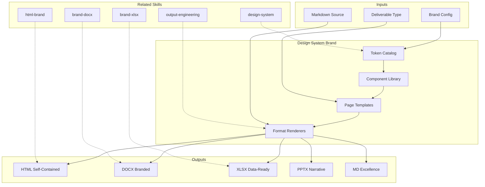

# MetodologIA Design System Brand — Full-Fidelity Multi-Format Output Templates

Produces production-ready deliverables in 5 formats (HTML, DOCX, XLSX, PPTX, MD) using the canonical MetodologIA Design System v5. Every output is brand-compliant, accessible, self-contained, and ready for client delivery without manual intervention.

## TL;DR

- Sistema de diseño extraido de 14 deliverables HTML de produccion (22,378 lineas) y consolidado en un token catalog canonical
- 5 formatos de salida: HTML (self-contained), DOCX (Pandoc-ready), XLSX (openpyxl-ready), PPTX (python-pptx-ready), MD (markdown-excellence)
- 126 componentes CSS catalogados con variantes, estados y responsive breakpoints
- 4 tipos de pagina: Dark-First Executive, Light-First Technical, Timeline/Roadmap, Commercial
- Brand compliance automatica: tokens CSS, tipografia, color semantics, accessibility WCAG AA

## Principio Rector

**Un entregable sin identidad de marca es ruido visual. Un entregable con MetodologIA Design System v5 es una experiencia profesional que transmite autoridad, claridad y confianza.** Cada token, cada componente, cada pixel existe para comunicar que detras del documento hay metodo, no improvisacion.

## Inputs

- `$1` — Target format: `html`, `docx`, `xlsx`, `pptx`, `md`, `all`
- `$2` — Deliverable type (optional): `executive-pitch`, `technical-spec`, `roadmap`, `analysis`, `handover`, `commercial`, `findings`, `generic`

Parse from `$ARGUMENTS`. Si no se especifica formato, default `html`. Si no se especifica tipo, inferir del contenido.

## Parametros

| Parametro | Valores | Default | Efecto |
|-----------|---------|---------|--------|
| `{FORMATO}` | `html` `docx` `xlsx` `pptx` `md` `all` | `html` | Formato de salida |
| `{TIPO_PAGINA}` | `dark-executive` `light-technical` `timeline` `commercial` | Auto-detect | Template base |
| `{VARIANTE}` | `ejecutiva` `tecnica` `dual` | `tecnica` | Nivel de detalle |
| `{INTERACTIVO}` | `si` `no` | `si` (HTML) | Modals, accordions, scroll animations |

## Entregables

1. **HTML Self-Contained** — Archivo unico con CSS inline, SVG inline, Mermaid CDN, WCAG AA, responsive, print-ready
2. **DOCX Branded** — Cover page, TOC auto, headers/footers branded, tablas zebra, semaforo preservado
3. **XLSX Data-Ready** — Sheets con headers branded, conditional formatting, filtros, pivot-compatible
4. **PPTX Narrative** — Slide master branded, max 20 slides executive / 30 technical, speaker notes
5. **MD Excellence** — Markdown-excellence standard con Mermaid, cross-references, evidence tags

## Design System v5 — Token Catalog

### Colores Core

| Token | Valor | Uso |
|-------|-------|-----|
| `--mia-navy` | `#0A122A` | Background profundo, hero, secciones dark |
| `--mia-navy-light` | `#111D3A` | Superficies elevadas en dark mode |
| `--mia-navy-mid` | `#1e293b` | Card backgrounds, gradient endpoint |
| `--mia-blue` | `#137DC5` | Accion primaria, links, info |
| `--mia-blue-light` | `#38BDF8` | Hover states, acentos secundarios |
| `--mia-gold` | `#FFD700` | CTA, acento, indicadores de exito — CANONICAL |
| `--mia-gold-dark` | `#B8860B` | Gold variant para secciones claras |
| `--mia-white` | `#FFFFFF` | Texto sobre dark, fondos puros |
| `--mia-offwhite` | `#F8F9FC` | Fondos de secciones claras |
| `--mia-text` | `#C8D1E0` | Texto body sobre dark |
| `--mia-text-muted` | `#8892A8` | Metadata, captions sobre dark |
| `--mia-dark-text` | `#1F2833` | Texto body sobre light |
| `--mia-positive` | `#42D36F` | Exito, completado, ganado |
| `--mia-warning` | `#F59E0B` | Precaucion, riesgo |
| `--mia-critical` | `#EF4444` | Peligro, error, perdido |
| `--mia-info` | `#3B82F6` | Informacion, nuevo |

### Tipografia

| Familia | Uso | Carga |
|---------|-----|-------|
| Poppins | Display, headings, nav, buttons | Google Fonts wght@300-900 |
| Montserrat | Body alternativo | Google Fonts wght@400-700 |

### Espaciado y Bordes

| Token | Valor | Uso |
|-------|-------|-----|
| `--radius-sm` | `8px` | Inputs, badges |
| `--radius-md` | `12px` | Cards, callouts |
| `--radius-lg` | `16px` | Modals, sections |
| `--radius-xl` | `24px` | Hero elements, CTAs |

### Sombras

| Token | Valor | Uso |
|-------|-------|-----|
| `--shadow-sm` | `0 1px 3px rgba(0,0,0,0.12)` | Subtle elevation |
| `--shadow-md` | `0 4px 16px rgba(0,0,0,0.15)` | Cards, buttons |
| `--shadow-lg` | `0 12px 40px rgba(0,0,0,0.25)` | Modals, overlays |
| `--shadow-card` | `0 2px 8px rgba(0,0,0,0.08), 0 8px 24px rgba(0,0,0,0.06)` | Standard card |
| `--shadow-glow-gold` | `0 0 30px rgba(255,215,0,0.10)` | Gold accent glow |

## Componentes (126 clases, 16 categorias)

### Hero (12 variantes)
`.hero`, `.hero-inner`, `.hero-content`, `.hero-brand`, `.hero-tagline`, `.hero-title`, `.hero-subtitle`, `.hero-kpis`, `.hero-kpi`, `.hero-cta-group`, `.hero-punchline`, `.hero-logo`

### Navegacion (5 variantes)
`.toc-sticky`, `.toc-inner`, `.toc-link`, `.nav-link`, sticky-nav con `backdrop-filter: blur(10px)`

### Secciones (7 variantes)
`.section-dark`, `.light`, `.section-header`, `.section-number`, `.section-title`, `.section-subtitle`, `.section-content`

### Cards (12 variantes)
`.card`, `.card-dark`, `.card-clickable`, `.card-gold`, `.card-accent`, `.card-icon`, `.card-title`, `.card-description`, `.card-meta`, `.card-click-hint`, `.card-grid-{2,3,4}`

### Modals (8 variantes)
`.modal-overlay`, `.modal-box`, `.modal-close`, `.modal-section`, `.modal-section.anticipation`, `.modal-section.resolution`, `.modal-section.success`, `.modal-badge-row`

### Badges y Callouts (10 variantes)
`.badge`, `.badge-{blue,gold,green,red,warning}`, `.callout`, `.callout-{blue,gold,green,red}`, `.punchline`

### Datos (5 variantes)
`.pricing-table`, `.pricing-pair`, `.pricing-card`, `.scoring-table`, `.table-wrapper`

### Interaccion (12 variantes)
`.contrast-row`, `.contrast-box.{today,future}`, `.micro-commit`, `.evolution-steps`, `.phase-grid`, `.phase-block`, `.timeline`, `.timeline-item`, `.faq-item`, `.faq-question`, `.faq-answer`

### Botones (5 variantes)
`.btn`, `.btn-primary`, `.btn-secondary`, `.cta-button`, `.cta-button.gold`

### KPIs (5 variantes)
`.kpi-card`, `.kpi-box`, `.kpi-value`, `.kpi-label`, `.kpi-strip`

### Footer (7 variantes)
`.footer`, `.footer-inner`, `.footer-brand`, `.footer-logo`, `.footer-id`, `.footer-code`, `.footer-cta`

## Tipos de Pagina

### A — Dark-First Executive (Pitch, Handover)
```
Hero (full dark, KPIs, CTAs)
  → Section dark (cards clickables con modals)
  → Section light (dream team, business case)
  → Section dark (timeline, phases)
  → Section light (pricing, ROI)
  → Section dark (FAQ con modals)
  → CTA final + Footer
```

### B — Light-First Technical (Spec, AS-IS, Flujos)
```
Hero compacto → Sticky TOC
  → Sections alternando light/dark
  → Data tables, scoring matrices
  → Callouts tecnicos, badges
  → FAQ accordion
  → Footer con document ID
```

### C — Timeline/Roadmap (Plan, Roadmap, Escenarios)
```
Hero con KPIs → Phase grid
  → Timeline components
  → Evolution steps
  → Milestone markers
  → Footer
```

### D — Commercial (Guia Comercial)
```
Hero con pricing KPIs → Sticky TOC
  → Pricing tables con highlight rows
  → ROI cards grid
  → Reseller comparison
  → FAQ accordion → CTA
  → Footer
```

## Proceso

1. **Identificar tipo** — Detectar tipo de deliverable (A/B/C/D) del contenido
2. **Seleccionar formato** — HTML / DOCX / XLSX / PPTX / MD segun $1
3. **Aplicar template** — Cargar estructura base del tipo detectado
4. **Poblar tokens** — Inyectar paleta, tipografia, componentes
5. **Renderizar contenido** — Mapear contenido al template con componentes correctos
6. **Validar brand** — Verificar compliance: tokens, accesibilidad, responsive
7. **Producir archivo** — Generar archivo self-contained y production-ready

## Formato HTML — Especificacion Detallada

### Estructura Base
```html
<!DOCTYPE html>
<html lang="es">
<head>
  <meta charset="UTF-8">
  <meta name="viewport" content="width=device-width, initial-scale=1.0">
  <title>{titulo} — MetodologIA</title>
  <link href="https://fonts.googleapis.com/css2?family=Poppins:wght@300;400;500;600;700;800;900&family=Montserrat:wght@400;500;600;700&display=swap" rel="stylesheet">
  <style>
    :root { /* Token catalog completo */ }
    /* Reset + Base + Components + Responsive + Animations */
  </style>
</head>
<body>
  <!-- Sticky Nav (optional) -->
  <!-- Hero -->
  <!-- Sections (alternating dark/light) -->
  <!-- Modals (if interactive) -->
  <!-- Footer -->
  <script>/* IntersectionObserver + Modal handlers + TOC tracking */</script>
</body>
</html>
```

### Reglas Inmutables HTML
1. Self-contained: TODO inline (CSS, SVG, JS). Sin dependencias externas excepto Google Fonts y Mermaid CDN
2. WCAG AA: contraste >= 4.5:1, semantic HTML, aria labels, focus-visible
3. Responsive: mobile-first, breakpoint 768px
4. Print-ready: `@media print` con page-break control
5. Hero siempre tiene gradiente radial overlay
6. Section numbers siempre en circulos con borde gold
7. Footer siempre tiene document ID code (MTIA-{NN}-{TIPO}-{CLIENTE}-SE)

## Formato DOCX — Especificacion Detallada

### Estructura
1. **Cover page**: Titulo, subtitulo, fecha, version, logo MetodologIA
2. **TOC**: Generado automaticamente desde heading hierarchy
3. **Headers**: Logo izquierda, titulo documento derecha
4. **Footers**: Pagina X de Y, copyright MetodologIA, document ID
5. **Content**: Heading styles branded (Poppins), body (Montserrat), tablas zebra
6. **Colores**: Navy headers, gold accents, semaforo en tablas

### Produccion via python-docx
```python
# Template de referencia
styles = {
    'Heading 1': {'font': 'Poppins', 'size': Pt(24), 'color': RGBColor(0x0A, 0x12, 0x2A), 'bold': True},
    'Heading 2': {'font': 'Poppins', 'size': Pt(18), 'color': RGBColor(0x13, 0x7D, 0xC5), 'bold': True},
    'Normal': {'font': 'Montserrat', 'size': Pt(11), 'color': RGBColor(0x1F, 0x28, 0x33)},
    'Table Header': {'bg': RGBColor(0x0A, 0x12, 0x2A), 'font_color': RGBColor(0xFF, 0xFF, 0xFF)},
}
```

## Formato XLSX — Especificacion Detallada

### Estructura
1. **Sheet "Resumen"**: KPIs, metricas clave, dashboard-ready
2. **Sheet "Datos"**: Tabla principal con filtros auto
3. **Sheet "Analisis"**: Matrices de evaluacion, scoring
4. **Sheets adicionales**: Segun dominio del skill

### Branding via openpyxl
```python
styles = {
    'header': PatternFill(fgColor='0A122A'), Font(color='FFFFFF', name='Poppins', bold=True),
    'gold_accent': PatternFill(fgColor='FFD700'), Font(color='0A122A'),
    'positive': Font(color='42D36F', bold=True),
    'warning': Font(color='F59E0B', bold=True),
    'critical': Font(color='EF4444', bold=True),
}
```

## Formato PPTX — Especificacion Detallada

### Slide Types
1. **Title Slide**: Fondo navy gradient, titulo gold, subtitulo white
2. **Section Divider**: Fondo navy, numero de seccion, titulo
3. **Content Slide**: Titulo + bullets o tabla
4. **Two-Column**: Comparacion, before/after
5. **Full Visual**: Diagrama, chart, o imagen full-slide
6. **KPI Slide**: 3-4 metricas grandes
7. **Closing Slide**: CTA, contacto, logo

### Branding via python-pptx
```python
slide_master = {
    'bg_dark': RGBColor(0x0A, 0x12, 0x2A),
    'title_font': 'Poppins',
    'title_size': Pt(36),
    'body_font': 'Montserrat',
    'body_size': Pt(18),
    'accent': RGBColor(0xFF, 0xD7, 0x00),  # Gold
    'primary': RGBColor(0x13, 0x7D, 0xC5),  # Blue
}
```

## Formato MD — Especificacion Detallada

### Markdown Excellence Standard
1. Frontmatter YAML con metadata
2. TL;DR en primeros 5 bullets
3. Mermaid diagrams embebidos
4. Evidence tags: [CODIGO], [CONFIG], [DOC], [INFERENCIA], [SUPUESTO]
5. Cross-references entre secciones
6. Tables alineadas, codigo fenced
7. Footer con autor, version, timestamp

## Criterios de Calidad

- [ ] Tokens CSS coinciden 100% con catalogo canonical (0 hardcodes)
- [ ] Contraste WCAG AA >= 4.5:1 en todo texto interactivo
- [ ] Responsive funcional en mobile (< 768px), tablet, desktop
- [ ] Self-contained: archivo unico sin dependencias rotas
- [ ] Brand compliance: gold para exito (NUNCA verde), navy para autoridad
- [ ] Print-ready: @media print con page-breaks correctos
- [ ] Accesibilidad: semantic HTML5, aria labels, focus-visible
- [ ] Cada formato preserva 100% del contenido sin perdida

## Supuestos y Limites

- Google Fonts (Poppins, Montserrat) requieren conexion a internet en HTML
- Mermaid diagrams en DOCX/PPTX se pre-renderizan como imagen o se describen textualmente
- XLSX no soporta narrativa — solo datos tabulares y matrices
- PPTX limite 20 slides executive, 30 technical para evitar fatiga de audiencia
- PDF se genera desde HTML via browser print o desde DOCX via LibreOffice

## Casos Borde

| Caso | Estrategia de Manejo |
|------|---------------------|
| HTML con >15 secciones | Sticky TOC obligatorio, scroll-to-top button, lazy render de modals |
| DOCX sin fuentes Poppins instaladas | Fallback a Calibri, nota de advertencia en cover page |
| XLSX con >10,000 filas | Sheets particionados, summary sheet con pivots |
| PPTX para audiencia bilingual | Slides en español, speaker notes en ingles |
| Contenido sin Mermaid pero skill lo requiere | Generar diagrama ASCII en MD, render visual en HTML |
| Offline delivery sin Google Fonts | Inline font subsets via base64 o usar system fonts |

## Decisiones y Trade-offs

| Decision | Alternativa Descartada | Justificacion |
|----------|----------------------|---------------|
| Gold #FFD700 como canonical (no #E5A100) | Variante ambar de Pitch v1 | 13/14 produccion HTML usan #FFD700; consistencia > preferencia individual |
| Self-contained HTML (no CSS externo) | Stylesheet compartido | Portabilidad: un archivo = funciona en cualquier contexto sin setup |
| Poppins + Montserrat (no Clash Grotesk) | Clash Grotesk (design system v3) | Poppins tiene mejor soporte de pesos (300-900) y disponibilidad Google Fonts |
| 4 tipos de pagina (no template unico) | Template universal adaptable | Cada tipo de deliverable tiene patrones estructurales distintos; forzar uno produce outputs genericos |

## Knowledge Graph



## Output Templates

### HTML (primary)
- Filename: `{fase}_{entregable}_{cliente}_{WIP}.html`
- Structure: self-contained, :root tokens, 126 components, responsive, WCAG AA
- Reference: `references/design-system-metodologia.md`

### DOCX
- Filename: `{fase}_{entregable}_{cliente}_{WIP}.docx`
- Structure: cover → TOC → sections → appendices
- Via: python-docx con brand styles

### XLSX
- Filename: `{fase}_{entregable}_{cliente}_{WIP}.xlsx`
- Structure: summary sheet → data sheets → analysis sheets
- Via: openpyxl con brand formatting

### PPTX
- Filename: `{fase}_{entregable}_{cliente}_{WIP}.pptx`
- Structure: title → agenda → findings → details → actions → closing
- Via: python-pptx con slide master branded

### Markdown
- Filename: `{fase}_{entregable}_{cliente}_{WIP}.md`
- Structure: frontmatter → TL;DR → sections → Mermaid → evidence tags

## Evaluacion

| Dimension | Peso | Criterio |
|-----------|------|----------|
| Trigger Accuracy | 10% | Activa ante "branded output", "HTML deliverable", "design system", "convert to DOCX" sin falsos positivos en styling generico |
| Completeness | 25% | Cubre 5 formatos con token compliance, 4 tipos de pagina, 126 componentes disponibles |
| Clarity | 20% | Token catalog es ejecutable sin ambiguedad; cada componente tiene ejemplo de uso |
| Robustness | 20% | Maneja offline, bilingual, >15 secciones, sin fuentes, >10K filas XLSX |
| Efficiency | 10% | Proceso de 7 pasos sin redundancia; cada paso produce artefacto verificable |
| Value Density | 15% | Cada token, componente y template es directamente usable en produccion |

**Umbral minimo**: 7/10 en cada dimension para considerar el skill production-ready.

## Cross-References

- **metodologia-output-engineering:** Ghost menu pipeline, orchestration de formatos
- **metodologia-html-brand:** Generacion HTML con Design System v4 (este skill lo supercede con v5)
- **metodologia-design-system:** Token catalog generico configurable (este skill lo especializa para MetodologIA)
- **metodologia-brand-docx:** Produccion DOCX via python-docx
- **metodologia-brand-xlsx:** Produccion XLSX via openpyxl
- **metodologia-executive-pitch:** Deliverable tipo A (Dark-First Executive)

---
**Autor:** Javier Montaño · Comunidad MetodologIA | **Version:** 1.0.0
