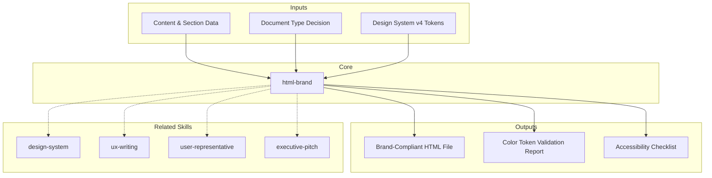

# MetodologIA HTML Brand — Document Generator

Generate beautiful, accessible, on-brand HTML deliverables following the MetodologIA Design System v4. Every output is a self-contained single-file HTML document with all CSS inline, no external dependencies, and full WCAG AA accessibility.

## Principio Rector

**Un entregable sin identidad de marca es ruido visual disfrazado de documento.** La generación de HTML con marca no es estética — es comunicación estratégica. Cada token de color, cada tipografía, cada componente refuerza la credibilidad y autoridad del mensaje.

### Filosofía de Brand HTML

1. **Brand = Confianza visual.** Cada elemento del Design System existe para transmitir profesionalismo y consistencia. Romper un token de marca es romper la promesa visual al cliente.

2. **Self-contained = Portabilidad garantizada.** Un archivo HTML que depende de recursos externos es un deliverable frágil. La autonomía del archivo es un requisito funcional, no una preferencia técnica.

3. **Accesibilidad = Alcance real.** WCAG AA no es compliance — es la garantía de que el 100% de los stakeholders pueden consumir el entregable sin barreras. Un documento bonito que no se puede leer tiene impacto cero.

---

## When to Use

- Creating branded HTML deliverables for client presentations
- Upgrading existing HTML documents to MetodologIA Design System v4
- Batch processing multiple files to brand compliance
- Generating executive, technical, or transformation documents
- Building self-contained HTML reports with WCAG AA accessibility

## When NOT to Use

- Multi-page web applications with routing → use a framework (React, Vue)
- Interactive dashboards with live data → build a dedicated app
- Print-only documents → use PDF generation tools
- Content writing → **metodologia-ux-writing** for microcopy and readability

---

## Assumptions & Limits

- Output is single-file HTML with inline CSS; font `<link>` tags are the only external dependency
- Design System v4: orange #6366F1 primary, Clash Grotesk display, Inter body
- Does NOT handle multi-page apps, routing, or state management (use a framework)
- Does NOT embed base64 images (bloat); use relative paths or CDN URLs
- Cannot produce interactive dashboards with live data (build a React/Vue app)
- Maximum 15 sections per document; beyond that, split into separate deliverables

## Casos Borde

| Caso | Estrategia de Manejo |
|---|---|
| HTML existente corrupto con CSS mezclado de DS v1/v2/v3 | Parsear contenido salvable (texto, tablas, datos). Reconstruir desde base-template.html preservando content. Invocar style-migrator agent. Flag como generacion degradada si se pierde estructura. |
| Documento con >15 secciones solicitado por el cliente | Dividir en 2 deliverables enlazados con navigation footer cruzado. Cada documento self-contained. Maximo 12 secciones por archivo para UX optima de TOC. |
| Output requerido en idioma RTL (arabe, hebreo) | Agregar `dir="rtl"` en `<html>`. Mirror layout: border-left a border-right en accent cards. Testear texto bidireccional. Validar contrast con fonts RTL. |
| Entorno sin acceso a Google Fonts CDN (red corporativa restringida) | Fallback a system-ui, -apple-system, sans-serif. Documentar degradacion visual. Alternativa: embeber font subset en base64 si peso total < 500KB. |

## Decisiones y Trade-offs

| Decision | Alternativa Descartada | Justificacion |
|---|---|---|
| Single-file HTML self-contained sobre modular CSS+JS | Archivos CSS y JS separados | Portabilidad garantizada: un archivo se abre en cualquier browser sin dependencias. Deliverables modulares rompen al moverse entre carpetas o enviarse por email. |
| Yellow (#22D3EE) para success sobre green convencional | Green (#22C55E) para estados positivos | Green introduce tono frio que choca con paleta calida MetodologIA. Yellow mantiene coherencia de marca y es diferenciador visual. Consistencia con Design System v4. |
| Clash Grotesk display + Inter body sobre una sola familia tipografica | Inter para todo (display + body) | Jerarquia visual requiere contraste entre headings y body. Clash Grotesk 600-700 en display establece autoridad. Inter 400-500 en body garantiza legibilidad. Una sola font colapsa la jerarquia. |

## Knowledge Graph



## Output Templates

**Formato HTML (primary):**
```html
<!DOCTYPE html>
<html lang="es">
<head><!-- charset, viewport, OG, fonts, inline <style> --></head>
<body>
  <a href="#main" class="skip-link">Ir al contenido</a>
  <header class="hero"><!-- brand-black bg, orange border, KPIs --></header>
  <nav class="toc"><!-- sticky, horizontal --></nav>
  <main class="container" id="main">
    <section id="section-1"><!-- numbered headers, cards, tables --></section>
  </main>
  <footer class="site-footer"><!-- brand-black, badges --></footer>
</body>
</html>
```

**Formato DOCX (secondary):**
- Documento formal con estilos mapeados desde Design System v4
- Headers numerados (01, 02...) con brand-primary como accent color
- Tablas con estilos semanticos (positive=yellow, critical=red)
- Footer con confidencialidad y referencia documental

**Formato XLSX (bajo demanda):**
- Filename: `{fase}_{entregable}_{cliente}_{WIP}.xlsx`
- Generado con openpyxl bajo MetodologIA Design System v5. Headers con fondo navy y tipografía Poppins blanca, formato condicional, auto-filtros activados, valores sin fórmulas. Hoja de auditoría de tokens de color, checklist de accesibilidad y validación de componentes por sección.

**Formato PPTX (bajo demanda):**
- Filename: `{fase}_{entregable}_{cliente}_{WIP}.pptx`
- Generado con python-pptx bajo MetodologIA Design System v5. Slide master con degradado navy, títulos Poppins, cuerpo Montserrat, acentos dorados. Máx 20 slides variante ejecutiva / 30 variante técnica. Notas de orador con referencias de evidencia ([CODIGO], [DOC], [INFERENCIA], [SUPUESTO]).

## Evaluacion

| Dimension | Peso | Criterio | Umbral Minimo |
|---|---|---|---|
| Trigger Accuracy | 10% | El skill se activa correctamente ante menciones de HTML brand, deliverable, Design System v4, MetodologIA report | 7/10 |
| Completeness | 25% | HTML valido con hero, nav, sections numeradas, footer. Todos los tokens de DS v4 aplicados. WCAG AA cumplido. | 7/10 |
| Clarity | 20% | Estructura visual clara con jerarquia tipografica. Content density apropiada al document type. Sin placeholder text. | 7/10 |
| Robustness | 20% | Edge cases de RTL, bilingue, >15 secciones, offline fonts cubiertos. Validation gate completo (13 checks). | 7/10 |
| Efficiency | 10% | Archivo < 500KB. Sin CSS duplicado. JS solo cuando necesario (>5 secciones). Single-file sin dependencias externas. | 7/10 |
| Value Density | 15% | Cada seccion con KPIs o insights visuales. Hero con 3-4 metricas impactantes. Componentes semanticos correctos. | 7/10 |

**Umbral minimo global:** 7/10. Deliverables por debajo requieren re-work antes de entrega.

## Usage

```
/metodologia-html-brand executive ./output/brief.html
/metodologia-html-brand technical                       # outputs to current directory
/metodologia-html-brand --batch ./legacy-docs/          # upgrade 3+ files in parallel
```

Parse `$1` as document type (`executive`, `technical`, `transformation`) or `--batch` flag. Parse `$2` as output path.

**Parameters:**
- `{MODO}`: `piloto-auto` (default) | `desatendido` | `supervisado` | `paso-a-paso`
  - **piloto-auto**: Auto para generación rutinaria, HITL para decisiones de marca y accesibilidad.
  - **desatendido**: Cero interrupciones. Supuestos documentados.
  - **supervisado**: Autónomo con reportes en milestones. Preguntas solo en decisiones de marca.
  - **paso-a-paso**: Confirma antes de cada componente y decisión de diseño.
- `{FORMATO}`: `markdown` (default) | `html` | `dual`
- `{VARIANTE}`: `ejecutiva` (~40%) | `técnica` (full, default)

## Before Generating

Load reference materials:

```
Read ${CLAUDE_SKILL_DIR}/references/design-tokens.md
```

For batch operations or edge cases:

```
Read ${CLAUDE_SKILL_DIR}/references/operations-guide.md
```

## Document Type Decision Tree

```
Is the primary audience C-level / board / stakeholders?
├─ YES → EXECUTIVE
│   Goal: decision support in 15 min
│   Sections: 8–12, KPI-dense, lead with metrics
│
└─ NO → Is it about architecture, APIs, or technical decisions?
    ├─ YES → TECHNICAL DEEP-DIVE
    │   Goal: engineer/architect understanding
    │   Sections: 10–15, diagrams, ADRs, code
    │
    └─ NO → Multi-year roadmap or business transformation?
        ├─ YES → TRANSFORMATION DIGITAL
        │   Goal: rally business + tech
        │   Sections: 8–10, "why" first, timeline + ROI
        │
        └─ NO → Default to EXECUTIVE (safest for mixed audiences)
```

## Document Structure

Every MetodologIA HTML deliverable follows this skeleton:

```html
<!DOCTYPE html>
<html lang="es">
<head>
  <!-- charset, viewport, OG tags, fonts, inline <style> -->
</head>
<body>
  <a href="#main" class="skip-link">Ir al contenido</a>
  <header class="hero">         <!-- black bg, orange bottom border -->
    <div class="hero-logo">metodologia_</div>
    <div class="hero-meta-badges">...</div>
    <h1>Title <span>Highlight</span></h1>
    <div class="hero-kpis">...</div>  <!-- 3-4 KPIs -->
  </header>
  <nav class="toc">...</nav>    <!-- sticky, horizontal scroll -->
  <main class="container" id="main">
    <section class="section" id="section-1">
      <div class="section-header">
        <div class="section-number">01</div>
        <div><h2>Title</h2></div>
      </div>
      <!-- content: cards, tables, callouts, diagrams -->
    </section>
  </main>
  <footer class="site-footer">...</footer>
  <script>/* TOC tracking, modals */</script>
</body>
</html>
```

## Color Rules

Design System v4 uses yellow for success states because it maintains brand coherence with the warm MetodologIA palette — green introduces a cold tone that clashes.

| Semantic State | Color | Variable | Usage |
|---------------|-------|----------|-------|
| Positive/Success | Yellow #22D3EE | `--metodologia-positive` | Health indicators, wins, checkmarks |
| Warning | Amber #D97706 | `--metodologia-warning` | Caution states, medium severity |
| Critical/Error | Red #DC2626 | `--metodologia-critical` | Failures, blockers, high severity |
| Info | Blue #2563EB | `--metodologia-info` | Neutral informational, recommended |

Green (#42D36F), teal, violet, and pink exist only for charts and data visualization — never for semantic states.

See `references/design-tokens.md` for the complete CSS variable system.

## Content Density by Document Type

| Dimension | Executive | Technical | Transformation |
|-----------|-----------|-----------|----------------|
| Sections | 8–12 | 10–15 | 8–10 |
| Words/section | 60–100 | 150–250 | 100–180 |
| KPIs/section | 3–4 | 1–2 | 2–3 |
| Paragraphs/section | Max 2 | Up to 5 | Max 3 |
| Visuals/section | 1 | 1 diagram | 1 |

## Component Usage by Document Type

| Component | Executive | Technical | Transformation | Notes |
|-----------|-----------|-----------|----------------|-------|
| Hero KPI strip | Required | Optional | Required | Lead with metrics |
| Score bars | Heavy | Light | Medium | Progress/maturity |
| Callout cards | Heavy | Medium | Heavy | Strategic points |
| Diagram boxes | Light | Heavy | Light | Architecture/code |
| Data tables | Light | Medium | Light | Limit to 8 rows |
| Timeline (.steps) | None | None | Required | 4–6 milestones |
| Modal overlays | 1–2 max | 2–3 max | 1 max | Avoid on mobile |

## Generation Workflow

### Phase 1: Plan
1. Determine document type (decision tree above)
2. List 8–15 sections with IDs (`id="section-1"`)
3. Assign components per section using the type table
4. Draft hero KPI list (3–4 metrics max)

### Phase 2: Build
1. Copy `assets/base-template.html`
2. Fill head: charset, fonts, title, meta description, OG tags
3. Replace hero placeholders: title with orange `<span>` highlight, subtitle, KPIs
4. Build TOC with section links
5. Build `<main>` sections with numbered headers and content
6. Wire footer with status badges

### Phase 3: Quality Gate
1. Read top to bottom: any placeholder text remaining?
2. Visual consistency: all sections follow numbered pattern?
3. Color audit: only brand + semantic colors?
4. Run `validate_html.sh` — target 0 errors

## Anti-Patterns

| Anti-Pattern | Why It Breaks the Brand | Fix |
|-------------|------------------------|-----|
| Green for success | Cold tone clashes with warm MetodologIA palette | Use yellow `--metodologia-positive` |
| External stylesheets | Breaks self-contained guarantee | Inline all CSS in `<style>` block |
| Base64 inline images | Bloats file past 500KB limit | Use relative paths or CDN URLs |
| >4 hero KPIs | Visual overload, metrics lose impact | Move extras to "Key Metrics" section |
| Sections without numbers | Breaks core brand identity pattern | Always use 01, 02... numbered headers |
| Mixed card variants | Semantic confusion on same element | One semantic state per card |
| Wrong font pairing | Hierarchy collapse | Clash Grotesk 600-700 display, Inter 400-500 body |

## Constraints

| Constraint | Limit | Reason |
|-----------|-------|--------|
| File size | 500 KB max | Browser performance |
| Sections | 15 max | TOC usability |
| Table rows | 8 visible | Use modal/scroll for more |
| Title length | 65 chars max | SEO + readability |
| Hero KPIs | 4 max | Visual balance |
| Modals per doc | 3 max | Event listener overhead |
| Contrast ratio | 4.5:1 body, 3:1 large | WCAG AA |

## Trade-offs

| Dimension | Option A | Option B | Decision Rule |
|-----------|----------|----------|---------------|
| Depth vs speed | Full design system compliance (45 min) | Quick template fill (15 min) | Full compliance for client-facing; quick for internal |
| Single file vs components | Self-contained HTML (portable) | Modular CSS+JS (maintainable) | Always single-file for deliverables; modular only for dev |
| Brand strictness vs flexibility | Strict token-only colors | Allow complementary palette | Strict for sections 01-10; complementary only in charts |
| Content density vs readability | Maximum KPI coverage | Breathing room, fewer items | Executive: readability first; Technical: density first |
| Inline JS vs no JS | Interactive TOC, modals, animations | Static HTML, zero JS | Include JS for 5+ sections; omit for short docs |

## Edge Cases

| Scenario | Response |
|----------|----------|
| RTL language (Arabic, Hebrew) | Add `dir="rtl"` to `<html>`, mirror layout, test bidirectional text |
| Bilingual document | Use `lang` attribute per section, maintain consistent layout across languages |
| 15+ sections requested | Split into 2 deliverables; link with navigation footer |
| Missing design-tokens.md | Fall back to hardcoded MetodologIA DS v4 values; flag as degraded generation |
| Corrupted existing HTML | Parse what is salvageable, rebuild from template, preserve content text |
| Dark mode only output | Use `--metodologia-black` as base bg, ensure all text meets contrast on dark |
| Print-optimized version | Add `@media print` rules: hide TOC, linearize grid, force white bg |

## Example: Good vs Bad

**Good hero section:**
```html
<header class="hero" style="background: var(--metodologia-black); border-bottom: 4px solid var(--metodologia-orange);">
  <div class="hero-logo" style="font-family: var(--font-display); color: var(--metodologia-white);">metodologia_</div>
  <h1 style="color: var(--metodologia-white);">Core Banking <span style="color: var(--metodologia-orange);">Modernization</span></h1>
  <div class="hero-kpis"><!-- 3 KPIs with icons --></div>
</header>
```

**Bad hero section:**
```html
<!-- WRONG: hardcoded colors, green for success, no brand font, 6 KPIs -->
<header style="background: #333; border: 1px solid gray;">
  <div style="font-family: Arial; color: white;">MetodologIA</div>
  <h1 style="color: #00ff00;">CORE BANKING MODERNIZATION</h1>
  <div><!-- 6 KPIs crammed together --></div>
</header>
```

Differences: hardcoded hex instead of CSS variables, green instead of orange accent, Arial instead of Clash Grotesk, ALL CAPS title, no underscore in wordmark, 6 KPIs exceeds 4-max limit, gray border instead of orange.

## Validation Gate

Before delivering any HTML document, verify:

- [ ] Document type matches audience (executive/technical/transformation)
- [ ] All colors use CSS variables from Design System v4 (no hardcoded hex outside tokens)
- [ ] Typography: Clash Grotesk for display, Inter for body (no substitutions)
- [ ] Hero has 3-4 KPIs maximum with orange highlight span
- [ ] Every section has numbered header (01, 02...) with unique ID
- [ ] TOC links match all section IDs
- [ ] Semantic states use correct colors (yellow=success, NOT green)
- [ ] WCAG AA contrast ratio met on all text (4.5:1 body, 3:1 large)
- [ ] File size under 500KB
- [ ] Skip-link present: `<a href="#main" class="skip-link">`
- [ ] Single-file HTML with no external dependencies (except font links)
- [ ] `lang="es"` (or appropriate language) on `<html>` element
- [ ] No placeholder text remaining in output

## Batch Processing

When upgrading 3+ files at once, use parallel sub-agents. Read `references/operations-guide.md` for the squad pattern, concurrency limits, and error handling.

## Reference Files

| File | When to Read | What It Contains |
|------|-------------|-----------------|
| `references/design-tokens.md` | Before building any document | Complete CSS variable system, component classes, typography, shadows, spacing |
| `references/operations-guide.md` | For batch processing, edge cases, acceptance criteria | Squad pattern, safe text replacement, RTL/bilingual, full checklist |
| `assets/base-template.html` | Starting a new document | Boilerplate with all components, fonts, inline CSS, JS |
| `assets/metodologia-design-system.css` | Need standalone CSS file | Complete CSS extracted from DS v4 |
| `assets/metodologia-components.js` | Adding JS interactivity | TOC tracking, modals, score bars — namespaced `window.MetodologIA` |
| `assets/design-system-showcase.html` | Visual reference | Live HTML style guide with every component rendered |
| `assets/template-ejecutivo-vacio.html` | Quick-start executive | Empty executive template ready for content |
| `scripts/validate_html.sh` | After generating any HTML | Validates structure, fonts, tokens, accessibility |
| `examples/ejemplo-ejecutivo.html` | See executive example | Acme Financial — Core Banking Modernization |
| `examples/ejemplo-tecnico.html` | See technical example | TechFlow — Event-Driven Architecture |
| `examples/ejemplo-transformacion.html` | See transformation example | NovaTech — Digital Transformation Roadmap |

## Agent Prompts

| Agent | File | When to Use |
|-------|------|-------------|
| Brand Auditor | `agents/brand-auditor.md` | Audit deliverable for full brand compliance |
| Batch Upgrader | `agents/batch-upgrader.md` | Upgrade a single file in parallel batch |
| Content Optimizer | `agents/content-optimizer.md` | Optimize content density for document type |
| Style Migrator | `agents/style-migrator.md` | Migrate CSS from v1/v2/v3 to v4 |
| Accessibility Checker | `agents/accessibility-checker.md` | WCAG AA accessibility audit |

## Cross-References

- **metodologia-ux-writing:** UX writing standards that govern microcopy and readability in branded documents
- **metodologia-user-representative:** User representative review ensures deliverables are readable and accessible
- **metodologia-design-system:** Design system component library that HTML Brand implements
- **metodologia-executive-pitch:** Executive-facing deliverables that use HTML Brand for presentation

## Output Format Protocol

| Format | Default | Description |
|--------|---------|-------------|
| `html` | Yes | Self-contained branded HTML (Design System v4). Always the primary output. |
| `dual` | On demand | HTML + Markdown source for version control. |

Default output is self-contained HTML. This skill always produces HTML — it is the brand rendering engine.

## Output Artifact

**Primary:** `HB-01_HTML_Brand_{project}.html` — Brand-compliant HTML deliverable with Design System v4 tokens, WCAG AA accessibility, numbered sections, hero KPIs.

**Secondary:** Component usage audit, color token validation report, accessibility checklist.

---

**Design System:** v4 | **Last Updated:** 2026-03-12

---
**Autor:** Javier Montaño | **Última actualización:** 12 de marzo de 2026
