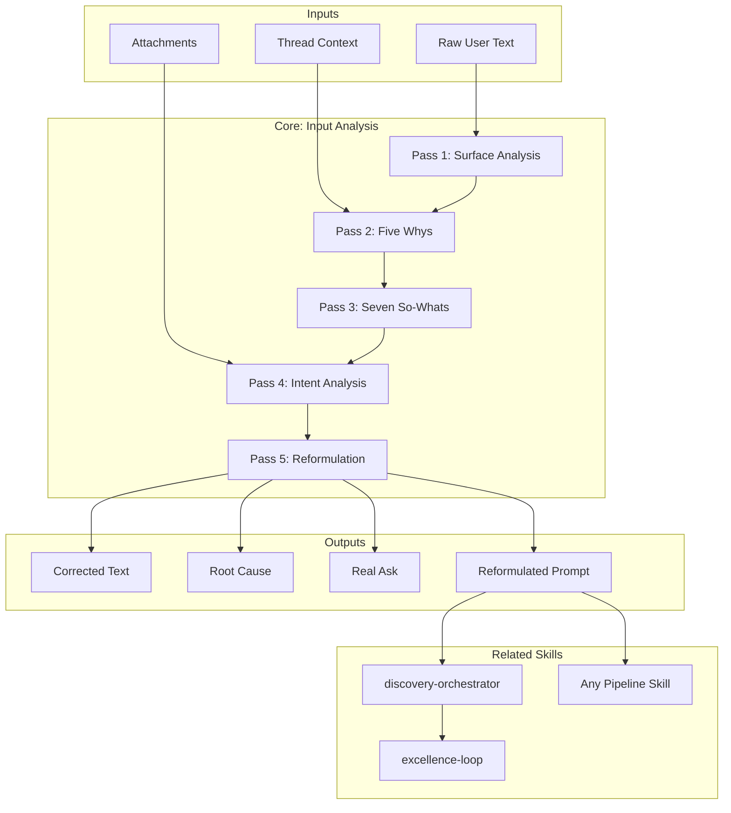

# Input Analysis — Input Pre-processing Layer

> **Guiding Principle:** Presume imperfection — every human input contains surface noise, intent gaps, or implicit context. Capture what the user *meant*, not just what they *wrote*.

## When to Activate

This skill is a **pre-processing layer**. It executes BEFORE other skills activate. Not all inputs need deep analysis.

| Input Quality | Passes to Execute | Example |
|-------------------|------------------|---------|
| Clear + specific | Pass 4 only (intent verification) | "Crear análisis AS-IS del sistema de facturación SAP" |
| Clear + vague scope | Passes 2, 4, 5 | "Ayúdame con el proyecto del banco" |
| Messy + clear intent | Passes 1, 5 | "ncsito el diganostico del legasy" |
| Messy + vague | All 5 passes | "eso q hblamos ayer dl tema ese pa la reunion d mañna" |

**Critical rule:** Do NOT over-analyze clear and well-formed inputs.

## Inputs

| Input | Source | Usage |
|-------|--------|-----|
| Raw user text | Direct conversation | Material to analyze |
| Prior thread context | Previous messages | Reference resolution |
| Mentioned attachments | Documents, code, images | Implicit context |

## Parameters

| Parameter | Values | Default |
|-----------|---------|---------|
| `{MODO_OPERACIONAL}` | `integral`, `superficie`, `intencion`, `reformulacion` | `integral` |
| `{IDIOMA}` | `es`, `en`, `mixed` | `es` |
| `{PROFUNDIDAD}` | `express`, `standard`, `deep` | `standard` |

## The Five Passes

```
Raw Input → SURFACE → 5 WHYS → 7 SO-WHATS → INTENT → REFORMULATION → Structured Prompt
```

### Pass 1: Surface Analysis

Detect and catalog surface errors. **Always presume** that the input has noise.

**What to capture:**

| Category | Patterns | Examples |
|-----------|----------|----------|
| **Dyslexia** | Letter inversions (b/d, p/q), adjacent transpositions, missing vowels | "buil → build", "teh → the", "frm → from" |
| **Haste / speed** | Extreme abbreviations, merged words, no punctuation | "ncsito", "xfa", "q", "dl", "tmbn", "pa" |
| **Spelling** | Phonetic errors, missing accents, c/s/z confusion, b/v, omitted h | "aver si", "haber si", "desición", "exito" |
| **Punctuation** | Total absence, excessive, run-on sentences | No periods or commas across 3+ lines |
| **Syntax** | Fragments, incomplete sentences, implicit subject | "y entonces lo del tema ese" |
| **Autocorrect** | Keyboard substitutions, voice-to-text artifacts | "ducking", random words interspersed |
| **Spanglish** | Spanish-English mixing within the same sentence | "Necesito hacer un deploy del feature" |

**Detection patterns for Spanish:**

| Pattern | Signal | Confidence |
|--------|-------|-----------|
| Consonants without vowels (3+) | Haste abbreviation: "prblm", "cntrl" | HIGH |
| Total absence of accents | Fast typing or keyboard without accents | MEDIUM |
| Standalone "q" | Abbreviation of "que" | VERY HIGH |
| "x" as "por" | "xfa" = "por favor", "xq" = "porque" | VERY HIGH |
| Adjacent QWERTY letters swapped | "wirking", "teh" | HIGH |
| Spanish homophones: "a ver/haber", "hay/ahí/ay" | Phonetic confusion | MEDIUM (context) |

**Output:** Corrected text + list of corrections + quality assessment.

**Critical rule:** Preserve intent when correcting. Correct only surface errors — NEVER change meaning.

### Pass 2: Five Whys (Root Cause)

Dig beneath the surface request to find the root need.

**Protocol:**
```
Usuario dice: "Necesito una presentación de los resultados Q4"
¿Por qué 1? → El jefe pidió una revisión trimestral
¿Por qué 2? → El equipo no cumplió objetivos, necesita realineamiento
¿Por qué 3? → Pivote de estrategia a mitad del trimestre
¿Por qué 4? → La planificación presupuestaria depende de ello
¿Por qué 5? → Necesitan justificar inversión continua

Necesidad raíz: Un caso persuasivo para inversión continua a pesar de incumplimientos Q4,
               formateado como revisión trimestral.
```

**Rules:**
- Stop before 5 if the root is clear. Do not force all 5.
- Each "why" must be answerable from context or reasonable inference.
- If a "why" requires unavailable information, note it as an **open question** — do not guess.

### Pass 3: Seven So-Whats (Impact Tracing)

Trace implications forward. If we solve this, what happens next?

**Purpose:** Calibrate response depth. A "presentation" that determines budget allocation deserves more investment than a casual summary.

**Calibration by depth:**

| Chain reaches... | Quality investment |
|-------------------|---------------------|
| So-what 2-3 | Standard |
| So-what 5-6 | Premium — strategic importance |
| So-what 7 | Flagship — competitive advantage |

**Rules:**
- Follow the highest-impact chain, not all branches.
- Stop when implications become speculative.
- Use the result to calibrate downstream skill quality.

### Pass 4: Intent Analysis

Compare what was written with what was meant. Identify the gap.

**Gap types:**

| Type | Signal | Example |
|------|-------|---------|
| **Vocabulary** | Incorrect technical term for the correct concept | "algorithm" meaning "workflow" |
| **Scope** | Underestimated need | "fix this" meaning "redesign the architecture" |
| **Expertise** | Wrong terminology for the correct concept | Asks for "microservices" for 2 endpoints |
| **Emotional** | Hedging, vagueness, hidden frustration | "make it better" meaning "I am frustrated with X" |
| **Context** | Dangling references, assumed knowledge | "that thing we discussed" without shared context |

**Protocol:**
1. List explicit statements (what they literally said).
2. List implicit signals (tone, word choice, what was NOT said).
3. Identify gaps between explicit and implicit.
4. Formulate the "real ask" — what they would say with perfect clarity.

### Pass 5: Reformulation

Synthesize all passes into a high-quality prompt.

**Reformulation template:**
```
OBJETIVO: [Verbo de acción + resultado medible]
CONTEXTO: [De 5 Porqués + 7 Entonces-qués]
INTENCIÓN: [Del análisis de brechas Pase 4]
RESTRICCIONES: [Explícitas + inferidas]
OUTPUT ESPERADO: [Tipo de entregable, estructura, longitud]
CALIBRACIÓN: [standard | premium | flagship]
```

## Operational Modes

| Mode | Passes | When to Use |
|------|-------|-------------|
| `integral` | 1-5 | Messy and vague input — full analysis |
| `superficie` | 1 only | Input with errors but clear intent — correction only |
| `intencion` | 4 only | Clean but ambiguous input — intent verification only |
| `reformulacion` | 2, 4, 5 | Clear input but vague scope — find root and reformulate |

## Integration with Discovery Pipeline

```
[metodologia-input-analysis] → [metodologia-discovery-orchestrator] → [specific skill] → [excellence-loop]
```

The reformulated prompt from Pass 5 becomes the input for the metodologia-discovery-orchestrator or any pipeline skill. Higher input quality leads to higher baseline quality and fewer downstream iterations.

**Command activation:**

| Command | Activation |
|---------|-----------|
| `/discovery`, `/discovery-auto` | Automatic in CP-0 (Ingestion) |
| Any document command | On demand if input is ambiguous |
| Direct interaction | When the conductor detects noise |

## Assumptions & Limits

- This skill infers intent from textual signals. It does not read minds. When inference confidence is low, flag the ambiguity instead of committing to a guess.
- Language detection is heuristic. Spanglish inputs may lose nuance in reformulation.
- The 5 Whys analysis works best with sufficient thread context. On cold-start (first message, no history), root cause depth is limited.
- Reformulation MUST NEVER add requirements the user did not express or imply. Clarify, do not invent.
- For very short inputs (< 5 words), skip passes 2-3 and focus only on intent verification.

## Workarounds

| Problem | Workaround |
|----------|-----------|
| Input in unsupported language | Detect language → flag for manual processing |
| Input with mixed code | Separate code blocks → analyze only natural text |
| Multiple questions in one message | Decompose into separate reformulated prompts, one per question |
| User self-corrects mid-message | Use the final version as intent. Ignore prior contradictions |
| Sarcasm or irony | Flag as uncertain intent → request clarification |

## Edge Cases

- **Intentionally informal input:** Some users write casually on purpose. Do not "fix" tone — correct only objective errors and preserve voice.
- **"Just do X":** Signal to skip deep analysis. Execute Pass 4 only to confirm, then pass-through with minimal reformulation.
- **Input with emojis as content:** Interpret emojis as emotional signals (fire = urgency, angry face = frustration, checkmark = confirmation).
- **Voice-to-text artifacts:** Random capitalization, absent punctuation, extreme homophony. Treat as Pass 1 with HIGH confidence in corrections.
- **Context only in attachments:** If the user says "review this" attaching a PDF, intent analysis is based on attachment content, not the text.

## Trade-off Matrix

| Tension | Option A | Option B | Decision criterion |
|---------|----------|----------|---------------------|
| Depth vs speed | Full analysis (5 passes) | Surface only (1 pass) | Input quality determines |
| Correction vs preservation | Correct everything | Preserve user voice | Correct errors, preserve style |
| Inference vs question | Infer intent | Ask the user | Confidence >80% → infer; <80% → ask |
| Short vs full reformulation | Minimal prompt | Prompt with full context | Downstream task complexity |

## Antipatterns

| Problem | Bad Pattern | Fix |
|----------|-------------|-----|
| Over-analysis | Running 5 Whys on "What time is it?" | Use the escalation table |
| Projection | Assuming intent without textual evidence | Ground every inference in specific words/signals |
| Corrective arrogance | Changing meaning when correcting errors | Preserve intent; correct only surface |
| Lost nuance | Reformulation eliminates emotional context | Include emotional signals in context section |
| Inflated reformulation | Output 10x longer than input | Separate "necessary context" from "nice to have" |

## Validation Gate

Before passing the reformulated prompt downstream, confirm:

- [ ] Surface corrections (if any) did NOT alter meaning
- [ ] Root cause analysis is grounded in available context, not speculation
- [ ] The "real ask" differs from the literal ask only where evidence supports it
- [ ] Reformulated prompt has: objective, constraints, context, and expected output
- [ ] Unresolvable ambiguities are explicitly flagged
- [ ] Analysis depth matches input quality (do not over-analyze clear inputs)
- [ ] Output language matches user language (or pipeline default)

## Output Format Protocol

**Analysis output format:**

```markdown
## Análisis de Input

**Input original:** [texto crudo]
**Confianza:** ALTA | MEDIA | BAJA
**Pases ejecutados:** 1, 2, 3, 4, 5

### Correcciones de superficie
| Original | Corregido | Tipo | Confianza |
|----------|-----------|------|-----------|
| ncsito | necesito | Afán — vocales faltantes | ALTA |
| diganostico | diagnóstico | Ortografía — transposición | ALTA |

### Causa raíz (5 Porqués)
[Cadena de porqués con parada natural]

### Impacto (7 Entonces-qués)
[Cadena de impacto con calibración]

### Brechas de intención
| Tipo | Explícito | Implícito | Brecha |
|------|-----------|-----------|--------|

### Prompt reformulado
OBJETIVO: ...
CONTEXTO: ...
INTENCIÓN: ...
RESTRICCIONES: ...
OUTPUT ESPERADO: ...
CALIBRACIÓN: [standard | premium | flagship]
```

## Escalation Triggers

Escalate to the conductor when:
- Intent confidence < 50% after all passes
- Input contains irreconcilable contradictory information
- Multiple valid interpretations with divergent impact
- User appears to be in emotional mode (frustration, pressure) — conductor must validate before proceeding
- Input suggests significant scope change relative to ongoing discovery

## Output Configuration

- **Language**: Spanish (Latin American, business register — simple, clear, concise, direct)
- **Attribution**: Expert committee of the MetodologIA Discovery Framework
- **Tagline**: *"Construido por profesionales, potenciado por la red agéntica de MetodologIA."*

## Casos Borde

| Caso | Estrategia de Manejo |
|---|---|
| Input intencionalmente informal | No corregir tono; corregir solo errores objetivos y preservar la voz del usuario; flag diferencia entre informalidad y error |
| "Just do X" — senial de skip deep analysis | Ejecutar solo Pass 4 (intent verification); pass-through con reformulacion minima; no sobre-analizar |
| Input con emojis como contenido semantico | Interpretar emojis como seniales emocionales (fuego = urgencia, cara enojada = frustracion, checkmark = confirmacion); incluir en contexto |
| Voice-to-text con artefactos | Capitalizacion aleatoria, ausencia de puntuacion, homofonia extrema; tratar como Pass 1 con confianza ALTA en correcciones |
| Contexto solo en attachments, no en texto | Si el usuario dice "review this" adjuntando un PDF, el analisis de intencion se basa en contenido del attachment, no en el texto |

## Decisiones y Trade-offs

| Decision | Alternativa Descartada | Justificacion |
|---|---|---|
| Presume imperfeccion en cada input humano | Asumir que el input es correcto hasta demostrar lo contrario | La evidencia muestra que la mayoria de inputs contienen noise, gaps o contexto implicito; presuponer imperfeccion activa la deteccion sin sobrecargar inputs limpios |
| Profundidad de analisis adaptada a calidad del input | Misma profundidad para todos los inputs | Sobre-analizar inputs claros desperdicia tokens y tiempo; sub-analizar inputs confusos produce reformulaciones incorrectas; la tabla de escalacion calibra el esfuerzo |
| Inferir cuando confianza > 80%, preguntar cuando < 80% | Siempre inferir o siempre preguntar | Inferir siempre arriesga errores de interpretacion; preguntar siempre frustra al usuario y ralentiza el pipeline; el umbral de 80% balancea flujo y precision |
| Corregir solo superficie, NUNCA cambiar significado | Corregir agresivamente incluyendo reestructuracion | Alterar el significado cuando se corrigen errores destruye la intencion del usuario; preservar intent es mas importante que correccion gramatical |

## Knowledge Graph



## Output Templates

| Formato | Nombre | Contenido |
|---|---|---|
| **Markdown** | `Input_Analysis_{timestamp}.md` | Analisis completo: input original, confianza, pases ejecutados, correcciones de superficie, causa raiz, impacto, brechas de intencion y prompt reformulado con objetivo, contexto, intencion, restricciones y calibracion. |
| **DOCX** | `Input_Analysis_Report_{timestamp}.docx` | Reporte formal de analisis para documentar decisiones de interpretacion en contexto de discovery; util cuando el input ambiguo requiere trazabilidad de la reformulacion. |
| **HTML** | `Input_Analysis_{timestamp}_{WIP}.html` | Mismo contenido en HTML branded (Design System MetodologIA v5). Self-contained, WCAG AA, responsive. Light-First Technical. Incluye tabla de correcciones de superficie con indicador de confianza, cadena de 5 Porqués colapsable, y prompt reformulado resaltado. |
| **XLSX** | `{fase}_{entregable}_{cliente}_{WIP}.xlsx` | Generado con openpyxl bajo MetodologIA Design System v5. Headers con fondo navy y tipografía Poppins blanca, formato condicional, auto-filtros activados, valores sin fórmulas. Hojas: Correcciones de Superficie, Análisis de Causa Raíz, Impacto, Brechas de Intención, Prompt Reformulado. |
| **PPTX** | `{fase}_{entregable}_{cliente}_{WIP}.pptx` | Generado con python-pptx bajo MetodologIA Design System v5. Slide master con degradado navy, títulos Poppins, cuerpo Montserrat, acentos dorados. Máx 20 slides variante ejecutiva / 30 variante técnica. Notas de orador con referencias de evidencia ([CODIGO], [DOC], [INFERENCIA], [SUPUESTO]). |

## Evaluacion

| Dimension | Peso | Criterio |
|---|---|---|
| Trigger Accuracy | 10% | Se activa como pre-processing layer cuando el input tiene noise, vaguedad o gaps; no sobre-analiza inputs claros y bien formados |
| Completeness | 25% | Los 5 pases cubren superficie, causa raiz, impacto, intencion y reformulacion sin huecos; ambiguedades no resueltas flaggeadas explicitamente |
| Clarity | 20% | Correcciones de superficie no alteran significado; reformulacion tiene objetivo, contexto, intencion, restricciones y output esperado; calibracion explicita |
| Robustness | 20% | Maneja dislexia, prisa, spanglish, voice-to-text, emojis, sarcasmo e inputs con solo attachments con estrategias diferenciadas |
| Efficiency | 10% | Modos operacionales (integral, superficie, intencion, reformulacion) calibran profundidad al input; no ejecuta pases innecesarios |
| Value Density | 15% | Cada pase aporta valor practico directo; la reformulacion produce prompts de mayor calidad que reducen iteraciones downstream |

**Umbral minimo: 7/10.**

---

## Additional Resources

- `references/knowledge-graph.mmd` — Skill relationship graph
- `references/body-of-knowledge.md` — Primary sources (linguistics, UX writing, NLP)
- `references/state-of-the-art.md` — Natural language processing trends 2024-2028
- `examples/sample-output.md` — Complete input analysis example
- `prompts/use-case-prompts.md` — Ready-to-use prompts
- `prompts/metaprompts.md` — Meta-analysis strategies

---
