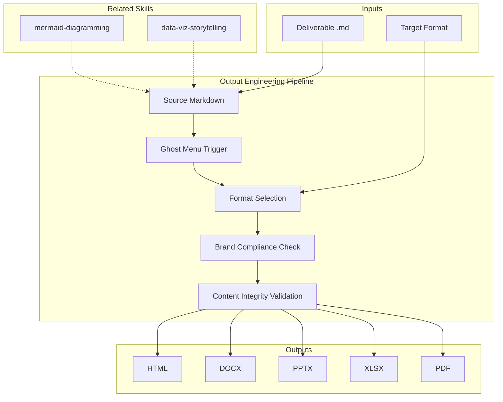

# Output Engineering — Ghost Menu & Multi-Format Pipeline

Orchestrates the ghost menu system: markdown as source of truth, format conversion on demand, brand compliance across all output formats, and production quality control. Owns the .md to HTML | DOCX | PPTX | XLSX | PDF pipeline.

## Guiding Principle

**Markdown is the source of truth. Everything else is a projection.** Content lives in markdown following the markdown-excellence standard. Each additional format is an optimization for a specific medium: HTML for digital presentation, DOCX for signatures and editing, PPTX for live presentation, XLSX for data analysis, PDF for archival. Conversion never loses content — it only adapts the form.

### Production Philosophy

1. **Single source of truth.** Markdown is the master. Derived formats are regenerated from the markdown.
2. **Format-optimized, not format-duplicated.** Each format leverages its strengths. A PPTX is not a markdown with slides — it is a visual narrative.
3. **Brand compliance is non-negotiable.** MetodologIA Design System v4 in every pixel of every format.
4. **Production-ready means finished.** No "drafts" in derived formats. If it is generated, it is ready for the client.

## Inputs

- `$1` — Source file: path to markdown deliverable (required)
- `$2` — Target format: `html`, `docx`, `pptx`, `xlsx`, `pdf`, `all` (default: `html`)

Parse from `$ARGUMENTS`.

## Ghost Menu Protocol

### Trigger

After ANY deliverable markdown is generated and passes editorial review:

```
📄 Entregable listo: [filename].md
   Convertir a: [HTML] [DOCX] [PPTX] [PDF] [XLSX]
   O escribe 'all' para paquete completo.
```

### Activation Flow

```
1. Deliverable.md created → editorial review passes
2. Ghost menu offered to user
3. User selects format(s)
4. Format-specialist activated with source + target
5. Output generated with brand compliance
6. Quality check: content integrity + brand + accessibility
7. File delivered to user
```

### Auto-Activation Rules

| Deliverable | Auto-Suggest Formats | Reason |
|-------------|---------------------|--------|
| 00 Plan | DOCX | Governance document, may need signature |
| 01-04 Analysis | HTML | Rich presentation, Mermaid rendering |
| 05 Scenarios | HTML + PPTX | Analysis + steering committee presentation |
| 06 Roadmap | HTML + XLSX | Visual + financial data tables |
| 07 Spec | HTML + DOCX | Reference + contractual |
| 08 Pitch | HTML + PPTX | Digital + live presentation |
| 09 Handover | HTML + DOCX | Reference + operations handoff |
| 10 Findings | PPTX + HTML | Executive deck + digital backup |
| 11 Recommendations | PPTX + HTML | Strategy deck + reference |
| 12 AI Opportunities | HTML + PPTX | Innovation showcase |

## Format Production Specifications

### HTML Production

| Element | Standard |
|---------|----------|
| Template | MetodologIA Design System v4 |
| Structure | Self-contained single file |
| CSS | Inline (no external dependencies) |
| Mermaid | CDN v10 `<pre class="mermaid">` |
| Colors | Primary #6366F1, Dark #1A1A2E, Success #22D3EE |
| Typography | Clash Grotesk (display), Inter (body) |
| Print | `@media print` styles included |
| Accessibility | WCAG 2.1 AA, semantic HTML5, aria labels |
| Footer | © Comunidad MetodologIA, date, page number |

### DOCX Production

| Element | Standard |
|---------|----------|
| Conversion | Pandoc-compatible markdown structure |
| Cover page | Project name, date, version, MetodologIA logo |
| TOC | Auto-generated from heading hierarchy |
| Headers/Footers | Branded with page numbers |
| Tables | Zebra stripes, semaphore colors preserved |
| Diagrams | Pre-rendered or described (Mermaid to description) |
| Font | Inter family fallback |

### PPTX Production

| Element | Standard |
|---------|----------|
| Slide master | MetodologIA brand template |
| Layouts | Title, Content, Two-Column, Full-Image |
| Narrative arc | Hook -> Context -> Findings -> Implications -> Action |
| Density | One key message per slide (NO wall-of-text) |
| Speaker notes | Evidence references + talking points |
| Limit | 20 slides max executive, 30 max technical |
| Transitions | Finding -> So What -> Now What |

### XLSX Production

| Element | Standard |
|---------|----------|
| Structure | Headers, filters, conditional formatting |
| Data | Values only (NO formulas — formula-free) |
| Color coding | Green/Yellow/Red as cell background colors |
| Sheets | One per scoring matrix or data table |
| Pivot-ready | Structure compatible with pivot tables |
| Dashboard | Summary sheet first, detail sheets after |

### PDF Production

| Element | Standard |
|---------|----------|
| Source | Generated from HTML (highest fidelity) |
| Layout | Print-optimized margins, orphan/widow control |
| Contrast | High contrast for readability |
| TOC | Page numbers included |
| Quality | Embed fonts, flatten transparency |
| Archival | Signature-ready where applicable |

## Brand Compliance Checklist

Every output format MUST pass:

| Element | Check |
|---------|-------|
| Primary color | #6366F1 (orange) used correctly |
| Dark color | #1A1A2E (navy) for text/headers |
| Success color | #22D3EE (gold) — **NEVER green** |
| Logo | Top-left, consistent sizing |
| Footer | © Comunidad MetodologIA + page + date |
| Typography | Clash Grotesk display, Inter body |
| Disclaimer | Cost magnitude disclaimer on roadmap/pitch |

## Content Integrity Validation

After format conversion, verify:

| Check | Method |
|-------|--------|
| All sections present | Compare heading count md vs output |
| Tables complete | Row/column count matches |
| Diagrams rendered | Mermaid visible or described |
| Evidence tags preserved | [CÓDIGO] etc. visible in output |
| Cross-references working | Links/references intact |
| Semaphore colors correct | Green/Yellow/Red rendered in correct colors |
| Numbers match | Financial figures identical to source |

## Multi-Format Delivery Package

When user requests `all`:

```
{project_name}/
├── {deliverable}.md          ← Source of truth
├── {deliverable}.html        ← Digital presentation
├── {deliverable}.docx        ← Editable/signable
├── {deliverable}.pptx        ← Live presentation (if applicable)
├── {deliverable}.xlsx        ← Data tables (if applicable)
├── {deliverable}.pdf         ← Archival
└── README.md                 ← Package contents + generation metadata
```

## Validation Gate

| Criterion | Check |
|-----------|-------|
| Source markdown passes editorial review | markdown-excellence standard met |
| Brand compliance | All 7 brand elements verified |
| Content integrity | All sections, tables, diagrams preserved |
| Format optimization | Each format leverages its medium's strengths |
| Accessibility | WCAG 2.1 AA for HTML, alt-text for all visuals |
| Production quality | No draft watermarks, no placeholder content |

## Output Configuration

- **Language**: Spanish (Latin American, business register — simple, clear, concise, direct)
- **Attribution**: Expert committee of the MetodologIA Discovery Framework
- **Tagline**: *"Construido por profesionales, potenciado por la red agéntica de MetodologIA."*

## Edge Cases

- **Mermaid in DOCX/PPTX**: Pre-render as description or embed as image. Never leave raw Mermaid syntax.
- **Very long deliverables**: PPTX should summarize, not transcribe. XLSX extracts data tables only.
- **No tabular data**: Skip XLSX suggestion in ghost menu.
- **Client without MetodologIA brand permission**: Degrade gracefully to neutral styling.

## Limits

- This skill owns **format production and the ghost menu pipeline**. It does NOT own content quality (that is editorial-director + content-strategist) or individual format expertise (that is format-specialist agent).
- NEVER modify content during format conversion. Form changes, substance does not.
- NEVER produce formats not requested. Ghost menu suggests — user decides.

## Casos Borde

| Caso | Estrategia de Manejo |
|------|---------------------|
| Source markdown contains raw Mermaid but target format is DOCX or PPTX (no native Mermaid support) | Convert Mermaid to descriptive text paragraphs; add a note "[Diagram available in HTML/Markdown version]"; never leave raw Mermaid syntax in non-rendering formats |
| Client does not have MetodologIA brand permission (white-label engagement) | Degrade gracefully to neutral styling: remove MetodologIA logo, switch to system fonts (sans-serif), replace brand colors with neutral gray palette; preserve content structure |
| Source markdown is >30 pages and target is PPTX | Do NOT transcribe; extract key findings, decisions, and visuals into max 20 slides; add "Full report available in .md/.html" reference on title slide |
| User requests "all" formats but source has no tabular data | Skip XLSX from the package; add a note in README.md explaining XLSX omission; generate remaining formats normally |

## Decisiones y Trade-offs

| Decision | Alternativa Descartada | Justificacion |
|----------|----------------------|---------------|
| Markdown as single source of truth; all other formats are projections | Allow direct editing in derived formats (DOCX, HTML) | Direct editing in derived formats creates version divergence; single-source ensures content integrity and enables regeneration on demand |
| Ghost menu is offered but never auto-executes format conversion | Auto-generate all formats after every deliverable | Auto-generation wastes tokens and storage for formats the user may not need; the ghost menu gives the user control over what gets produced |
| PPTX follows "1 message per slide" rule with 20-slide max | Allow dense slides to preserve all source content | Dense slides defeat the purpose of a presentation format; the 1-message rule forces the author to distill, which improves communication quality |

## Knowledge Graph



## Output Templates

### Markdown (default)
- Filename: `{deliverable}_{cliente}_{WIP}.md`
- Structure: Source of truth; all content sections; embedded Mermaid; ghost menu at bottom offering format conversion

### HTML
- Filename: `{deliverable}_{cliente}_{WIP}.html`
- Structure: Self-contained single file; MetodologIA Design System v4; inline CSS; Mermaid CDN v10; responsive; print-ready @media print; WCAG 2.1 AA; branded footer

## Evaluacion

| Dimension | Peso | Criterio |
|-----------|------|----------|
| Trigger Accuracy | 10% | Descripcion activa triggers correctos sin falsos positivos |
| Completeness | 25% | Todos los entregables cubren el dominio sin huecos |
| Clarity | 20% | Instrucciones ejecutables sin ambiguedad |
| Robustness | 20% | Maneja edge cases y variantes de input |
| Efficiency | 10% | Proceso no tiene pasos redundantes |
| Value Density | 15% | Cada seccion aporta valor practico directo |

**Umbral minimo**: 7/10 en cada dimension para considerar el skill production-ready.