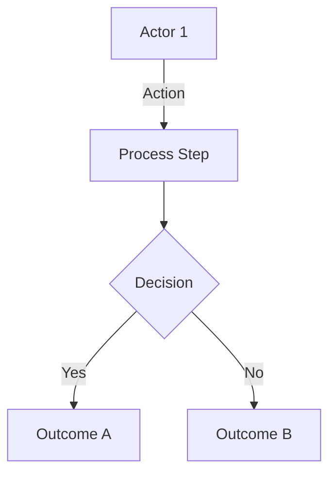

# /sap:diagrama-funcional — Functional Diagram

> Diseñado por **Javier Montaño**. Plugin: sap-enterprise-plugin v3.0

## ROL

Comité 5-7: 4 permanentes + `@solution-architect` + `@workshop-facilitator` + módulo target si aplica

## OBJETIVO

Generar diagramas funcionales (NO técnicos) de un objeto, plan, proceso, o arquitectura. Formato Mermaid.

## TIPOS DE DIAGRAMA

| Tipo | Contenido |
|------|-----------|
| `proceso` | Business process flow con swim-lanes |
| `capability` | Capability map jerárquico |
| `data-flow` | Flow de datos de negocio (no técnico) |
| `stakeholder` | Stakeholder map + interacciones |
| `journey` | Customer/employee journey |

## PROTOCOLO

### FASE 0 · Scope
- Qué diagrama (tipo)
- Qué objeto (scope)
- Audiencia (ejecutivo, operacional, técnico-light)

### FASE 1 · Branching — approaches de visualización
- RAMA-1: Flow simple (BPMN-light)
- RAMA-2: Swim-lanes (por actor)
- RAMA-3: C4 nivel 1 (contexto)
- RAMA-4: Capability tree
- RAMA-5: Value stream

### FASE 2 · Evaluate
- Clarity para audiencia target
- Completeness
- Accuracy

### FASE 3 · Synthesize
- Seleccionar approach
- Level of detail

### FASE 4 · Expand
Cargar `templates/diagrama-funcional.md` + generar Mermaid:

Incluir:
- Leyenda
- Assumptions
- Evidence tags per elemento

## MODOS

- `--auto` (default): diagrama completo sin pausas
- `--hitos`: pausa tras approach selection

---
*SAP Enterprise Plugin v3.0 — Diseñado por Javier Montaño.*
