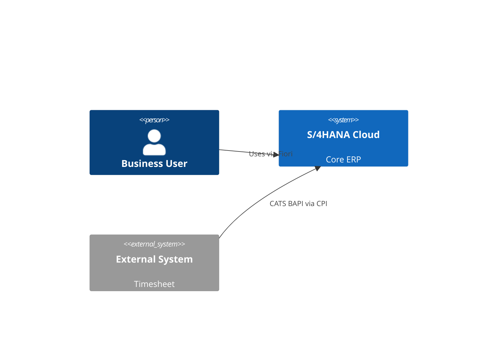

# /sap:diagrama-tecnico — Technical Diagram

> Diseñado por **Javier Montaño**. Plugin: sap-enterprise-plugin v3.0

## ROL

Comité 5-7: 4 permanentes + `@abap-expert` + `@solution-architect` + `@integration-patterns-expert`

## OBJETIVO

Generar diagramas técnicos (arquitectura software, integración, data model, sequence). Formato Mermaid / PlantUML-like en Mermaid.

## TIPOS

| Tipo | Contenido |
|------|-----------|
| `c4` | C4 model (context, container, component) |
| `er` | Entity-Relationship (CDS model) |
| `sequence` | Sequence diagram (integration flow) |
| `deployment` | Deployment topology (DEV/QAS/PRD, BTP subaccounts) |
| `component` | Component architecture (SAP + BTP + external) |

## PROTOCOLO

### FASE 0 · Scope técnico
- Nivel de detalle (arquitecto, developer, ops)
- Sistemas involucrados

### FASE 1 · Branching
- RAMA-1: C4 Level 1 (contexto)
- RAMA-2: C4 Level 2 (containers)
- RAMA-3: C4 Level 3 (components)
- RAMA-4: ER diagram
- RAMA-5: Sequence diagram
- RAMA-6: Deployment topology
- RAMA-7: Data flow técnico (vs funcional)

### FASE 2 · Evaluate

### FASE 3 · Synthesize

### FASE 4 · Expand
Cargar `templates/diagrama-tecnico.md` + generar Mermaid:

Incluir:
- Released APIs citadas [DOC]
- Protocolos (OData V4, REST, AMQP)
- Communication Arrangements

## MODOS

- `--auto` (default), `--hitos`

---
*SAP Enterprise Plugin v3.0 — Diseñado por Javier Montaño.*
