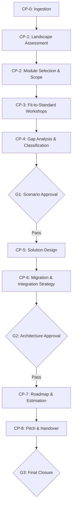

# SAP Discovery Pipeline Orchestration

> "Discovery is not a checkbox — it's the foundation that determines whether 80% of SAP implementation effort is spent on value or on rework."

## Purpose

Orchestrate a complete SAP discovery engagement by sequencing all SAP-specific skills, managing quality gates, composing the expert committee, and producing a coherent set of deliverables aligned with SAP Activate Discover and early Prepare phases.

## When to Use

- Starting a new SAP S/4HANA discovery or pre-sales engagement
- Conducting a full SAP landscape assessment
- Defining scope for an SAP implementation project
- Running the SDF pipeline with `{TIPO_SERVICIO}=SAP`
- User invokes `/sdf:sap-discovery` or `/sdf:sap`

---

## Table of Contents

1. [SAP Discovery Pipeline Overview](#1-sap-discovery-pipeline-overview)

> Deep knowledge: `references/body-of-knowledge.md`
> Skill dependencies: `references/knowledge-graph.mmd`
2. [Phase Protocol](#2-phase-protocol)
3. [Expert Committee Composition](#3-expert-committee-composition)
4. [Deliverable Pipeline](#4-deliverable-pipeline)
5. [Module Selection Decision Tree](#5-module-selection-decision-tree)
6. [SAP Landscape Assessment Protocol](#6-sap-landscape-assessment-protocol)
7. [Clean Core Compliance Check](#7-clean-core-compliance-check)
8. [Discovery Modes](#8-discovery-modes)

---

## 1. SAP Discovery Pipeline Overview



---

## 2. Phase Protocol

### CP-0: Ingestion
**Skill**: N/A (orchestrator direct)
- Collect client context: industry, countries, headcount, current ERP, pain points
- Detect `{TIPO_SERVICIO}=SAP` if not explicit
- Load priming RAG: `sofka-sap-implementation`, `sofka-regional-finance`
- Initialize `.discovery/session-state.json` with SAP service type
- Ask for: company name, countries of operation, current ERP landscape, number of legal entities, primary pain points

### CP-1: Landscape Assessment
**Skill**: `sofka-sap-discovery` (self) + `sofka-sap-implementation`
- Map current ERP landscape (legacy systems, Excel tools, shadow IT)
- Identify data sources and integration points
- Assess organizational readiness for S/4HANA Cloud
- Assess Clean Core readiness (custom code volume, modification count)
- Output: `00_SAP_Landscape_Assessment_{client}_{WIP}.md`

### CP-2: Module Selection & Scope Definition
**Skill**: `sofka-sap-implementation` + module specialists
- Run Module Selection Decision Tree (see Section 5)
- Map business processes to SAP Scope Items
- Define in-scope vs out-of-scope modules
- Identify cross-module dependencies
- Output: `01_SAP_Scope_Definition_{client}_{WIP}.md`

### CP-3: Fit-to-Standard Workshops
**Skill**: `sofka-sap-fit-to-standard`
- Execute fit-to-standard workshop per in-scope module
- Present SAP best practice → compare AS-IS → score gaps
- Classify each process area: Green (Fit) / Yellow (Configure) / Red (Gap)
- Output: `02_FitToStandard_Results_{client}_{WIP}.md` (one section per module)

### CP-4: Gap Analysis & Classification
**Skill**: `sofka-sap-gap-analysis`
- Consolidate gaps from all workshops
- Classify: Fit / Configure / Extend / Custom / Workaround
- Map dependencies between gaps
- Identify blocking gaps requiring early resolution
- Score and prioritize
- Output: `03_Gap_Analysis_{client}_{WIP}.md`

### GATE 1: Scenario Approval
- Present gap analysis and initial scenarios to steering
- Decision: proceed with solution design vs. descope vs. abort
- Required: >= 80% gaps classified, blocking gaps identified, initial effort estimate

### CP-5: Solution Design
**Skill**: `sofka-sap-solution-design` + `sofka-sap-btp-extensibility`
- Design Clean Core target-state architecture
- Extension decision per gap: Key User Extension → ABAP Cloud → BTP Side-by-Side
- Module interaction diagram
- Non-functional requirements (performance, security, compliance)
- Output: `04_Solution_Architecture_{client}_{WIP}.md`

### CP-6: Migration & Integration Strategy
**Skill**: `sofka-sap-data-migration` + `sofka-sap-integration`
- Data migration strategy (Strangler Fig vs big-bang, wave planning)
- Integration architecture (CPI/BTP patterns, API contracts)
- Error handling and monitoring design
- Output: `05_Migration_Integration_Strategy_{client}_{WIP}.md`

### GATE 2: Architecture Approval
- Present solution architecture, migration strategy, integration design
- Decision: approve architecture vs. iterate
- Required: All extension decisions documented as ADRs, migration waves defined, integration PoC scope agreed

### CP-7: Roadmap & Estimation
**Skill**: `sofka-sap-activate-methodology` + SDF estimation skills
- SAP Activate phase timeline
- Module deployment sequence
- FTE-month estimation per phase (P50/P80/P95)
- Risk register with mitigations
- Output: `06_SAP_Roadmap_{client}_{WIP}.md`

### CP-8: Pitch & Handover
**Skill**: SDF pitch/handover skills
- Executive pitch deck
- Technical findings report
- Handover package to implementation team
- Output: `07_SAP_Pitch_{client}_{WIP}.html` + `08_SAP_Handover_{client}_{WIP}.md`

### GATE 3: Final Closure
- All deliverables validated
- Consistency check across all SAP deliverables
- Stakeholder sign-off

---

## 3. Expert Committee Composition

When `{TIPO_SERVICIO}=SAP`, the following committee is assembled:

| Role | Agent | Tier |
|------|-------|------|
| **Pipeline Lead** | `sap-discovery-conductor` | Orchestrator |
| **CO Specialist** | `sap-co-specialist` | Domain |
| **SD Specialist** | `sap-sd-specialist` | Domain |
| **PS Specialist** | `sap-ps-specialist` | Domain |
| **FI Specialist** | `sap-fi-specialist` | Domain |
| **Integration Architect** | `sap-integration-architect` | Technical |
| **Migration Lead** | `sap-migration-lead` | Technical |
| **Change Lead** | `sap-change-management-lead` | Organizational |
| **SDF Triad** | discovery-conductor + delivery-manager + risk-controller | SDF Core |

---

## 4. Deliverable Pipeline

| # | Deliverable | Skill | Format |
|---|-------------|-------|--------|
| 00 | SAP Landscape Assessment | sap-discovery | MD |
| 01 | SAP Scope Definition | sap-discovery + sap-implementation | MD |
| 02 | Fit-to-Standard Results | sap-fit-to-standard | MD |
| 03 | Gap Analysis Report | sap-gap-analysis | MD/HTML |
| 04 | Solution Architecture | sap-solution-design | MD/HTML |
| 05 | Migration & Integration Strategy | sap-data-migration + sap-integration | MD |
| 06 | SAP Roadmap | sap-activate-methodology | MD/HTML |
| 07 | Executive Pitch | SDF pitch skills | HTML |
| 08 | Handover Package | SDF handover skills | MD |

---

## 5. Module Selection Decision Tree

```
What does the company need SAP for?
|
|-- Financial management & reporting?
|   |-- YES → FI (Financial Accounting) ✅
|   |-- Multi-country? → FI + Localization per country
|   |-- Intercompany? → FI + IC Billing config
|
|-- Project-based work (IT services, consulting, engineering)?
|   |-- YES → PS (Project System) + CO (Controlling) ✅
|   |-- Time tracking? → HCM (Time Management) or CATS integration
|   |-- Revenue per project? → PS + SD + FI-RA (Revenue Recognition)
|
|-- Selling products or services to clients?
|   |-- YES → SD (Sales & Distribution) ✅
|   |-- T&M billing? → SD + Timesheet integration
|   |-- Fixed price? → SD + Milestone Billing Plan
|
|-- Cost management & profitability?
|   |-- YES → CO (Controlling) ✅
|   |-- Activity Types needed? → CO + Cost Rates + Sales Prices
|   |-- Profitability analysis? → CO-PA
|
|-- HR / Payroll?
|   |-- Cloud preferred → SuccessFactors
|   |-- On-premise legacy → HCM (assess migration path)
|
|-- Procurement?
|   |-- YES → MM (Materials Management) ✅
|   |-- Service procurement? → MM + SRM patterns
|
|-- Supply chain?
|   |-- YES → PP (Production Planning) + WM/EWM ✅
```

---

## 6. SAP Landscape Assessment Protocol

### Current State Inventory
| Dimension | Questions | Evidence Tag |
|-----------|-----------|-------------|
| ERP landscape | What ERP(s) in use? Versions? | [STAKEHOLDER] |
| Custom code | How many Z-objects? Modifications? | [CÓDIGO] |
| Integrations | What systems integrate with ERP? | [CONFIG] |
| Data volume | Transaction volumes per module? | [DOC] |
| Users | How many users per module/role? | [STAKEHOLDER] |
| Countries | Which countries operate? Legal entities? | [STAKEHOLDER] |
| Pain points | Top 5 process pain points? | [STAKEHOLDER] |
| Shadow IT | Excel tools, Access DBs, manual processes? | [STAKEHOLDER] |

### Readiness Scoring
| Dimension | 1 (Low) | 3 (Medium) | 5 (High) |
|-----------|---------|------------|----------|
| Executive sponsorship | Absent | Partial | Champion |
| Process documentation | None | Fragmented | Structured |
| Data quality | Poor | Inconsistent | Governed |
| Change readiness | Resistant | Cautious | Eager |
| Technical maturity | Legacy-heavy | Mixed | Cloud-ready |

**Readiness Score**: Average across dimensions. <2.5 = High Risk, 2.5-3.5 = Moderate, >3.5 = Ready.

---

## 7. Clean Core Compliance Check

For S/4HANA Cloud implementations, every extension must pass the Clean Core filter:

```
Is it available in SAP standard?
|-- YES → Use standard. No extension needed.
|-- NO: Can it be solved with Key User Extensibility?
    |-- YES → Custom fields, custom logic, custom CDS views
    |-- NO: Can it be solved with ABAP Cloud (on-stack)?
        |-- YES → ABAP RESTful Application Programming (RAP)
        |-- NO: Must it be side-by-side?
            |-- YES → BTP (CAP, SAP Build, Integration Suite)
            |-- NO → Process redesign. Change the business process.
```

**Red Flags (Clean Core Violations)**:
- Direct database table modifications
- Classic ABAP enhancements (User Exits, BADIs in classic namespace)
- Modification of SAP standard code
- Custom transactions replacing standard Fiori apps
- Direct RFC calls to on-premise systems (use CPI mediation)

---

## 8. Discovery Modes

### Express (`--mode express`)
- 1 session, 3 deliverables: Landscape Assessment + Scope Definition + Gap Summary
- Skip detailed workshops, use questionnaire-based assessment
- Duration: 2-4 hours

### Guided (`--mode guided`)
- Full pipeline with human facilitation at each gate
- All 8 deliverables produced
- Duration: 3-5 sessions

### Deep (`--mode deep`)
- Full pipeline + detailed workshops per module
- Architecture Decision Records for each blocking gap
- PoC scope definition for critical integrations
- Duration: 5-8 sessions

---

## Quality Criteria

1. All CP-0 through CP-8 phases documented with clear inputs/outputs
2. Expert committee assembled with SAP-specific agents
3. Module selection justified with decision tree evidence
4. Landscape assessment scored with measurable readiness dimensions
5. Clean Core compliance verified for every proposed extension
6. All 8 deliverables produced with correct naming convention
7. Gates G1-G3 have explicit pass/fail criteria

## Anti-Patterns

1. **Skipping landscape assessment** — Going straight to module selection without understanding current state leads to misscoped projects
2. **Module-by-module silos** — Cross-module dependencies (CO↔SD, PS↔FI) must be assessed as a system, not in isolation
3. **Treating all gaps equally** — Blocking gaps (master data, intercompany) must be identified and resolved before non-blocking ones
4. **Discovery without Clean Core filter** — Every proposed extension must pass the compliance check before entering the roadmap

## Edge Cases

1. **Brownfield migration (ECC → S/4HANA)** — Add CP-1.5: Custom Code Analysis using SAP Custom Code Migration tools. Score each Z-object for conversion/deprecation/rewrite.
2. **Multi-wave rollout** — Repeat CP-2 through CP-6 per wave. First wave defines template; subsequent waves localize.
3. **SAP + non-SAP discovery** — When SAP is one component of a larger digital transformation, this skill runs as a sub-pipeline within the broader SDF discovery.

## Cross-References

- **sofka-sap-activate-methodology**: Phase/gate alignment
- **sofka-sap-fit-to-standard**: Workshop execution for CP-3
- **sofka-sap-gap-analysis**: Gap classification for CP-4
- **sofka-sap-solution-design**: Architecture for CP-5
- **sofka-sap-btp-extensibility**: Extension patterns for CP-5
- **sofka-sap-data-migration**: Migration strategy for CP-6
- **sofka-sap-integration**: Integration architecture for CP-6
- **sofka-sap-testing-validation**: Testing strategy referenced in roadmap
- **sofka-sap-change-adoption**: Change management spanning all phases
- **sofka-sap-implementation**: Module configuration reference
- **sofka-regional-finance**: CTC formulas, localization, transfer pricing
