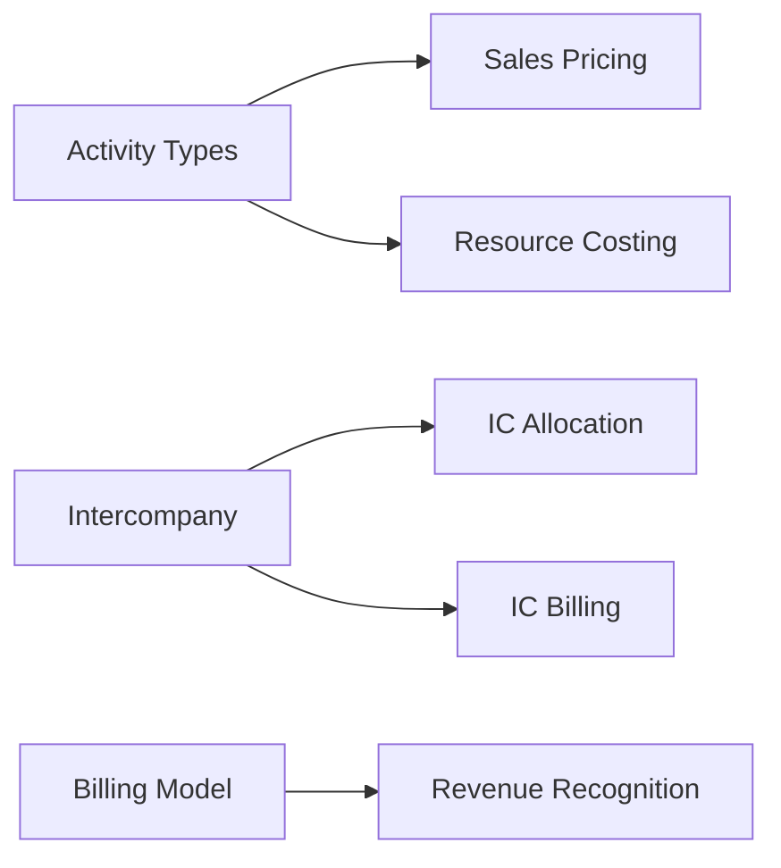

# SAP Gap Analysis & Classification

> "A gap register without dependency mapping is a list. A gap register with dependencies is a strategy."

## Purpose

Transform raw fit-to-standard workshop results into an actionable, prioritized gap register with dependency mapping, blocking gap identification, and remediation path design. Ensure every gap has a Clear Core-compliant resolution before it enters the roadmap.

## When to Use

- After fit-to-standard workshops (consuming CP-3 output)
- When consolidating gaps across multiple SAP modules
- When prioritizing gap remediation for roadmap planning
- When identifying blocking gaps that must be resolved before others
- During SAP Activate Explore phase

---

## Table of Contents

1. [Gap Classification Taxonomy](#1-gap-classification-taxonomy)

> Deep knowledge: `references/body-of-knowledge.md`
> Skill dependencies: `references/knowledge-graph.mmd`
2. [Dependency Graph Protocol](#2-dependency-graph-protocol)
3. [Blocking Gap Identification](#3-blocking-gap-identification)
4. [Remediation Strategy per Gap Type](#4-remediation-strategy-per-gap-type)
5. [Gap Prioritization Algorithm](#5-gap-prioritization-algorithm)
6. [ADR Template for Gap Resolution](#6-adr-template-for-gap-resolution)
7. [Gap Register Output Format](#7-gap-register-output-format)

---

## 1. Gap Classification Taxonomy

### Primary Classification

| Class | Description | Clean Core | Typical Resolution |
|-------|-------------|-----------|-------------------|
| **FIT** | SAP standard covers the requirement | Compliant | Configuration only |
| **CONFIGURE** | Standard SAP config (IMG, Fiori admin) | Compliant | Config + testing |
| **EXTEND-KU** | Key User Extensibility (custom fields, logic) | Compliant | No-code / low-code |
| **EXTEND-RAP** | ABAP Cloud / RAP development | Compliant | Developer extension |
| **EXTEND-BTP** | BTP side-by-side application | Compliant | Separate app |
| **CUSTOM** | Classic modification (AVOID) | Non-compliant | Process redesign |
| **WORKAROUND** | Business process change | Compliant | Change management |

### Secondary Classification (Cross-cutting Concerns)

| Tag | Description | Impact |
|-----|-------------|--------|
| `BLOCKING` | Other gaps depend on this resolution | Must resolve first |
| `REGULATORY` | Legal/compliance requirement | Cannot be descoped |
| `INTEGRATION` | Requires external system interface | CPI/BTP involvement |
| `DATA` | Requires master data or migration | Data quality dependency |
| `CROSS-MODULE` | Affects multiple SAP modules | SDA coordination |

---

## 2. Dependency Graph Protocol

### Step 1: List all gaps from all module workshops
Consolidate gaps into a single register with unique IDs: `GAP-{MODULE}-{NNN}`

### Step 2: For each gap, ask
- Does this gap require resolution of another gap first? → **depends-on**
- Does resolution of this gap enable other gaps? → **enables**
- Does this gap share data objects with other gaps? → **shares-data-with**
- Does this gap affect the same SAP object as another? → **conflicts-with**

### Step 3: Build dependency graph



### Step 4: Identify clusters
Gaps that form connected subgraphs are **gap clusters**. Clusters must be resolved as packages, not individually.

---

## 3. Blocking Gap Identification

A gap is **BLOCKING** if any of these conditions are true:

| Condition | Example |
|-----------|---------|
| >= 3 other gaps depend on it | Master data structure affects CO, SD, PS |
| On critical path for go-live | Core billing model must be decided before SD config |
| Regulatory requirement | E-invoicing compliance cannot be descoped |
| Data migration prerequisite | Chart of accounts must be defined before any FI migration |
| Integration prerequisite | CATS API contract must be agreed before timesheet development |

**Rule**: Blocking gaps must have ADRs (Architecture Decision Records) before Gate 1.

---

## 4. Remediation Strategy per Gap Type

### FIT (Score 0)
- **Action**: Document the fit. No development needed.
- **Effort**: 0 days
- **Risk**: None

### CONFIGURE (Score 1-4)
- **Action**: Standard SAP configuration via IMG or Fiori admin apps
- **Effort**: 1-5 days per configuration area
- **Artifacts**: Configuration workbook, test cases
- **Risk**: Low — standard upgrade path

### EXTEND-KU (Score 5-6)
- **Action**: Key User Extensibility tools
- **Options**: Custom fields (app-level), custom logic (BRF+), custom CDS views, custom Fiori tiles
- **Effort**: 2-10 days per extension
- **Artifacts**: Extension specification, test cases
- **Risk**: Low — managed by SAP lifecycle

### EXTEND-RAP (Score 7-8)
- **Action**: ABAP Cloud development using RAP
- **Options**: Custom RAP BO, released API consumption, custom OData service
- **Effort**: 5-20 days per application
- **Artifacts**: ADR, technical design, code, test cases
- **Risk**: Medium — requires ABAP Cloud expertise
- **Prerequisites**: Developer access, ABAP Cloud guidelines

### EXTEND-BTP (Score 9-10)
- **Action**: Side-by-side application on SAP BTP
- **Options**: CAP application, SAP Build Apps, Integration Suite flow, SAP Work Zone
- **Effort**: 10-40 days per application
- **Artifacts**: ADR, architecture diagram, code, integration test
- **Risk**: Medium-High — separate deployment, additional infra
- **Prerequisites**: BTP subaccount, entitlements, connectivity

### CUSTOM (Score 11-12) — AVOID
- **Action**: Redesign the business process to fit SAP standard
- **Rationale**: Classic modifications break Clean Core, block upgrades, increase TCO
- **Exception**: Only if regulatory AND no standard/extension path exists (rare)
- **Escalation**: Requires Steering Committee approval

### WORKAROUND (Score 3-6)
- **Action**: Change the business process + change management
- **Effort**: Variable — depends on organizational readiness
- **Artifacts**: Process change documentation, training plan, adoption metrics
- **Risk**: Adoption risk — requires strong change management

---

## 5. Gap Prioritization Algorithm

### Input: Gap Register with scores

### Step 1: Calculate Priority Score
```
Priority = (Business Value x 2) + (Blocking Factor x 3) - (Effort + Risk + Upgrade Impact)
```

Where:
- Business Value: 1-3 (from workshop)
- Blocking Factor: 0 (not blocking), 1 (enables 1-2 gaps), 2 (enables 3+ gaps)
- Effort, Risk, Upgrade Impact: 1-3 each (from workshop)

### Step 2: Sort by Priority (descending)
Higher priority = resolve first

### Step 3: Validate ordering against dependency graph
- If Gap A depends on Gap B, but Gap A has higher priority → move Gap B up
- If a gap cluster exists, all gaps in cluster share the highest priority of the cluster

### Step 4: Assign to resolution waves
- **Wave 1 (Blocking)**: All BLOCKING gaps + their dependencies
- **Wave 2 (High Value)**: Priority > 5, non-blocking
- **Wave 3 (Medium)**: Priority 2-5
- **Wave 4 (Low/Defer)**: Priority < 2 or can be deferred to Phase 2

---

## 6. ADR Template for Gap Resolution

```markdown
# ADR-{NNN}: {Gap Title}

## Status: {Proposed | Accepted | Rejected | Superseded}

## Context
{Why does this gap exist? What business need does it address?}

## Gap Details
- **ID**: GAP-{MODULE}-{NNN}
- **Module(s)**: {CO, SD, PS, FI, HCM}
- **Score**: {0-12} (Effort: {n}, Risk: {n}, Upgrade: {n})
- **Business Value**: {1-3}
- **Classification**: {Fit|Configure|Extend-KU|Extend-RAP|Extend-BTP|Custom|Workaround}
- **Blocking**: {Yes/No} — Enables: {list of dependent gaps}

## Decision
{What was decided and why}

## Options Considered
1. {Option A} — {pros/cons}
2. {Option B} — {pros/cons}
3. {Option C} — {pros/cons}

## Clean Core Compliance
{Score: N/6, detail per criterion}

## Consequences
- {Positive consequence}
- {Negative consequence / trade-off}
- {Dependencies created or resolved}

## Evidence
{[CÓDIGO] [CONFIG] [DOC] [STAKEHOLDER] tags with sources}
```

---

## 7. Gap Register Output Format

```markdown
# SAP Gap Register — {Client}

## Summary
| Classification | Count | % |
|---------------|-------|---|
| Fit | {n} |  |
| Extend (Key User) | {n} |  |
| Extend (BTP) | {n} |  |
| Workaround | {n} | {%} |

## Blocking Gaps (Wave 1)
{Table of blocking gaps with ADR status}

## Dependency Graph
{Mermaid diagram}

## Full Gap Register
| ID | Module | Process Area | Score | Class | Priority | Wave | ADR |
|----|--------|-------------|-------|-------|----------|------|-----|
| GAP-CO-001 | CO | Activity Types | 6 | Extend-KU | 8 | 1 | ADR-001 |
| ... | ... | ... | ... | ... | ... | ... | ... |

## Gap Clusters
{List of connected gap subgraphs with shared resolution strategy}
```

---

## Quality Criteria

1. All gaps from all module workshops consolidated into single register
2. Every gap classified using the 7-class taxonomy
3. Dependency graph documented with blocking gaps identified
4. Priority algorithm applied with wave assignments
5. ADRs written for all blocking gaps
6. Clean Core compliance verified for every extension proposal
7. Gap clusters identified and treated as packages

## Anti-Patterns

1. **Treating gaps independently** — Always check for dependencies and clusters before assigning waves
2. **Classifying without scoring** — Every gap must have a 4-dimension score before classification
3. **Accepting CUSTOM classification** — Always challenge with "Can we redesign the process?" before accepting
4. **Ignoring data dependencies** — Gaps that require master data changes (Activity Types, Chart of Accounts) are almost always blocking

## Cross-References

- **sofka-sap-fit-to-standard**: Produces the raw gaps that this skill consumes
- **sofka-sap-solution-design**: Consumes the gap register for architecture decisions
- **sofka-sap-btp-extensibility**: Provides extension patterns for EXTEND-RAP and EXTEND-BTP gaps
- **sofka-sap-data-migration**: Gaps tagged with DATA require migration coordination
- **sofka-sap-implementation**: Module reference for gap resolution options
