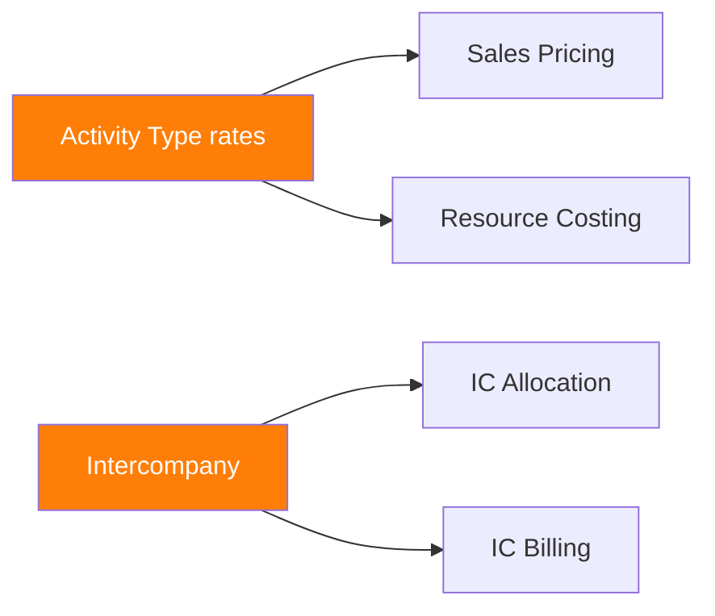

# Gap Registry — AcmeCorp 24 gaps classified

> **Skill**: sap-gap-analysis · **Phase**: CP-N · **Agent**: `@sap-orchestrator`
> **Author**: Diseñado por Javier Montaño

## TL;DR

- 24 gaps consolidados de 5 módulos (CO/SD/PS/FI/HCM)
- Fit: 8 (33%), Configure: 10 (42%), Extend-KU: 3, Extend-RAP: 2, Extend-BTP: 1
- Blocking gaps: 3 (GAP-CO-001, GAP-FI-003, GAP-SD-005)
- 3 ADRs escritos para blocking gaps

## Dependency Graph

## Priority Score Applied

| Gap | BV×2 | Block×3 | E+R+U | Priority | Wave |
|-----|------|---------|-------|----------|------|
| GAP-CO-001 | 6 | 15 | 6 | 15 | 1 |
| GAP-FI-003 | 6 | 15 | 8 | 13 | 1 |
| GAP-SD-005 | 6 | 9 | 6 | 9 | 2 |

## ADRs

- ADR-017: Activity Type rate segregation via Key User Custom Fields
- ADR-018: Intercompany via Scope 4EZ standard
- ADR-019: Cross-border Sales Price via CPI mediation

## Quality Validation

- [x] Domain assertions met (per agents/grader.md)
- [x] Evidence tags applied
- [x] Ghost menu
- [x] Metacognitive closing

## 📊 METADATA DE RAZONAMIENTO

- Confianza global: 0.88
- Fuentes: referencias oficiales SAP, body-of-knowledge del skill
- Ambigüedades residuales: depende del cliente/escenario real
- Recomendación siguiente paso: workflow específico del skill

---
*SAP Enterprise Plugin v3.4+ — Diseñado por Javier Montaño.*
