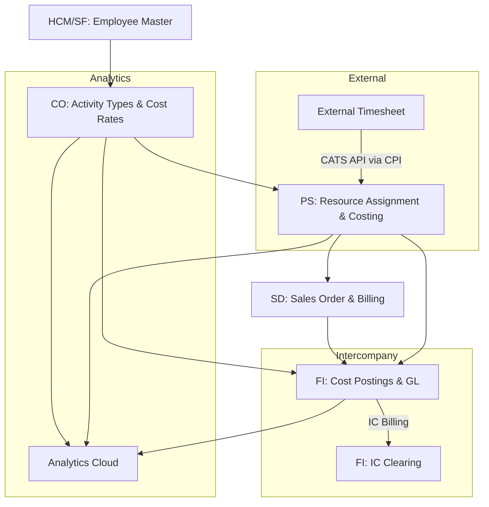

# SAP Solution Architecture Design — Clean Core

> "Clean Core is not a constraint — it's the guarantee that your SAP investment survives the next decade of innovation."

## Purpose

Design the target-state SAP architecture based on gap analysis results, applying Clean Core principles to every extension decision. Produce a Solution Architecture Document (SAD) that serves as the blueprint for the Realize phase.

## When to Use

- After gap analysis (CP-4) during SAP discovery
- When making extension decisions (Key User vs ABAP Cloud vs BTP)
- When designing the overall SAP module landscape
- When defining non-functional requirements for SAP
- During SAP Activate Prepare/Explore phases

---

## Table of Contents

1. [Clean Core Architecture Principles](#1-clean-core-architecture-principles)

> Deep knowledge: `references/body-of-knowledge.md`
> Skill dependencies: `references/knowledge-graph.mmd`
2. [Extension Decision Tree](#2-extension-decision-tree)
3. [Module Interaction Architecture](#3-module-interaction-architecture)
4. [Data Flow Architecture](#4-data-flow-architecture)
5. [Non-Functional Requirements](#5-non-functional-requirements)
6. [Solution Architecture Document Template](#6-solution-architecture-document-template)

---

## 1. Clean Core Architecture Principles

### The 5 Pillars of Clean Core

| Pillar | Principle | Enforcement |
|--------|-----------|-------------|
| **Clean Data** | No Z-tables in core namespace; use custom fields or BTP persistence | Data architecture review |
| **Clean Code** | ABAP Cloud only; no classic enhancements, no modifications | Code review checklist |
| **Clean Extensions** | Key User > ABAP Cloud > BTP Side-by-Side; never classic | Extension Decision Tree |
| **Clean Integration** | OData V4, REST, Event Mesh; never direct RFC | Integration architecture review |
| **Clean Operations** | SAP Cloud ALM for monitoring; no custom monitoring tools | Ops architecture review |

### Clean Core Compliance Matrix

For each proposed extension, score against these 6 criteria:

| # | Criterion | Compliant | Non-Compliant |
|---|-----------|-----------|---------------|
| 1 | Uses released SAP APIs only | OData V4, released BAPIs, event topics | Unreleased APIs, direct DB access |
| 2 | No modification to SAP standard code | Clean extension point | Code overlay, implicit enhancement |
| 3 | Upgrade-safe extension mechanism | Key User tool, ABAP Cloud, BTP app | Classic BADI, User Exit, CMOD |
| 4 | Data model via custom fields only | Custom field app, CDS extend view | Z-table in SAP namespace |
| 5 | Integration via standard protocols | OData, REST, SOAP (released), events | Direct RFC, tRFC, ALE/IDoc (legacy) |
| 6 | UI via Fiori patterns | Fiori Elements, SAP Build, UI5 freestyle | BSP, WebDynpro, SAP GUI |

---

## 2. Extension Decision Tree

```
Gap identified from fit-to-standard:
|
|-- Can SAP standard solve it with configuration?
|   |-- YES → CONFIGURE. Document config in workbook. Done.
|
|-- Can Key User Extensibility solve it?
|   |-- Custom fields? → Key User Custom Fields app
|   |-- Custom logic (business rules)? → BRF+ / Custom Logic
|   |-- Custom analytics? → Custom CDS View
|   |-- Custom UI tile? → Custom Fiori Tile
|   |-- YES to any → EXTEND-KU. Low effort, no developer needed.
|
|-- Can ABAP Cloud (on-stack) solve it?
|   |-- New business object? → RAP Business Object
|   |-- Consume released API? → ABAP Cloud service consumption
|   |-- Custom OData service? → RAP-based OData V4
|   |-- Custom Fiori app (on-stack)? → RAP + Fiori Elements
|   |-- YES to any → EXTEND-RAP. Requires ABAP Cloud developer.
|
|-- Must it be side-by-side (off-stack)?
|   |-- External frontend needed? → SAP Build Apps / UI5 on BTP
|   |-- Complex integration logic? → SAP Integration Suite (CPI)
|   |-- External data persistence? → CAP app on BTP + HANA Cloud
|   |-- Workflow orchestration? → SAP Build Process Automation
|   |-- YES to any → EXTEND-BTP. Separate deployment.
|
|-- None of the above?
|   → REDESIGN PROCESS. Change the business, not SAP.
|   → If truly impossible: escalate to Steering Committee.
```

### Extension Comparison Matrix

| Dimension | Key User | ABAP Cloud | BTP Side-by-Side |
|-----------|----------|------------|------------------|
| **Developer needed** | No | Yes (ABAP Cloud) | Yes (CAP/Node/Java) |
| **Deployment** | Same system | Same system | BTP subaccount |
| **Data** | Custom fields on existing objects | Custom tables (ABAP Cloud) | Separate persistence |
| **Lifecycle** | Managed by SAP | ABAP Cloud lifecycle | Independent lifecycle |
| **Upgrade impact** | None | Minimal (released APIs) | None (isolated) |
| **Complexity** | Low | Medium | High |
| **Typical effort** | Hours-Days | Days-Weeks | Weeks-Months |
| **Best for** | Simple fields, rules, tiles | Business objects, APIs | Complex apps, external UI |

---

## 3. Module Interaction Architecture

### Standard Module Flow (IT Services / Professional Services)



### Module Dependency Rules

| If you implement... | You must also consider... |
|--------------------|--------------------------|
| PS (Projects) | CO (cost allocation) + SD (billing) + FI (revenue recognition) |
| SD (Billing) | FI (accounts receivable) + CO (profitability) |
| CO (Activity Types) | HCM (employee-AT link) + PS (resource costing) + SD (sales pricing) |
| FI (Intercompany) | CO (IC allocation) + SD (IC billing) + Tax (TP documentation) |

---

## 4. Data Flow Architecture

### Master Data Flow
```
Employee Master (HCM/SF) → Activity Type Assignment (CO)
                          → Cost Rate per AT per Period (CO)
                          → Sales Price per AT per Contract (SD)
                          → Project Assignment (PS)
```

### Transaction Data Flow
```
Timesheet Entry → CATS BAPI → PS (hours on WBS)
                            → CO (cost allocation via AT)
                            → SD (billing trigger)
                            → FI (revenue recognition)
                            → FI (intercompany if cross-border)
```

### Integration Data Flow
```
External System → SAP CPI (mapping + routing)
               → SAP S/4HANA (OData V4 or released BAPI)
               → Event Mesh (for async patterns)
```

---

## 5. Non-Functional Requirements

| NFR | SAP Context | Target |
|-----|------------|--------|
| **Performance** | HANA in-memory; CDS view optimization | < 2s for standard transactions |
| **Availability** | SAP-managed SLA (S/4HANA Cloud) | 99.5% uptime |
| **Scalability** | Tenant auto-scaling | Support 2x projected user count |
| **Security** | Role-based (PFCG), Fiori catalogs | Principle of least privilege |
| **Compliance** | Audit trail (Change Documents), SOX if applicable | Full traceability |
| **Integration** | CPI throughput, API rate limits | Handle peak timesheet submission |
| **Disaster Recovery** | SAP-managed backups, tenant restore | RPO < 1hr, RTO < 4hr |
| **Data Retention** | Archiving strategy per module | Country-specific retention laws |

---

## 6. Solution Architecture Document Template

```markdown
# Solution Architecture Document — {Client}

## 1. Executive Summary
{TL;DR: scope, modules, key design decisions, Clean Core compliance}

## 2. Solution Overview
### 2.1 Module Landscape
{Module interaction diagram — Mermaid}
### 2.2 Extension Landscape
{Summary of extensions by type: Key User / ABAP Cloud / BTP}
### 2.3 Integration Landscape
{Integration topology — Mermaid}

## 3. Module Architecture
### 3.1 CO — Controlling
{Activity Types, cost centers, allocation rules, rates}
### 3.2 SD — Sales & Distribution
{Sales order types, pricing, billing plans, revenue recognition}
### 3.3 PS — Project System
{WBS hierarchy, project profiles, resource planning}
### 3.4 FI — Financial Accounting
{Chart of accounts, company codes, intercompany, e-invoicing}
### 3.5 HCM / SuccessFactors
{Employee master, time management integration}

## 4. Extension Architecture
### 4.1 Key User Extensions
{List with justification}
### 4.2 ABAP Cloud Extensions
{List with ADR references}
### 4.3 BTP Side-by-Side Extensions
{List with architecture diagrams}

## 5. Integration Architecture
{CPI flows, API contracts, error handling, monitoring}

## 6. Data Architecture
{Master data flow, transaction data flow, migration scope}

## 7. Security Architecture
{Roles, authorizations, Fiori catalogs, SSO}

## 8. Non-Functional Requirements
{Table with targets and validation approach}

## 9. Architecture Decision Records
{Summary table with links to individual ADRs}

## 10. Risks & Mitigations
{Architecture-specific risks}
```

---

## Quality Criteria

1. Every extension decision justified with the Extension Decision Tree
2. Clean Core Compliance Matrix scored for every extension (minimum 5/6)
3. Module interaction architecture documented with Mermaid diagram
4. Data flow architecture covers master data, transactions, and integrations
5. Non-functional requirements defined with measurable targets
6. SAD template completed with all 10 sections

## Anti-Patterns

1. **Extension-first thinking** — Always exhaust standard configuration before proposing extensions
2. **Monolithic BTP app** — Prefer multiple small, focused extensions over one large side-by-side
3. **Ignoring module dependencies** — CO, SD, PS, FI are tightly coupled; design as a system
4. **NFRs as afterthought** — Performance, security, and compliance must inform architecture, not validate it

## Cross-References

- **sofka-sap-gap-analysis**: Provides the gap register that drives extension decisions
- **sofka-sap-btp-extensibility**: Deep technical patterns for EXTEND-RAP and EXTEND-BTP
- **sofka-sap-integration**: Integration architecture detail
- **sofka-sap-implementation**: Module configuration reference
- **sofka-sap-activate-methodology**: SAD aligns with SAP Activate Prepare phase
- **architecture-tobe**: SDF TO-BE architecture skill for non-SAP components
- **enterprise-architecture**: TOGAF alignment for SAP within enterprise landscape
