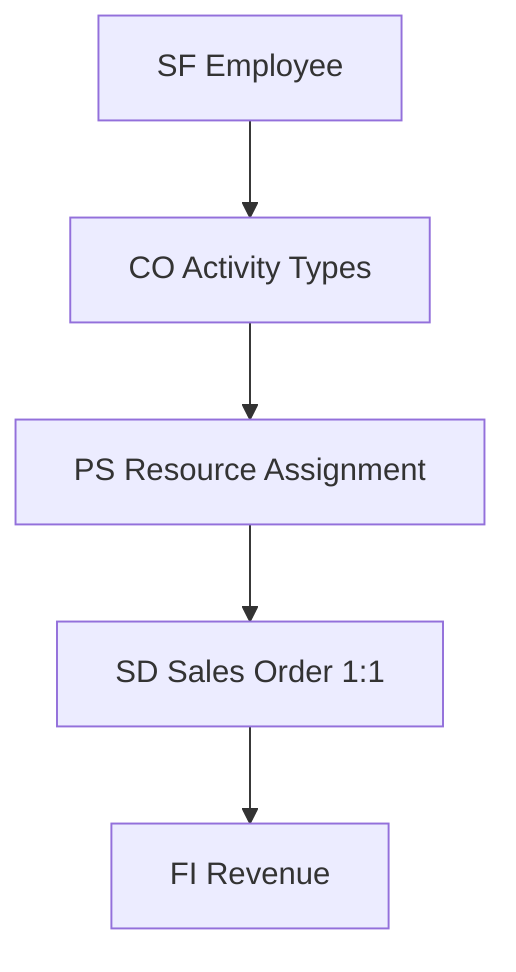

# Solution Architecture Document — AcmeCorp Summary

> **Skill**: sap-solution-design · **Phase**: CP-N · **Agent**: `@sap-orchestrator`
> **Author**: Diseñado por Javier Montaño

## TL;DR

- Clean Core compliance: 6/6 average
- 5 Key User extensions, 2 ABAP Cloud RAP, 1 BTP app
- Integration topology: 5 iFlows + 1 Event Mesh topic
- 10 ADRs signed

## Module Landscape

## Extension Landscape

| Type | Count | Example |
|------|-------|---------|
| Key User | 5 | Custom fields in Sales Order |
| ABAP Cloud RAP | 2 | Timesheet approval workflow |
| BTP Side-by-Side | 1 | Customer portal for project status |

## NFRs

- Fiori app load < 3s (target)
- OData response < 2s
- Batch close < 2h
- DR: RPO <1hr, RTO <4hr

## Quality Validation

- [x] Domain assertions met (per agents/grader.md)
- [x] Evidence tags applied
- [x] Ghost menu
- [x] Metacognitive closing

## 📊 METADATA DE RAZONAMIENTO

- Confianza global: 0.88
- Fuentes: referencias oficiales SAP, body-of-knowledge del skill
- Ambigüedades residuales: depende del cliente/escenario real
- Recomendación siguiente paso: workflow específico del skill

---
*SAP Enterprise Plugin v3.4+ — Diseñado por Javier Montaño.*
