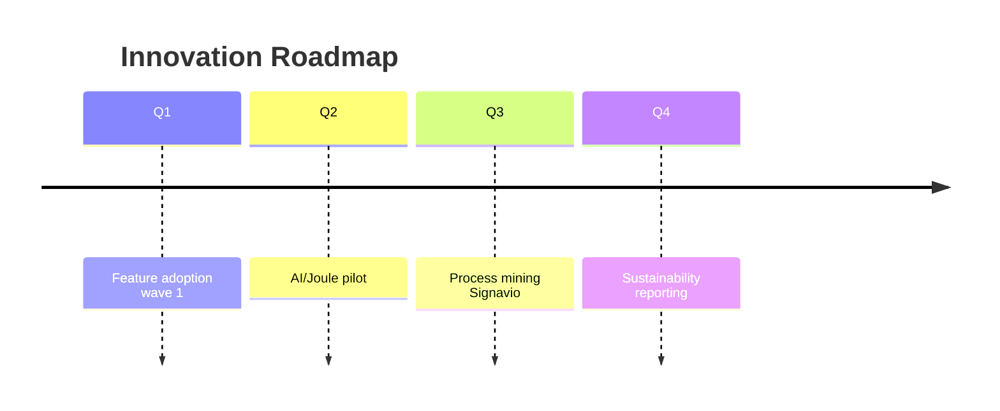

# Plan de Adopción SAP — {CLIENTE}

> **Skill**: sap-adopcion · **Phase**: CP-0 → CP-8 (pipeline completo)
> **Author**: Diseñado por Javier Montaño

## Executive Summary

- **Cliente**: {cliente}
- **Industria**: {industria}
- **Approach recomendado**: {Greenfield/Brownfield/Bluefield/GROW/RISE}
- **Duración estimada**: {N} meses
- **FTE-meses total**: {P50} / {P80} / {P95} (disclaimer: NO precio final)
- **Quick Wins (90 días)**: {count}
- **Innovation Roadmap**: {N} iniciativas

---

## 1. Business Case

{Motivación + valor esperado + ROI timeline}

## 2. Strategic Approach

{Elección Greenfield/Brownfield/Bluefield con justificación}

### Migration Path Scoring

| Dimensión | Score | Rationale |
|-----------|-------|-----------|
| Technical Debt | {1-3} | {} |
| Transformation Ambition | {1-3} | {} |
| Data Complexity | {1-3} | {} |

## 3. SAP Activate Roadmap

```mermaid
gantt
    title SAP Activate Timeline
    section Discover
    Phase Zero : 2026-Q1, 2M
    section Prepare
    Infrastructure : 2M
    section Explore
    Fit-to-Standard : 4M
    section Realize
    Configuration : 6M
    section Deploy
    Go-Live : 2M
    section Run
    Hypercare : 2M
```

## 4. Change Management Program (ADKAR)

| Stakeholder | A | D | K | Ab | R | Priority |
|-------------|---|---|---|----|----|---------|
| Executives | M | H | M | M | M | Maintain |
| Finance Users | M | L | L | L | L | Focus training |

## 5. Governance Model

- **Steering Committee**: {composition}
- **Solution Design Authority**: {composition}
- **Workstreams**: {FI, CO, SD, PS, Tech, Change, Data}
- **RACI Matrix**: {tabla}

## 6. Budget Model

| Fase | FTE-meses (P50) | FTE-meses (P80) | FTE-meses (P95) |
|------|-----------------|-----------------|-----------------|
| Discover | {} | {} | {} |
| Prepare | {} | {} | {} |
| Explore | {} | {} | {} |
| Realize | {} | {} | {} |
| Deploy | {} | {} | {} |
| Run (Y1) | {} | {} | {} |

> **Disclaimer**: Los valores son drivers de esfuerzo (FTE-meses), NO precios finales. Requiere multiplicar por tarifa horaria + overhead + contingency.

## 7. Team Topology

- **Core Team**: {roles}
- **Extended Team**: {roles}
- **Partners**: {SI, vendors}
- **Total Headcount Peak**: {N}

## 8. Risk Register (Top 10)

| # | Risk | Likelihood | Impact | Mitigation |
|---|------|-----------|--------|-----------|
| 1 | Master data quality | H | H | Data cleansing sprint |
| ... | ... | ... | ... | ... |

## 9. Quick Wins (90 Días)

| # | Quick Win | Beneficio | Complejidad |
|---|-----------|----------|-------------|
| 1 | {} | {} | Low |

## 10. Innovation Roadmap (24 meses)



---

📊 METADATA DE RAZONAMIENTO
• Confianza global: {X.XX}
• Comité activo: {9 members}
• Fuentes: stakeholders + SAP docs + industry benchmarks
• Recomendación siguiente paso: `/sap:plan-implementacion` después de aprobación

---
*SAP Enterprise Plugin v3.0 — Diseñado por Javier Montaño.*
