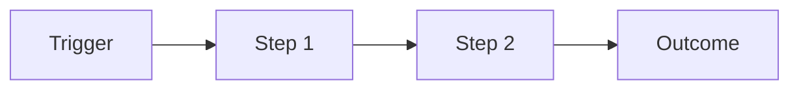
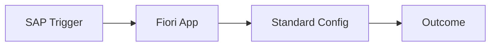

# Business Process Design Document — {Process Area} — {CLIENTE}

> **Phase**: CP-3 / CP-5 · **Agents**: `@functional-lead`
> **Author**: Diseñado por Javier Montaño

## 1. Process Identification

- **Process Name**: {Order-to-Cash / Procure-to-Pay / etc.}
- **SAP Scope Items**: {J11, 4E9, 1IL} [DOC]
- **Process Owner**: {name + role} [STAKEHOLDER]
- **Frequency**: {daily/monthly/quarterly}
- **Volume**: {transactions per period}

---

## 2. As-Is Process

### 2.1 Current Process Flow

### 2.2 Pain Points [STAKEHOLDER]
1. {pain point}
2. {pain point}

### 2.3 Systems Involved
| Sistema | Rol | Integración actual |
|---------|-----|-------------------|
| {legacy} | {role} | {protocol} |

---

## 3. To-Be Process (SAP Standard)

### 3.1 SAP Best Practice Flow [DOC]

### 3.2 Fiori Apps [DOC]
| App | Semantic Object | User Role |
|-----|----------------|-----------|
| {name} | {semobj} | {role} |

### 3.3 Configuration Required
- IMG path: {SPRO path}
- Scope Item activation: {code}

---

## 4. Gap Analysis

| Step AS-IS | Step SAP | Status | Gap | Remediation |
|-----------|---------|--------|-----|-------------|
| {step} | {step} | 🟢/🟡/🔴 | {desc} | {class} |

---

## 5. Business Rules

### 5.1 Validation Rules
- {rule}

### 5.2 Approval Flows
- {approver} → {threshold}

### 5.3 Exception Handling
- {scenario} → {action}

---

## 6. Master Data Requirements

| Object | Owner | Source | Governance |
|--------|-------|--------|-----------|
| {master data} | {team} | {system} | {cycle} |

---

## 7. KPIs & Reporting

| KPI | Target | Source | Frequency |
|-----|--------|--------|----------|
| {kpi} | {value} | CO-PA / SAC | Daily |

---

## 8. Risks & Controls

| Risk | Control | Evidence |
|------|---------|---------|
| {risk} | {control} | {audit trail} |

---

## Ghost Menu

| Acción | Comando |
|--------|---------|
| Generar gap registry | `/sap:gap-analysis` |
| Solution design | `/sap:solution-design` |

---
*Generado por SAP Enterprise Plugin v2.1 — Diseñado y desarrollado por Javier Montaño.*
