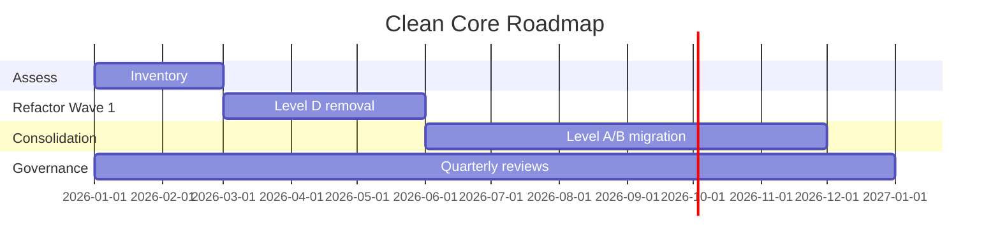

# Clean Core Blueprint — {CLIENTE}

> **Skill**: sap-clean-core · **Author**: Javier Montaño

## Executive Summary

- **Current Compliance**: {X/6}
- **Target Compliance**: 6/6 (zero Level D)
- **Extensions portfolio**: {N KU, M RAP, K BTP}
- **Refactor debt**: {N Level D items → Level A target}

## 1. Clean Core 5 Pillars

| Pillar | Principle | Enforcement |
|--------|-----------|-------------|
| Clean Data | No Z-tables en SAP namespace | Data architecture review |
| Clean Code | ABAP Cloud only | ATC variant `ABAP_CLEAN_CORE_DEVELOPMENT` |
| Clean Extensions | KU > RAP > BTP > nunca classic | Extension Decision Tree |
| Clean Integration | OData V4 + Events | Integration architecture review |
| Clean Operations | SAP Cloud ALM | Ops architecture review |

## 2. A-D Extensibility Model

| Level | Description | Clean Core | Status |
|-------|-------------|-----------|--------|
| A | Released APIs only (ABAP Cloud / BTP) | ✅ Best Practice | Default |
| B | Classic APIs (BAPIs, IDocs, RFCs) | ✅ Compliant | Acceptable |
| C | Internal/unreleased SAP objects | ⚠️ Conditional | Strict governance |
| D | Direct mods to SAP code | ❌ Forbidden | Must refactor |

## 3. Current State Assessment

### Z-object Inventory

| Namespace | Count | Recommendation |
|-----------|-------|---------------|
| Z* in SAP standard namespace | {N} | Migrate to ABAP Cloud namespace |
| Customer namespace /namespace/* | {M} | OK if using released APIs |

### Classical Modifications

| Type | Count | Action |
|------|-------|--------|
| User Exits active | {N} | Refactor to RAP or KU |
| CMOD enhancements | {N} | Refactor or remove |
| Implicit enhancements | {N} | Refactor (Level D violation) |

## 4. Target State

| Distribution | Count | % |
|--------------|-------|---|
| Level A | {N} |  |
| Level C | 0 | 0% |
| Level D | 0 | 0% |

## 5. Extension Decision Tree (Canonical)

```
¿SAP estándar resuelve?
  |-- SÍ → Use as-is ✅
  |-- NO: ¿Key User alcanza?
      |-- SÍ → Custom fields / BRF+ / CDS / Fiori tiles ✅
      |-- NO: ¿ABAP Cloud (RAP)?
          |-- SÍ → Released APIs only ✅
          |-- NO: ¿BTP side-by-side?
              |-- SÍ → CAP / SAP Build / Integration Suite ✅
              |-- NO → REDISEÑAR proceso de negocio
```

## 6. Governance Model

### ATC Check Variants
- `ABAP_CLEAN_CORE_DEVELOPMENT` for new dev
- `ABAP_CLOUD_READINESS` for existing code assessment

### Quarterly Review
- Compliance dashboard
- New extensions approved per quarter
- Debt reduction progress
- Violations flagged

### Steward Board
- Clean Core strategist + SDA + Enterprise Architect
- Monthly meeting
- Approval authority for Level B/C exceptions

## 7. Migration/Refactor Plan

### Level D → Level A Refactor

| Legacy Item | Target | Effort (FTE-m) | Priority |
|-------------|--------|---------------|----------|
| User Exit EXIT_X | RAP action | 5d | P1 |
| CMOD modification | Key User field | 2d | P2 |

## 8. Portfolio Roadmap



## 9. Developer Enablement

| Training | Audience | Duration |
|----------|----------|----------|
| ADT + ABAP Cloud fundamentals | All developers | 2 sem |
| RAP patterns deep dive | Senior devs | 1 sem |
| CAP on BTP | Cross-stack devs | 2 sem |
| Key User Extensibility | Functional + Power users | 3 días |

## 10. Metrics Dashboard

- **Clean Core Compliance**: trending % target 100%
- **Level D violations**: target 0
- **New extensions**: tracked per quarter
- **ATC exceptions**: target decreasing
- **Upgrade impact**: minutes saved per quarterly release

---

📊 METADATA DE RAZONAMIENTO
• Confianza global: {X.XX}
• Comité: @env-orch, @clean-core-strategist, @extensibility-expert, @enterprise-architect, @abap-expert, @functional-lead, @qa-validator
• Recomendación siguiente paso: `/sap:plan-personalizacion` para execution táctico

---
*SAP Enterprise Plugin v3.0 — Diseñado por Javier Montaño.*
