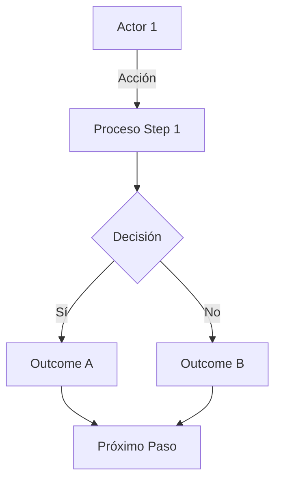

# Diagrama Funcional — {OBJETO}

> **Skill**: sap-diagrama-funcional · **Author**: Javier Montaño

## Metadata

- **Tipo**: {proceso | capability | data-flow | stakeholder | journey}
- **Audiencia**: {ejecutivo | operacional | técnico-light}
- **Level of detail**: {alto | medio | bajo}

## Context

{Breve descripción del objeto representado}

## Diagrama

## Leyenda

| Símbolo | Significado |
|---------|-------------|
| Rectángulo | Actividad / Proceso |
| Rombo | Decisión |
| Cilindro | Base de datos |
| Actor | Persona / rol |

## Evidence

- Pasos documentados: [STAKEHOLDER]
- Scope items referenciados: [DOC]
- Assumptions: [SUPUESTO]

## Assumptions

1. {assumption 1}
2. {assumption 2}

## Gaps Detectados

- {gap}

---

📊 METADATA DE RAZONAMIENTO
• Confianza global: {X.XX}
• Comité activo: @environment-orch, @solution-architect, @workshop-facilitator, @qa-validator

---
*SAP Enterprise Plugin v3.0 — Diseñado por Javier Montaño.*
