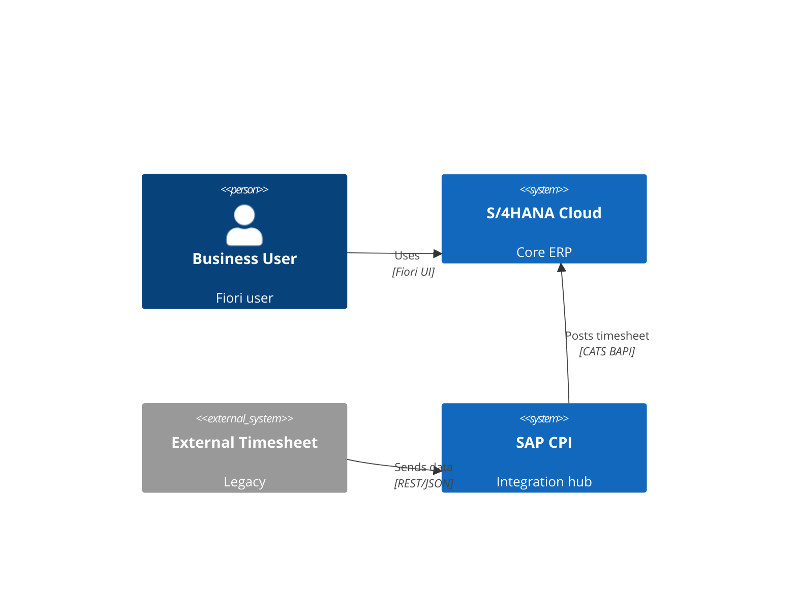
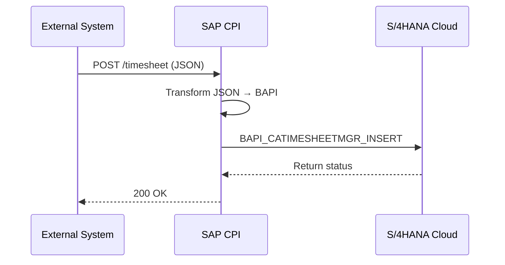

# Diagrama Técnico — {OBJETO}

> **Skill**: sap-diagrama-tecnico · **Author**: Javier Montaño

## Metadata

- **Tipo**: {c4 | er | sequence | deployment | component}
- **Audiencia**: {arquitectos | developers | ops}

## Context

{Objeto técnico + scope}

## Diagrama

### C4 Context Example

### Sequence Example

## Released APIs Used [DOC]

- `I_JournalEntry` (CDS released)
- `A_BusinessPartner` (OData V2)
- `BAPI_CATIMESHEETMGR_INSERT` (released for CPI, NOT for ABAP Cloud)

## Communication Arrangements

- SAP_COM_0008 (SuccessFactors ↔ S/4HANA)

## Protocols

| Integration | Protocol | Version | Auth |
|-------------|----------|---------|------|
| External → CPI | REST/JSON | n/a | OAuth 2.0 |
| CPI → S/4 | OData | V4 | OAuth 2.0 |
| S/4 → Event Mesh | AMQP | 1.0 | mTLS |

## Clean Core Compliance [DOC]

- ✅ Released APIs only
- ✅ No direct RFC from external
- ✅ Via CPI mediation
- ✅ Standard Communication Arrangements

## Deployment Topology

- BTP subaccount: DEV/QAS/PRD
- CPI tenant: {name}
- S/4 tenant: {name}

---

📊 METADATA DE RAZONAMIENTO
• Confianza global: {X.XX}
• Comité: @environment-orch, @abap-expert, @integration-patterns-expert, @solution-architect, @sap-docs-steward, @qa-validator
• Referencias: help.sap.com citadas

---
*SAP Enterprise Plugin v3.0 — Diseñado por Javier Montaño.*
