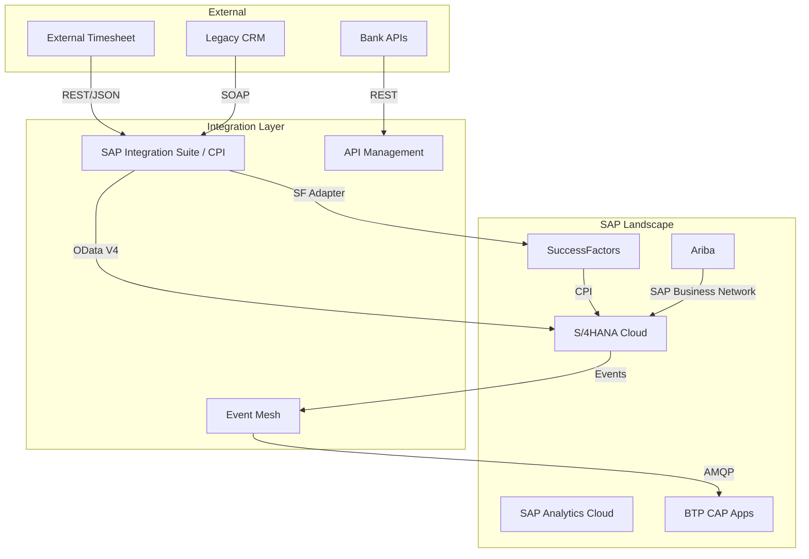

# Mapa de Integración — {CLIENTE}

> **Skill**: sap-mapa-integracion · **Author**: Javier Montaño

## Executive Summary

- **Integraciones totales**: {N}
- **Critical**: {N} · **High**: {M} · **Medium**: {K} · **Low**: {L}
- **Pattern recomendado**: {Hub & Spoke CPI / Event-driven / Hybrid}
- **Protocol mix**: OData V4  · REST 

## 1. Integration Landscape Diagram

## 2. Integration Catalog

| # | Name | Source | Target | Protocol | Frequency | Volume | SLA | Criticality |
|---|------|--------|--------|----------|-----------|--------|-----|-------------|
| 1 | Timesheet Inbound | External | S/4 CATS | REST→CPI→BAPI | Real-time | 1000/d | 5s | Critical |
| 2 | Customer Master | CRM | S/4 BP | SOAP→CPI→OData | Hourly | 500/d | 1h | High |
| 3 | Sales Order Events | S/4 | BTP Analytics | Event Mesh | Real-time | 200/d | 10s | Medium |

## 3. Pattern Selection Rationale

**Selected**: Hybrid (CPI + Event Mesh + API Mgmt)

**Rationale**:
- CPI: sync integrations + data mapping
- Event Mesh: async fan-out (S/4 → multiple consumers)
- API Mgmt: external consumers requiring throttling/quota

## 4. Security Model

| Integration | Auth | Encryption | Audit |
|-------------|------|-----------|-------|
| External → CPI | OAuth 2.0 | TLS 1.3 | MPL log |
| CPI → S/4 | Client Credentials | TLS | CA audit |
| S/4 → Event Mesh | mTLS | TLS | Event log |

## 5. Communication Arrangements

| CA | Source | Target | Scenario |
|----|--------|--------|----------|
| SAP_COM_0008 | SF | S/4 | Employee sync |
| SAP_COM_0006 | Bank | S/4 | Payment comm |

## 6. CPI iFlows Inventory

| iFlow | Source | Target | Adapter | Error Handling |
|-------|--------|--------|---------|---------------|
| Timesheet-Inbound | HTTP | OData | HTTP/OData V4 | DLQ + Alert |

## 7. Event Mesh Topics

| Topic | Publisher | Subscribers |
|-------|-----------|-------------|
| sap/s4/event/{tenant}/ns/SalesOrder.Changed | S/4 | BTP App, Analytics |

## 8. API Management Policies

| API | Product | Rate Limit | OAuth | CORS |
|-----|---------|-----------|-------|------|
| {name} | Public | 1000/min | Yes | Configured |

## 9. Monitoring Stack

- **CPI Dashboard**: per iFlow status
- **Event Mesh Dashboard**: queue depth, delivery
- **API Mgmt Analytics**: traffic, errors
- **SAP Cloud ALM**: E2E correlation
- **Alerts**: threshold + anomaly

## 10. Risks & Mitigations

| Risk | Mitigation |
|------|-----------|
| CPI downtime | Multi-AZ + CPI failover |
| Event Mesh backlog | Monitor queue depth, scale consumers |
| API abuse | Rate limiting + quotas |

## 11. Roadmap per Wave

| Wave | Integrations | Duration |
|------|-------------|---------|
| Wave 1 | Critical inbound | 3 sem |
| Wave 2 | Master data sync | 4 sem |
| Wave 3 | Outbound events | 3 sem |

---

📊 METADATA DE RAZONAMIENTO
• Confianza global: {X.XX}
• Comité: @environment-orch, @sap-orch, @integration-patterns-expert, @cloud-btp-expert, @security-expert, @abap-expert, @functional-lead, @qa-validator, @sap-docs-steward
• Recomendación siguiente paso: `/sap:diagrama-tecnico <iflow-name>` detallado

---
*SAP Enterprise Plugin v3.0 — Diseñado por Javier Montaño.*
