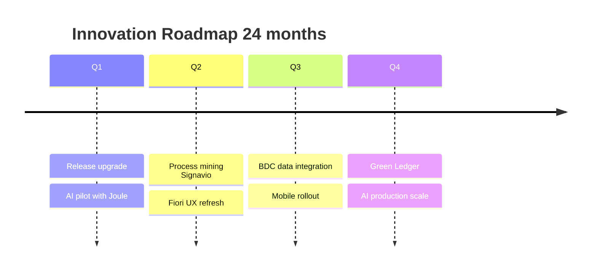

# Plan de Evolución SAP — {CLIENTE}

> **Skill**: sap-plan-evolucion · **Author**: Javier Montaño

## Executive Summary

- **Current Release**: {S/4HANA version}
- **Target Vision (24 meses)**: {vision statement}
- **Innovation Vectors**: {AI, Data, Process, UX, Integration, Sustainability}
- **Budget Y1**: {FTE-meses}

## 1. Vision Statement

{Dónde queremos estar en 24 meses}

## 2. Current State Assessment

| Dimensión | Current | Target | Gap |
|-----------|---------|--------|-----|
| Release | {} | {} | {} |
| Feature adoption |  | {%} |
| AI adoption | None | Joule + custom | All |
| Process mining | None | Signavio | All |
| Tech debt | {N} items | {N} items | {N} |

## 3. Innovation Roadmap

## 4. Feature Adoption Plan

| Feature | Release | Business Value | Effort |
|---------|---------|---------------|--------|
| Joule AI | {version} | High | Medium |
| Document Compliance LatAm | {version} | High | Low |

## 5. Tech Debt Reduction

| Debt | Type | Remediation | Effort |
|------|------|-------------|--------|
| Z-table in SAP namespace | Clean Core Level D | Migrate to KU/RAP | FTE-m |

## 6. Skills Development

| Skill | Target Team | Training | Duration |
|-------|------------|----------|----------|
| ABAP Cloud / RAP | Developers | ADT + Learning Hub | 2 semanas |
| Joule prompts | Power users | Joule playground | 1 semana |

## 7. Budget Split

| Category | % | FTE-meses |
|----------|---|-----------|
| Keep-the-lights-on | 40% | {} |
| Tech debt reduction | 20% | {} |
| Innovation | 40% | {} |

## 8. Success Metrics

- Feature adoption rate > 60% per quarter
- Clean Core compliance trending up
- User satisfaction NPS >= 4.0
- Innovation KPIs (AI usage, process cycle time reduction)

---

📊 METADATA DE RAZONAMIENTO
• Confianza global: {X.XX}
• Recomendación siguiente paso: `/sap:plan-personalizacion` para extensiones específicas

---
*SAP Enterprise Plugin v3.0 — Diseñado por Javier Montaño.*
