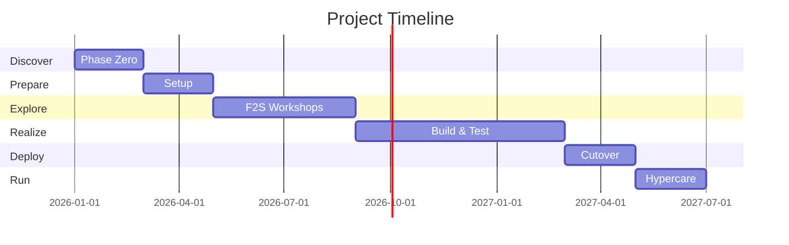

# Plan de Implementación SAP — {CLIENTE}

> **Skill**: sap-plan-implementacion · **Plugin**: sap-enterprise-plugin v3.0
> **Author**: Diseñado por Javier Montaño

## Executive Summary

- **Scope**: {módulos en scope}
- **Approach**: {Waterfall/Hybrid/Agile/Fast-track}
- **Duración**: {N} meses
- **Team peak**: {N} FTE
- **Budget range**: {P50}-{P95} FTE-meses

## 1. Scope & Out-of-Scope

### In Scope
- Módulos: {FI, CO, SD, ...}
- Países: {lista}
- Legal entities: {N}

### Out of Scope
- {items}

## 2. Approach

{Waterfall SAP Activate / Hybrid / Agile SAFe / Fast-track GROW}

**Rationale**: {por qué}

## 3. Phased Timeline

## 4. Sprint Plan (si Agile/Hybrid)

| Sprint | Duration | Goal | Deliverable |
|--------|---------|------|-------------|
| S1 | 2 sem | F2S CO | Workshop output |
| S2 | 2 sem | F2S SD | Workshop output |

## 5. Resource Plan

| Fase | Roles | FTE |
|------|-------|-----|
| Prepare | PM, SA, Leads | 6 |
| Explore | + Functional consultants | 14 |
| Realize | + Developers, Testers | 22 |
| Deploy | + Cutover team | 18 |

## 6. Dependencies

| Dependency | Type | Mitigation |
|-----------|------|-----------|
| Master data cleansing | Upstream | Phase Zero |

## 7. Quality Gates

| Gate | Criteria | Owner |
|------|----------|-------|
| G-Discover | Business case + scope | Steering |
| G-Prepare | Team ready, infra OK | Steering |
| G-Explore | Design freeze, ADRs firmadas | SDA |
| G-Realize | UAT >=95%, cutover rehearsed | Steering |
| G-Deploy | Go/No-Go passed | Steering |

## 8. Risk Register

| # | Risk | L | I | Mitigation |
|---|------|---|---|-----------|
| 1 | Data quality | H | H | Phase Zero |

## 9. Communication Plan

| Audience | Frequency | Channel | Content |
|----------|----------|---------|---------|
| Steering | Bi-weekly | Meeting + Email | Status report |
| Users | Monthly | Town hall | Progress + training |

## 10. Budget Model

| Fase | P50 | P80 | P95 |
|------|-----|-----|-----|
| {per phase} | | | |
| **Total** | {} | {} | {} |

## 11. Success Criteria

- [ ] System live per timeline
- [ ] UAT >= 95%
- [ ] Adoption >= 80% month 3
- [ ] Clean Core compliance >= 5/6
- [ ] Zero critical defects open at go-live

## 12. Definition of Done

- Phase complete when all Gate criteria pass + Steering approval.

---

📊 METADATA DE RAZONAMIENTO
• Confianza global: {X.XX}
• Comité activo: {9 members}
• Recomendación siguiente paso: `/sap:ajuste-estandar` por módulo

---
*SAP Enterprise Plugin v3.0 — Diseñado por Javier Montaño.*
