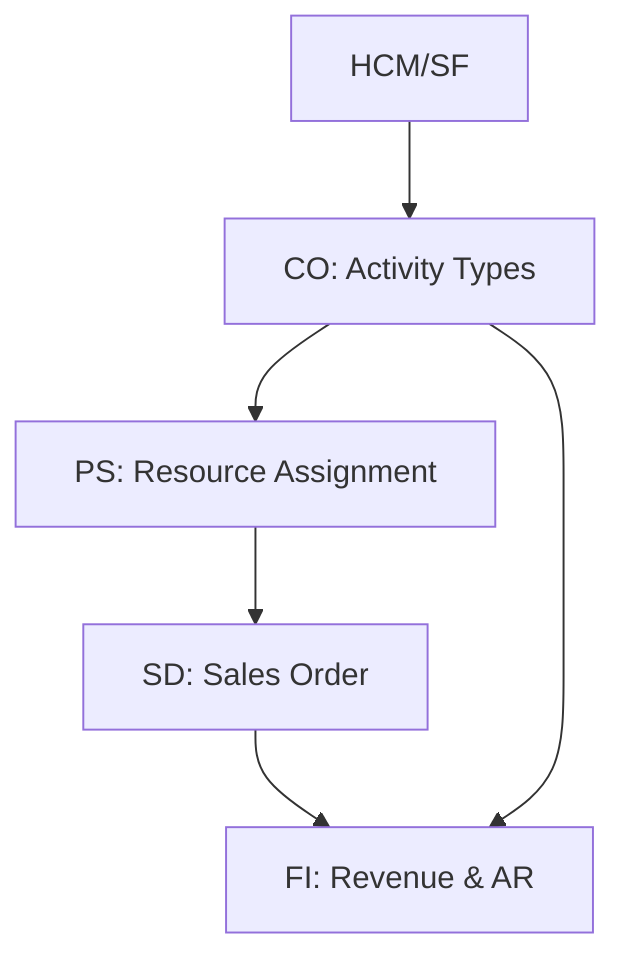
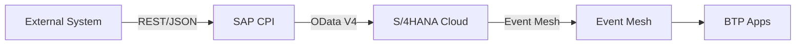

# Solution Architecture Document — {CLIENTE}

> **Skill**: sap-solution-design · **Phase**: CP-5 · **Agents**: `@sap-orchestrator` + `@abap-expert`
> **Author**: Diseñado por Javier Montaño

## 1. Executive Summary

- **Scope**: {modules + extensiones}
- **Clean Core Compliance**: {X/6} average
- **Extensions count**: Key User={k} · ABAP Cloud={r} · BTP={b} · Custom={c}
- **Key decisions**: {summary}

---

## 2. Solution Overview

### 2.1 Module Landscape



### 2.2 Extension Landscape

| Tipo | Count | Clean Core | Effort |
|------|-------|-----------|--------|
| Key User | {k} | Compliant | Low |
| ABAP Cloud (RAP) | {r} | Compliant | Medium |
| BTP Side-by-side | {b} | Compliant | Medium-High |
| Classic (AVOID) | 0 | ❌ | — |

### 2.3 Integration Landscape



---

## 3. Module Architecture

### 3.1 CO — Controlling [DOC]
- **Config**: {Activity Types, Cost Centers, CO-PA}
- **Extensions**: {list}

### 3.2 SD — Sales & Distribution [DOC]
- **Config**: {Sales Order types, pricing, billing plans}
- **Extensions**: {list}

### 3.3 PS — Project System [DOC]
- **Config**: {WBS, milestones, resource planning}
- **Extensions**: {list}

### 3.4 FI — Financial Accounting [DOC]
- **Config**: {Company Codes, CoA, parallel ledgers, IC}
- **Extensions**: {list}

### 3.5 HCM / SuccessFactors [DOC]
- **Config**: {Employee master, time management}
- **Extensions**: {list}

---

## 4. Extension Architecture

### 4.1 Key User Extensions ({k})
| Extension | Gap | App Name | Justification |
|-----------|-----|---------|--------------|
| {name} | GAP-{X}-{N} | {Fiori app} | {why} |

### 4.2 ABAP Cloud Extensions ({r})
| Extension | Gap | Pattern | ADR | Clean Core |
|-----------|-----|---------|-----|-----------|
| {name} | GAP-{X}-{N} | {managed-draft/unmanaged/projection} | ADR-{N} | 6/6 |

### 4.3 BTP Side-by-Side Extensions ({b})
| Extension | Gap | Service | Architecture |
|-----------|-----|---------|--------------|
| {name} | GAP-{X}-{N} | {CAP/Build Apps/Integration Suite} | {diagram} |

---

## 5. Integration Architecture

### 5.1 CPI Flows
| iFlow | Source | Target | Pattern |
|-------|--------|--------|---------|
| {name} | {system} | S/4HANA | {sync/async/batch} |

### 5.2 API Contracts
| API | Protocol | Auth | Consumer |
|-----|----------|------|---------|
| {name} | OData V4 | OAuth 2.0 | {system} |

### 5.3 Event Mesh
| Topic | Publisher | Subscribers |
|-------|-----------|-------------|
| {name} | S/4HANA | {list} |

### 5.4 Error Handling Strategy
| Categoría | Estrategia |
|-----------|-----------|
| Transient | Retry exponential backoff, max 3 |
| Data | DLQ + alerting |
| Auth | Credential refresh |
| Business | User notification |
| System | Circuit breaker |

---

## 6. Data Architecture

### 6.1 Master Data Flow
```
Employee Master → Activity Type → Cost Rate → Sales Price → Project Assignment
```

### 6.2 Transaction Data Flow
```
Timesheet → CATS → PS hours → CO cost → SD billing → FI revenue
```

### 6.3 Migration Scope
- Referencia a `/sap:migration-plan` deliverable

---

## 7. Security Architecture

- **Roles**: PFCG / Business Roles
- **Authorizations**: principle of least privilege
- **Fiori Catalogs**: por persona
- **SSO**: SAML 2.0 / OAuth
- **Audit Trail**: Change Documents

---

## 8. Non-Functional Requirements

| NFR | Target |
|-----|--------|
| Performance | Transactions < 2s (p95) |
| Availability | 99.5% (SAP SLA) |
| Scalability | 2x user count baseline |
| DR | RPO < 1hr, RTO < 4hr |
| Compliance | SOX audit trail |

---

## 9. Architecture Decision Records

| ADR ID | Title | Status | Clean Core |
|--------|-------|--------|-----------|
| ADR-001 | {title} | Accepted | Level A |

Detalle de cada ADR en `adrs/adr-{NNN}.md`.

---

## 10. Risks & Mitigations

| Risk | Likelihood | Impact | Mitigation |
|------|-----------|--------|-----------|
| {risk} | H/M/L | H/M/L | {action} |

---

## Quality Validation

- [ ] Extension decisions con decision tree evidence
- [ ] Clean Core Compliance >= 5/6 per extensión
- [ ] Module interaction documented (Mermaid)
- [ ] Data flow covers master + transactional + integration
- [ ] NFRs con targets medibles
- [ ] SAD completo (10 secciones)
- [ ] `@qa-validator` ejecutó `scripts/validate-clean-core.sh`

---

## Ghost Menu

| Acción | Comando |
|--------|---------|
| Migration plan | `/sap:migration-plan` |
| Configurar módulo | `/sap:module-config <module>` |
| Generar ABAP | `/sap:generate-abap <req>` |
| Paleta completa | `/sap:menu` |

---
*Generado por SAP Enterprise Plugin v2.1 — Diseñado y desarrollado por Javier Montaño.*
