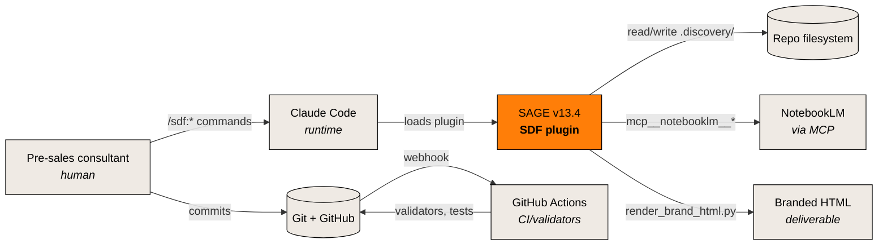

# C4 Level 1 — System Context

SAGE (SDF plugin) as a black box, with the external systems it touches.

## Diagram

## Narrative

The user is a pre-sales consultant. They interact through Claude Code by invoking `/sdf:*` slash commands. Claude Code loads the SDF plugin, which becomes the primary actor.

SDF touches four external systems:

1. **NotebookLM** via MCP — for grounded synthesis over 10-50 source documents.
2. **Repo filesystem** — where all session artefacts live (`.discovery/`, `sdf/skills/`, `sdf/docs/`, etc.).
3. **Git + GitHub** — version control, collaboration, PR review.
4. **GitHub Actions** — runs 6 docs validators + the pytest suite on every push.

Output delivered to the user: branded HTML files (via the deterministic renderer, see [ADR-0010](../../adr/0010-brand-html-deterministic.md)) + markdown source.

## What's NOT on this diagram

- Client companies (they consume deliverables but don't integrate).
- Sofka's commercial team (downstream of pre-sales).
- Individual agents/skills (that's [L2](L2-containers.md)).

## Related

- [L2 — Containers](L2-containers.md)
- [ADR-0019](../../adr/0019-c4-levels-1-2-3-mermaid.md) — why C4, why no L4
- [`../../explanation/architecture-overview.md`](../../explanation/architecture-overview.md)
