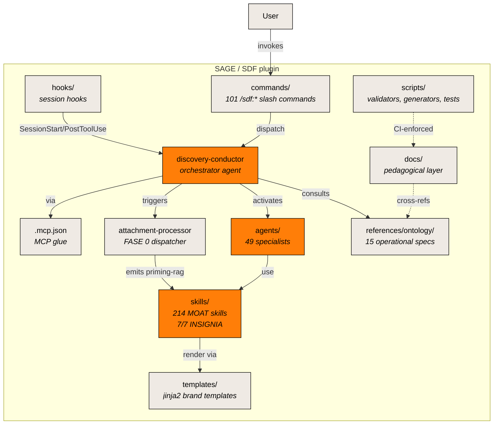

# C4 Level 2 — Containers

Zooming inside SAGE. Each box is a coherent piece of the plugin.

## Diagram

## Narrative

**Runtime hot path** (orange): discovery-conductor + agents + skills. This is what fires during a session.

**Runtime cold path** (cream): everything else. Hooks run at session boundaries; commands are the surface; ontology is read on demand; docs are for humans.

**Boundary artefacts**:

- **Hooks** (SessionStart / PostToolUse) regenerate `.discovery/*` on every fire.
- **Commands** are the user-facing surface (`/sdf:*`).
- **discovery-conductor** orchestrates — doesn't analyze.
- **attachment-processor** runs FASE 0 — detects format, dispatches to extractor, emits priming-rag.
- **Agents** are 49 specialists; the committee per session is rotated by `{TIPO_SERVICIO}` ([ADR-0001](../../adr/0001-agent-committee-composition.md)).
- **Skills** are 214 MOAT units ([ADR-0005](../../adr/0005-insignia-7of7-structure.md)).
- **Ontology** is the agent-read operational layer; **docs** is the human-read pedagogical layer.

## What's NOT on this diagram

- Internal composition of the orchestrator (that's [L3](L3-components.md)).
- Code-level detail (intentionally omitted — see [ADR-0019](../../adr/0019-c4-levels-1-2-3-mermaid.md)).

## Related

- [L1 — System Context](L1-system-context.md)
- [L3 — Components](L3-components.md)
