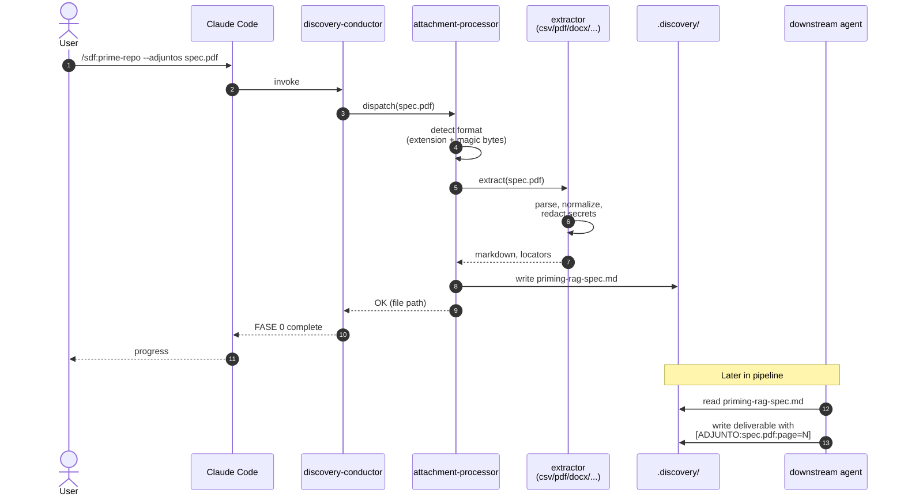

# Sequence 01 — FASE 0 attachment ingestion

User drops a file, `@attachment-processor` dispatches, priming-rag is emitted, subsequent agents cite `[ADJUNTO:<file>:<locator>]`.

## Diagram

## Key moments

- **Step 3** — dispatch is format-aware: extension first, magic bytes as fallback for misnamed files.
- **Step 5** — extractor includes secret redaction before emitting.
- **Step 7** — priming-rag is a normalized markdown doc with locators preserved; not a dump.
- **Step 12** — downstream agent cites with a locator so reviewers can open the source at the exact reference.

## Failure modes

- Format unknown → `E-ATT-001`; the user renames or manually dispatches.
- Extractor crash → `E-ATT-002`; report via antifragile loop.
- Secret detected → redacted inline; user reviews before use.

## Related

- [ADR-0008](../../adr/0008-fase-0-attachment-ingestion.md)
- [`../../how-to/feed-large-pdf-via-fase-0.md`](../../how-to/feed-large-pdf-via-fase-0.md)
- `references/ontology/attachment-taxonomy.md`
