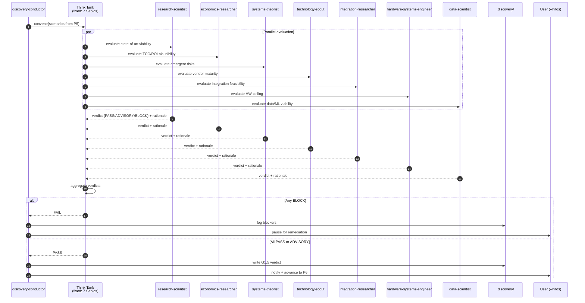

# Sequence 02 — Gate G1.5 (7 Sabios Think Tank)

After G1 passes, the 7-expert Think Tank deliberates on feasibility before scenarios advance to cost modeling.

## Diagram

## Key moments

- **Step 2-8** — all 7 Sabios evaluate in parallel. Each scores on their domain's rubric.
- **Step 9-15** — verdicts collected. Each has a rationale; no silent PASS.
- **Step 16** — aggregation is deterministic: any BLOCK fails the gate; unanimous PASS clears; mixed requires discovery-conductor reconciliation (not shown here for brevity).
- **Step 17-22** — on BLOCK, session pauses in `--hitos` mode; the user sees the specific blockers.

## Why parallel

Sabios are independent experts; sequentially they'd anchor each other. Parallel evaluation preserves diverse assessment.

## Related

- [ADR-0003](../../adr/0003-quality-gates-G0-G3.md)
- [`../../reference/gates/G1.5.md`](../../reference/gates/G1.5.md)
- [`../../explanation/why-hybrid-gates-G0-G3.md`](../../explanation/why-hybrid-gates-G0-G3.md)
