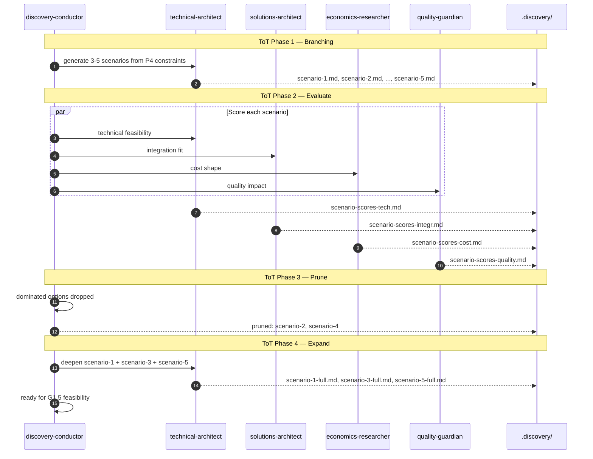

# Sequence 03 — ToT meta-phases across candidate scenarios (inside P5)

Tree-of-Thought applied at scenario stage: branch, evaluate, prune, expand.

## Diagram

## Key moments

- **Phase 1** — branching is explicit. No "the" scenario; always 3-5 options.
- **Phase 2** — multi-axis scoring. A scenario cheap but infeasible doesn't survive.
- **Phase 3** — pruning is mechanical: if scenario-2 is beaten on every dimension by scenario-1, it's dropped.
- **Phase 4** — expansion on survivors only. Pruned scenarios don't consume deliverable budget.

## Why this improves output

Linear agents commit early to one scenario. Multi-scenario exploration surfaces "we hadn't considered X" moments. The cost is bounded (branching caps at 5); the benefit compounds (scenarios that survive feasibility are pre-validated).

## Related

- [ADR-0006](../../adr/0006-tot-meta-phases.md)
- [`../../reference/phases-vs-stages.md`](../../reference/phases-vs-stages.md)
- [`../../explanation/why-tot-meta-phases.md`](../../explanation/why-tot-meta-phases.md)
