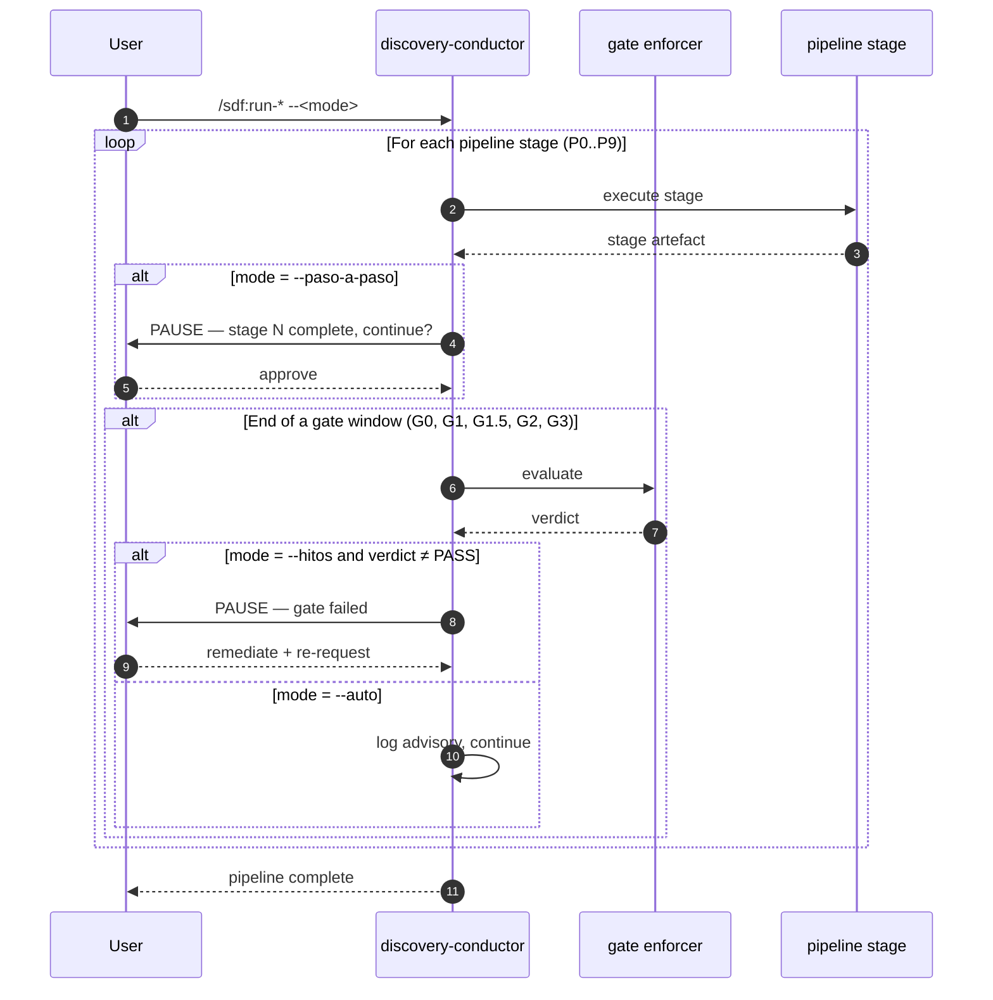

# Sequence 04 — HITL modes control flow

Same pipeline, three different pause cadences depending on `--auto` vs `--hitos` vs `--paso-a-paso`.

## Diagram

## Key moments

- **Step 3** — the user's mode flag sets the cadence for the whole session.
- **Step 5-8** — `--paso-a-paso` adds 11 touchpoints (one per stage).
- **Step 11-14** — gates always evaluate; what differs is whether the gate is a pause point or a log entry.
- **Step 15** — only `--hitos` or `--paso-a-paso` pauses on failed gate.
- **Step 16-18** — `--auto` never pauses; advisories are logged in `session-changelog.md` for later human review.

## Mode selection guidance

Covered in [`../../explanation/why-hitl-modes.md`](../../explanation/why-hitl-modes.md) and [ADR-0004](../../adr/0004-hitl-three-modes.md).

## Related

- [ADR-0004](../../adr/0004-hitl-three-modes.md)
- [ADR-0003](../../adr/0003-quality-gates-g0-g3.md)
