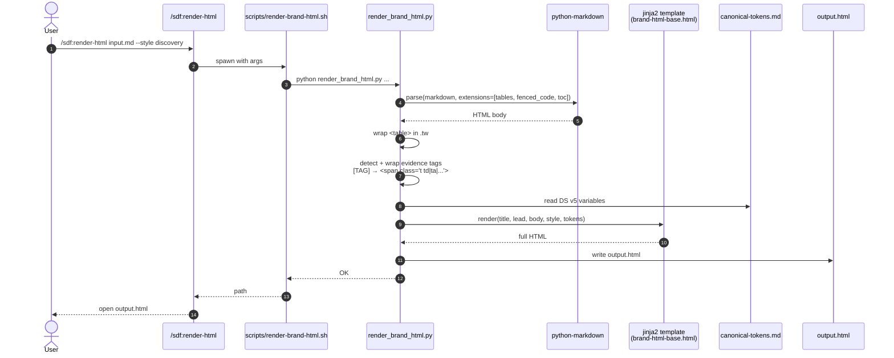

# Sequence 05 — Brand HTML render (markdown → DS v5 HTML)

Deterministic pipeline: markdown source → jinja2 template → branded HTML with evidence tags highlighted.

## Diagram

## Key moments

- **Step 4-5** — markdown parsing is deterministic; the extension set is fixed.
- **Step 6** — tables get a `.tw` wrapper for horizontal scroll on narrow screens.
- **Step 7** — evidence tag detection is regex-based: `\[TAG(:locator)?\]` → ``.
- **Step 8-9** — tokens (colors, font) are baked in at render time; no runtime CSS fetch.
- **Step 10** — jinja2 produces the full HTML including the `<head>`, `<style>`, hero, nav, body, footer.

## Offline guarantee

The only external fetch in the output HTML is the Google Fonts Inter `<link>`. When offline, system fallback fonts render cleanly (the CSS stack is intentional).

## Determinism guarantee

Same input + same template + same tokens = byte-identical output. This is testable via snapshot; any drift fails the render test.

## Related

- [ADR-0010](../../adr/0010-brand-html-deterministic.md)
- [`../../explanation/why-brand-html-is-deterministic.md`](../../explanation/why-brand-html-is-deterministic.md)
- `sdf/scripts/render_brand_html.py`
- `sdf/templates/brand-html-base.html`
