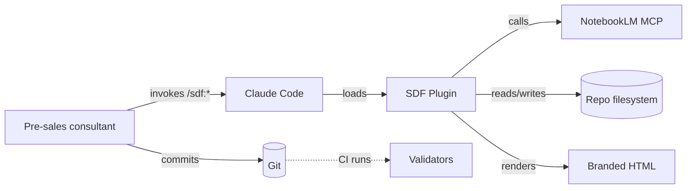
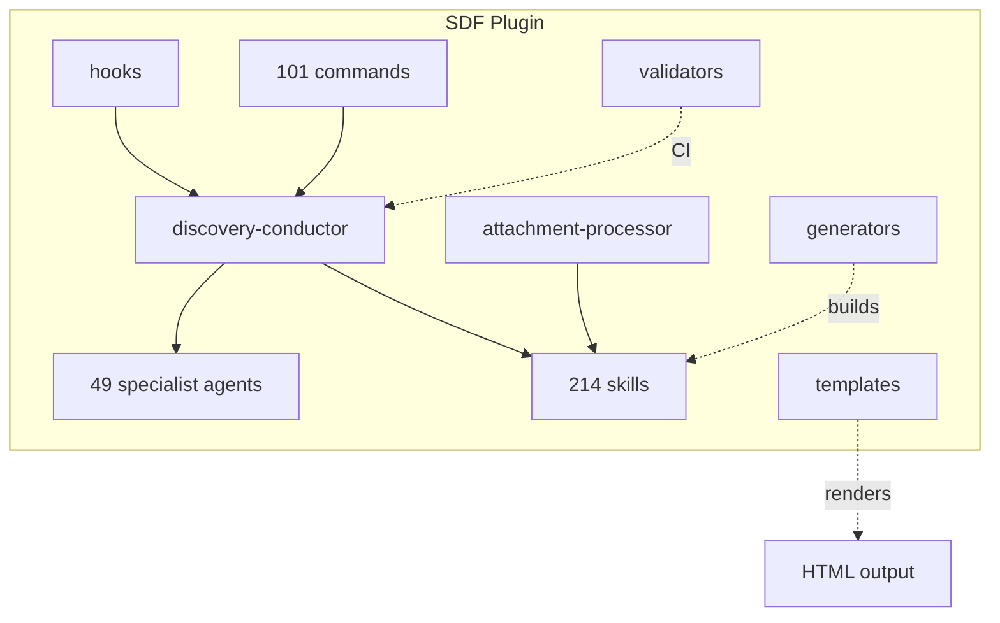

# Architecture overview (arc42-lite)

This document is the single starting point for understanding SDF's architecture. It uses arc42's content ontology, split into sections per [ADR-0018](../adr/0018-arc42-lite-split-files.md). Deeper topics link to dedicated essays or ADRs.

## 1. Goals

SDF (SAGE v13.4) enables pre-sales discovery for enterprise engagements using a Claude Code plugin. Primary goals:

- Produce audit-survivable deliverables (every claim evidence-tagged).
- Keep humans in control at meaningful checkpoints (gates, not every step).
- Scale to 10 distinct service types without code duplication.
- Enable repeat engagements to compound institutional learning.

Non-goals: replacing Sofka commercial, emitting prices ([ADR-0011](../adr/0011-never-prices-only-fte.md)), or replacing the human subject-matter experts.

## 2. Constraints

- **Claude Code** is the runtime. No custom server; no hosted UI.
- **Markdown-first** source-of-truth — deliverables, docs, configs.
- **Spanish default** for deliverables ([ADR-0012](../adr/0012-spanish-default-latam-register.md)); English for contributor docs.
- **No green** anywhere in brand output ([ADR-0010](../adr/0010-brand-html-deterministic.md)).
- **Zero-hallucination protocol** — every fact tagged ([ADR-0014](../adr/0014-zero-hallucination-protocol.md)).

## 3. Context (C4 Level 1)

External systems: Claude Code (runtime), NotebookLM MCP (grounded synthesis), Git (version control), CI (validator enforcement).

## 4. Solution strategy

The plugin is composed of:

- **Agents (49)** — specialists rotated into a committee per engagement ([ADR-0001](../adr/0001-agent-committee-composition.md)).
- **Skills (214)** — MOAT units in the 7/7 INSIGNIA structure ([ADR-0005](../adr/0005-insignia-7of7-structure.md)).
- **Commands (101)** — user surface (`/sdf:*`).
- **Hooks** — session start + post-tool-use, regenerate ghost menu + changelog.
- **Validators (6)** — docs quality enforcement ([ADR-0022](../adr/0022-validator-stack-six-jobs.md)).

A **discovery-conductor** orchestrates. Agents read the same ontology, so handoffs happen via the filesystem (not in-memory state).

## 5. Building blocks (C4 Level 2)

See [`../diagrams/c4/L2-containers.md`](../diagrams/c4/L2-containers.md) for a detailed container view.

## 6. Runtime view

A typical session:

1. Session start → hooks regenerate `.discovery/*`.
2. User invokes `/sdf:run-express` (or another pipeline command).
3. Discovery-conductor asks for `{TIPO_SERVICIO}`, activates committee.
4. FASE 0 ingests any attachments via `@attachment-processor`.
5. Pipeline stages P0..P4 produce deliverables.
6. **G1 gate** — quality-guardian + risk-controller verdict.
7. **G1.5 gate** — 7 Sabios Think Tank feasibility.
8. Stages P5..P6 produce scenarios + roadmap; **G2 gate**.
9. Stages P7..P9; **G3 gate**.
10. Brand HTML render on request.

See sequence diagrams in [`../diagrams/sequences/`](../diagrams/sequences/).

## 7. Deployment

SDF is a Claude Code plugin; there is no deployment in the traditional sense. The `.claude-plugin/plugin.json` is the manifest; installing the plugin makes 214 skills, 101 commands, and 49 agents available in the user's Claude Code session.

CI runs on every push/PR via GitHub Actions (`.github/workflows/docs-quality.yml` + existing test matrix).

## 8. Cross-cutting concepts

- **Evidence tags** ([ADR-0002](../adr/0002-evidence-tag-priority-chain.md))
- **Quality gates** ([ADR-0003](../adr/0003-quality-gates-g0-g3.md))
- **HITL modes** ([ADR-0004](../adr/0004-hitl-three-modes.md))
- **Service-type routing** ([ADR-0007](../adr/0007-service-type-routing.md))
- **FASE 0 ingestion** ([ADR-0008](../adr/0008-fase-0-attachment-ingestion.md))

## 9. Architectural decisions

25 ADRs in [`../adr/`](../adr/README.md). Start with 0001-0010 for "what SDF does", 0011-0016 for "how deliverables look", 0017-0025 for "how we govern and document".

## 10. Quality requirements

- Evidence density ≥ 60 % priority 1-4 tags at G1; ≥ 70 % at G3.
- Validator CI budget < 30 s.
- Deliverables render identically across devices (deterministic HTML).

See [`../reference/metrics.md`](../reference/metrics.md) for measured numbers.

## 11. Risks + technical debt

- External dependency on NotebookLM MCP availability.
- Agent committee drift if `agent-committee.md` and `agents/*.md` diverge.
- Validator CI time growing super-linearly with doc count (monitor; shard if needed).

## 12. Glossary

See [`../../GLOSSARY.md`](../../GLOSSARY.md) + monorepo-level [`../../../GLOSSARY.md`](../../../GLOSSARY.md).

---

*This document is the arc42-lite apex; it deliberately links outward rather than covering every section in depth. Follow the links for depth; stay here for breadth.*
