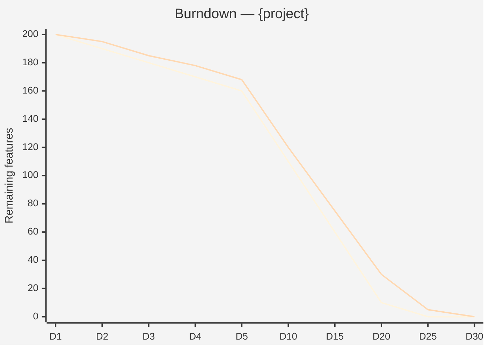

# Execution Burndown: Sofka Execution Model

Instruments the Sofka productivity model (1 FTE = 1 shippable feature/day) into burndown dashboards,
velocity tracking, and completion projections. Operates at daily sprint level per developer.

## Guiding Principle

**What is not measured is not managed. What is not decomposed is not estimated.**

The burndown is not a pressure tool — it is a **visibility** tool. It enables detecting
deviations early (day 3, not month 3) and adjusting before the project goes off track.

### Execution Philosophy

1. **1-day sprint.** Each developer has 1 day to deliver 1 shippable feature. If they do not deliver, it is a signal — not a failure.
2. **Onboarding is investment, not overhead.** Sprint 1 produces 0.3 features, Sprint 2 produces 0.7, Sprint 3+ produces 1.0. This is NOT slowness — it is a planned learning curve.
3. **Burndown is forecast, not deadline.** The burndown slope projects completion date. If the slope diverges from the plan, scope or team is adjusted — not "squeezed".
4. **Features ≤3 SP or they get decomposed.** The model collapses with large features. The Feature Decomposition Checklist is a prerequisite.

## Inputs

Parse `$1` as **project name**, `$2` as **team size** (number of developers).
Requires: feature backlog (decomposed, ≤3 SP each), team composition, start date.
Optional: historical velocity data, complexity distribution, dependency map.

## Delivery Structure

### S1: Team & Backlog Setup

| Parameter | Value |
|-----------|-------|
| Team | {N} developers |
| Total features | {N} (post-decomposition, ≤3 SP) |
| Start date | {date} |
| Onboarding sprints | {N} days |
| Base productivity factor | 1.0 |

### S2: Burndown Chart (Mermaid)



### S3: Velocity Dashboard

| Sprint (Day) | Planned Features | Delivered Features | Actual Velocity | Factor vs Plan | Status |
|---|---|---|---|---|---|
| Sprint 1 (D1-D5) | {N×0.3/day} | {actual} | {actual/plan} | {factor} | green/yellow/red |
| Sprint 2 (D6-D10) | {N×0.7/day} | {actual} | {actual/plan} | {factor} | green/yellow/red |
| Sprint 3+ (D11+) | {N×1.0/day} | {actual} | {actual/plan} | {factor} | green/yellow/red |

Semaphores: green ≥90% of plan, yellow 70-89%, red <70%

### S4: Completion Projection

```
COMPLETION PROJECTION
═══════════════════════
Remaining backlog: {N} features
Current velocity: {V} features/day (team)
Planned velocity: {N_devs} features/day
Ratio: {V/N_devs × 100}%

Estimated date (actual): {date}
Estimated date (plan): {date}
Deviation: {+/- N} days

Confidence: HIGH (>85% plan) | MEDIUM (70-85%) | LOW (<70%)
```

### S5: Risk Signals

Early deviation signals:
- **Day 3**: If velocity < 50% of plan → FLAG (may be normal onboarding)
- **Day 5**: If velocity < 70% of plan → ALERT (review impediments)
- **Day 10**: If velocity < 80% of plan → ESCALATION (adjust scope or team)
- **Feature blocked >1 day**: IMPEDIMENT — escalate immediately

### S6: Adjustment Recommendations

If burndown diverges from plan:
1. **Scope adjustment**: Which features can be deferred? (MoSCoW reprioritization)
2. **Team adjustment**: Can 1 developer be added? (onboarding cost = 3-5 days)
3. **Feature decomposition**: Are there features >3 SP that slipped through? (re-decompose)
4. **Impediment removal**: What is blocking? (dependencies, environment, knowledge)

## Ramp-up Model

```
Productivity per FTE:
  Sprint 1 (onboarding):  0.3 features/day
  Sprint 2 (ramp-up):     0.7 features/day
  Sprint 3+ (cruise):     1.0 features/day

Team productivity (N devs):
  Sprint 1:  N × 0.3 = {N×0.3} features/day
  Sprint 2:  N × 0.7 = {N×0.7} features/day
  Sprint 3+: N × 1.0 = {N} features/day
```

## When to Use

- After roadmap defines feature backlog (Phase 4)
- When client asks "how long will it take?" or "how many developers do I need?"
- When tracking execution velocity during project delivery
- When projecting completion date from current velocity

## When NOT to Use

- Discovery-only engagements (no execution phase)
- Research/exploration projects (features not decomposable)
- Projects with >50% unknowns (use spikes first)

## Trade-off Matrix

| Decision | Enables | Constrains | When to Use |
|---|---|---|---|
| 1-day sprints | Maximum visibility, fast feedback | Higher ceremony overhead | Teams ≥3 developers, features well-decomposed |
| Weekly sprints | Less overhead | Delayed signal detection | Small teams (1-2), complex features |
| Factor 1.0 baseline | Simple, optimistic | May underestimate complex domains | Greenfield projects, well-known stack |
| Factor 0.7 baseline | Realistic for brownfield | More conservative estimate | Legacy modernization, unfamiliar stack |

## Output Configuration

- **Language**: Spanish (Latin American, business register — simple, clear, concise, direct)
- **Attribution**: Expert committee of the Sofka Discovery Framework
- **Tagline**: *"Construido por profesionales, potenciado por la red agéntica de Sofka."*

## Validation Gate

- [ ] All features decomposed to ≤3 SP
- [ ] Team size and composition documented
- [ ] Ramp-up curve specified (default or custom)
- [ ] Burndown chart generated with plan vs actual
- [ ] Velocity tracking per sprint
- [ ] Completion projection with confidence level
- [ ] Risk signals defined with thresholds

## Output Artifact

**Primary:** `A-04_Execution_Burndown_{project}.md`

### Diagrams (Mermaid)
- xychart-beta: burndown (plan vs actual)
- Gantt: sprint timeline by developer

---
